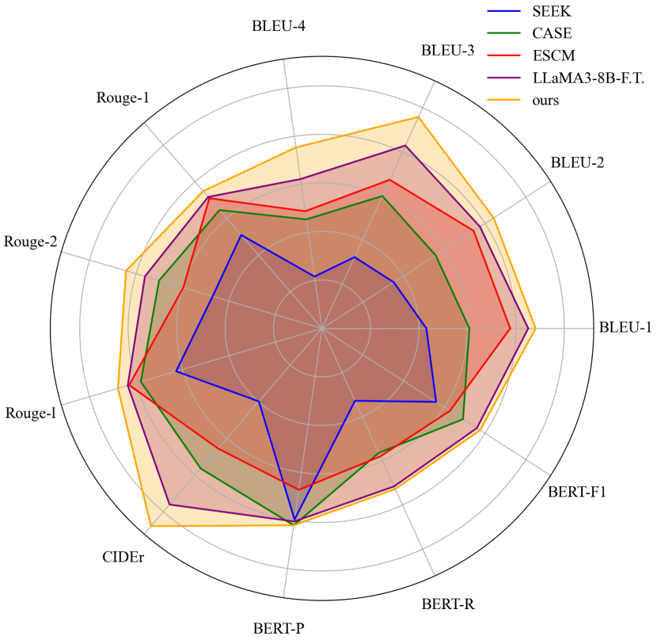
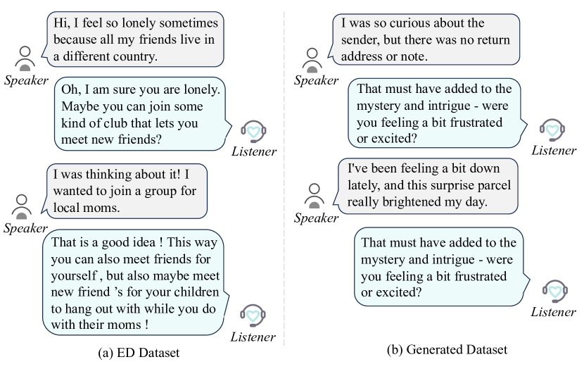
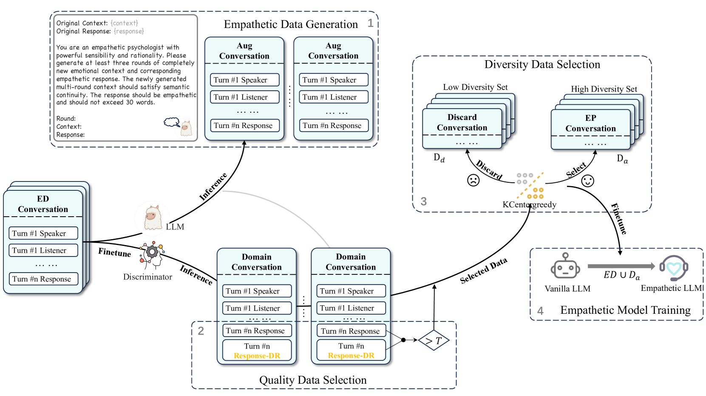
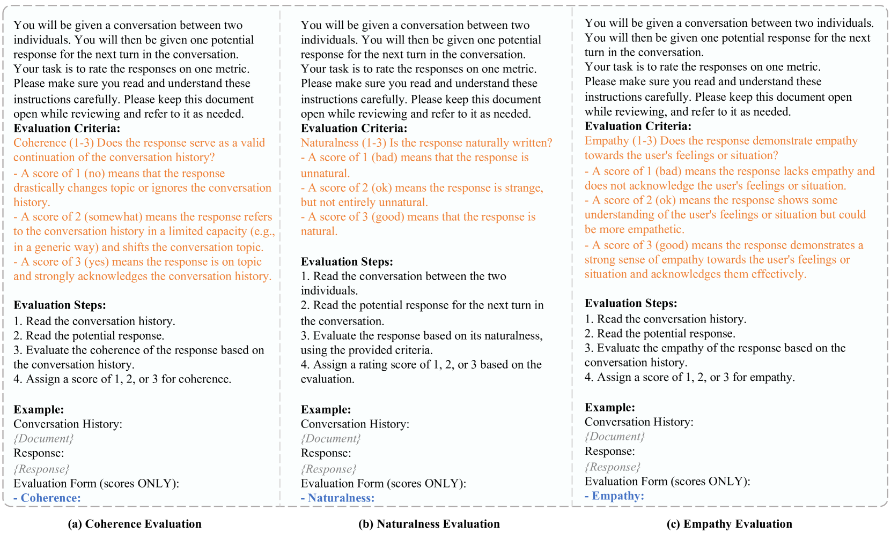
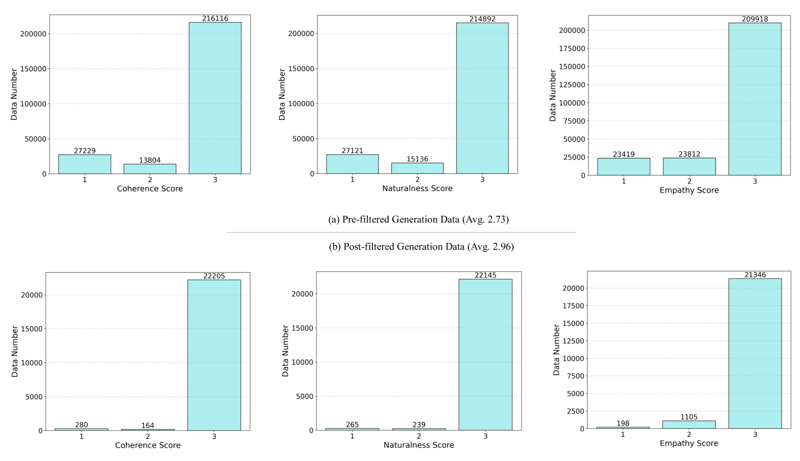
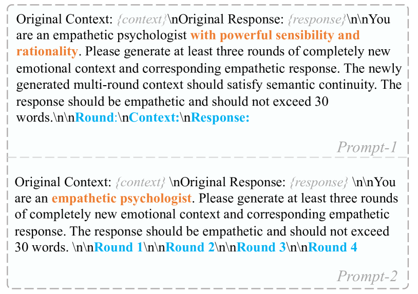
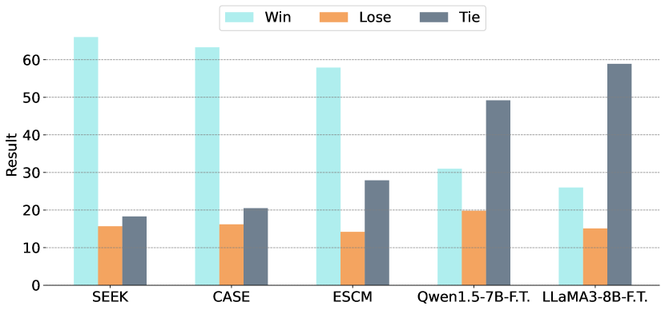
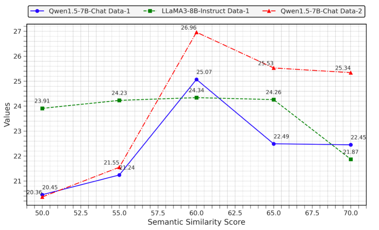

# Synth-Empathy：探索高质量合成共情数据之路

发布时间：2024年07月31日

`LLM应用` `人工智能` `心理健康`

> Synth-Empathy: Towards High-Quality Synthetic Empathy Data

# 摘要

> 随着LLM的迅猛发展，优秀的共情响应能力变得至关重要。为此，我们推出了Synth-Empathy，一个自动生成高质量共情数据并剔除低质量数据的流程。利用这一流程，我们不仅提升了共情响应性能，还在多个基准测试中达到了顶尖水平。我们的模型在人类评估中也表现出色，显示出其在实际应用中的强大效能。同时，我们探讨了数据量与质量的平衡，为共情数据的生成与选择提供了新视角。

> In recent years, with the rapid advancements in large language models (LLMs), achieving excellent empathetic response capabilities has become a crucial prerequisite. Consequently, managing and understanding empathetic datasets have gained increasing significance. However, empathetic data are typically human-labeled, leading to insufficient datasets and wasted human labor. In this work, we present Synth-Empathy, an LLM-based data generation and quality and diversity selection pipeline that automatically generates high-quality empathetic data while discarding low-quality data. With the data generated from a low empathetic model, we are able to further improve empathetic response performance and achieve state-of-the-art (SoTA) results across multiple benchmarks. Moreover, our model achieves SoTA performance on various human evaluation benchmarks, demonstrating its effectiveness and robustness in real-world applications. Furthermore, we show the trade-off between data quantity and quality, providing insights into empathetic data generation and selection.

[Arxiv](https://arxiv.org/abs/2407.21669)