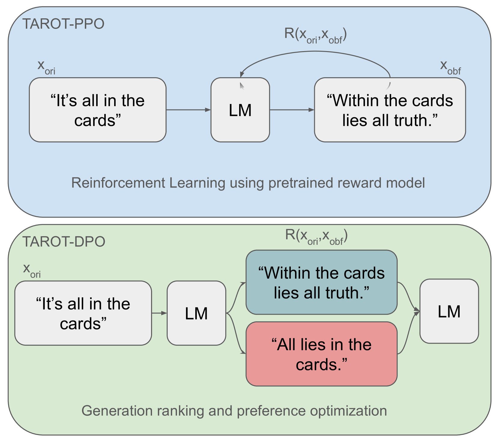
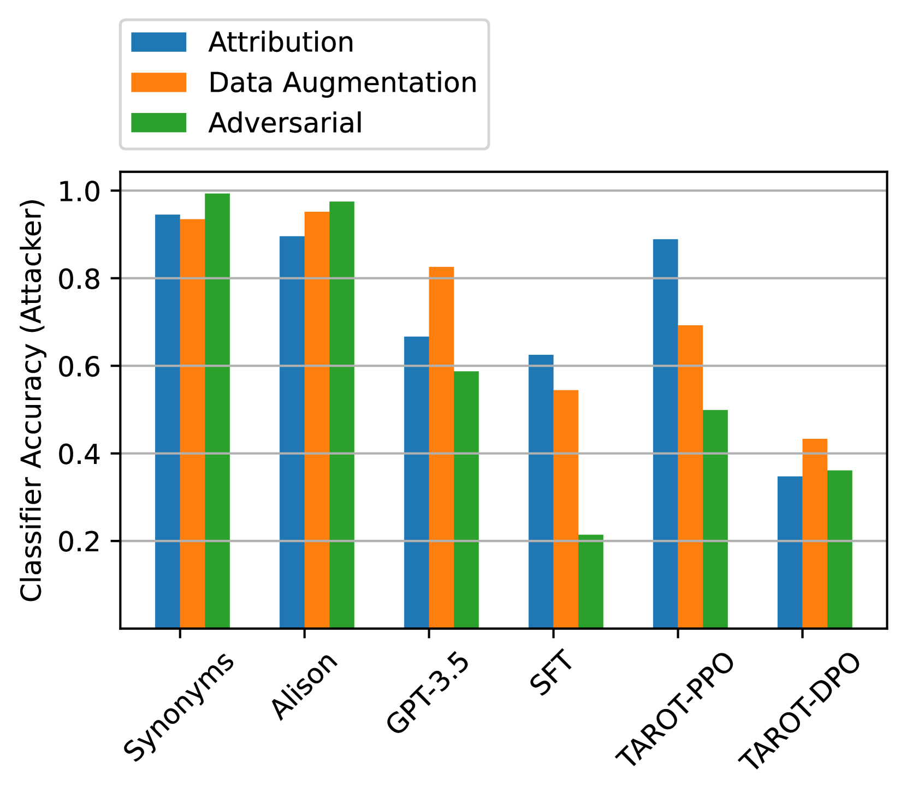
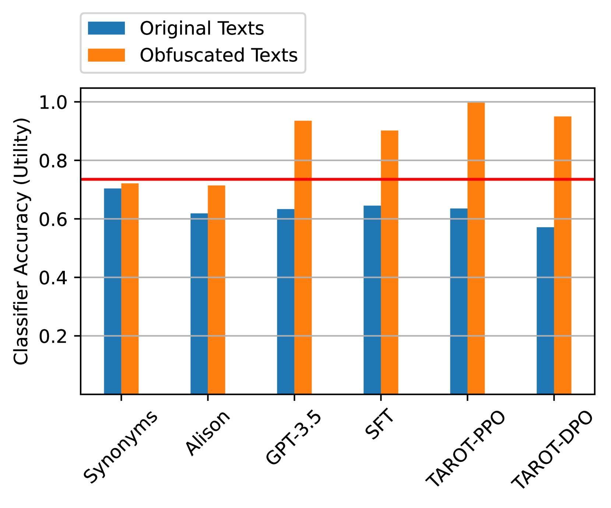
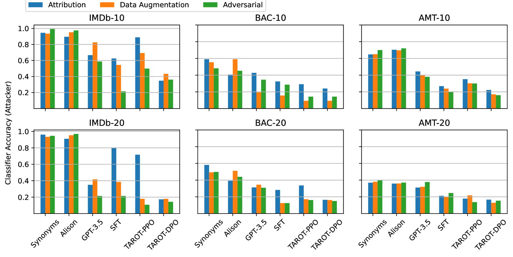
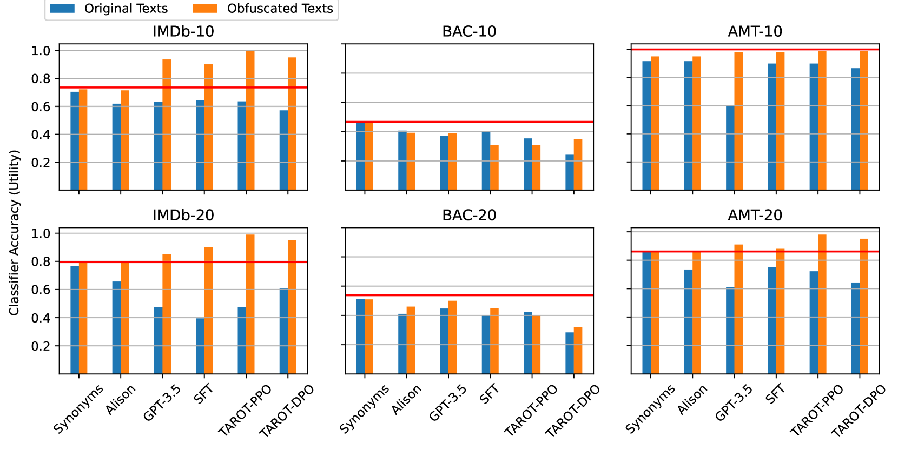

# TAROT：运用策略优化技术实现任务导向的作者身份隐匿

发布时间：2024年07月31日

`LLM应用` `网络安全` `人工智能`

> TAROT: Task-Oriented Authorship Obfuscation Using Policy Optimization Methods

# 摘要

> 作者身份混淆通过调整写作风格、词汇和语法等特征，旨在隐藏文本作者的真实身份。这一过程需巧妙平衡隐私保护与文本实用性。尽管高度混淆能有效隐匿作者身份，却常牺牲文本质量与效用；而追求高实用性则可能泄露隐私，增加被识别的风险。因此，实现隐私与实用性的最佳平衡至关重要。本文介绍的TAROT方法，通过策略优化，无监督地重构文本，兼顾隐私与下游任务的实用性。该方法利用小语言模型进行精细调整，重写文本同时保护作者身份与任务效用，显著降低攻击者识别准确率。我们已公开相关代码与模型，供进一步研究与应用。

> Authorship obfuscation aims to disguise the identity of an author within a text by altering the writing style, vocabulary, syntax, and other linguistic features associated with the text author. This alteration needs to balance privacy and utility. While strong obfuscation techniques can effectively hide the author's identity, they often degrade the quality and usefulness of the text for its intended purpose. Conversely, maintaining high utility tends to provide insufficient privacy, making it easier for an adversary to de-anonymize the author. Thus, achieving an optimal trade-off between these two conflicting objectives is crucial. In this paper, we propose TAROT: Task-Oriented Authorship Obfuscation Using Policy Optimization, a new unsupervised authorship obfuscation method whose goal is to optimize the privacy-utility trade-off by regenerating the entire text considering its downstream utility. Our approach leverages policy optimization as a fine-tuning paradigm over small language models in order to rewrite texts by preserving author identity and downstream task utility. We show that our approach largely reduce the accuracy of attackers while preserving utility. We make our code and models publicly available.

[Arxiv](https://arxiv.org/abs/2407.21630)