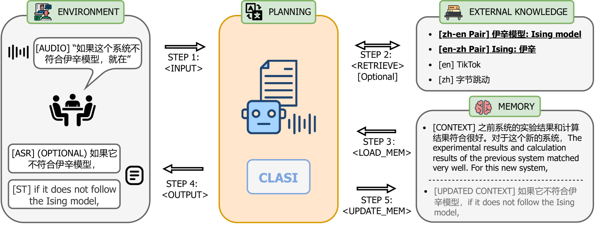
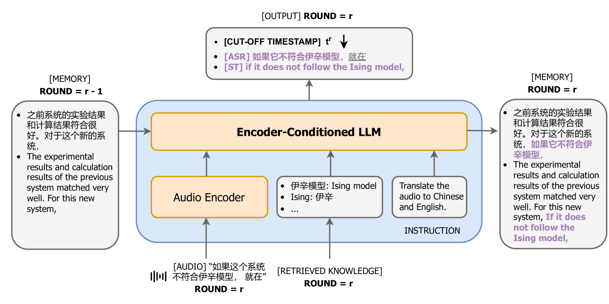

# 致力于通过 LLM 代理实现端到端同时语音翻译的人类同等水平

发布时间：2024年07月31日

`LLM应用` `翻译服务` `语音识别`

> Towards Achieving Human Parity on End-to-end Simultaneous Speech Translation via LLM Agent

# 摘要

> 本文介绍的CLASI系统，是一款高质量、类人化的同步语音翻译工具。借鉴专业口译员的技巧，我们创新性地运用数据驱动的读写策略，巧妙平衡了翻译质量与延迟。针对领域术语翻译难题，CLASI通过多模态检索模块，精准获取相关信息，助力翻译。依托LLM技术，我们的系统能综合音频输入、历史上下文及检索信息，产出容忍度高的翻译结果。实验表明，CLASI性能卓越，远超同类系统。我们采用有效信息比例（VIP）这一更贴近人类评价的指标来评估CLASI，该指标关注信息传达的有效性。在现实演讲场景中，CLASI在中英及英中翻译方向上分别实现了81.3%和78.0%的VIP，而顶尖商业或开源系统仅达35.4%和41.6%。即使在极端困难的数据集上，CLASI依然能保持70%的VIP，远超其他系统的13%以下表现。

> In this paper, we present Cross Language Agent -- Simultaneous Interpretation, CLASI, a high-quality and human-like Simultaneous Speech Translation (SiST) System. Inspired by professional human interpreters, we utilize a novel data-driven read-write strategy to balance the translation quality and latency. To address the challenge of translating in-domain terminologies, CLASI employs a multi-modal retrieving module to obtain relevant information to augment the translation. Supported by LLMs, our approach can generate error-tolerated translation by considering the input audio, historical context, and retrieved information. Experimental results show that our system outperforms other systems by significant margins. Aligned with professional human interpreters, we evaluate CLASI with a better human evaluation metric, valid information proportion (VIP), which measures the amount of information that can be successfully conveyed to the listeners. In the real-world scenarios, where the speeches are often disfluent, informal, and unclear, CLASI achieves VIP of 81.3% and 78.0% for Chinese-to-English and English-to-Chinese translation directions, respectively. In contrast, state-of-the-art commercial or open-source systems only achieve 35.4% and 41.6%. On the extremely hard dataset, where other systems achieve under 13% VIP, CLASI can still achieve 70% VIP.

[Arxiv](https://arxiv.org/abs/2407.21646)