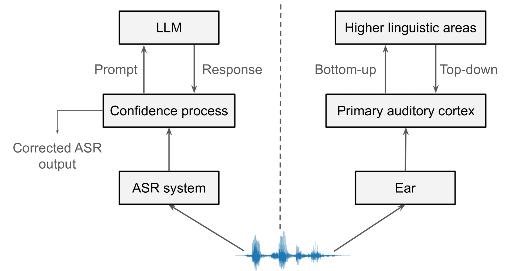
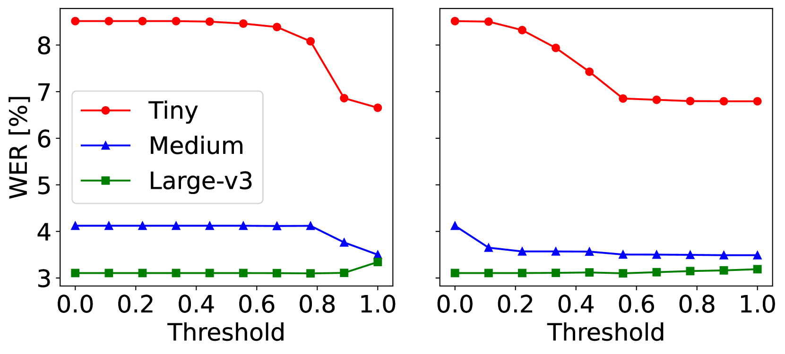
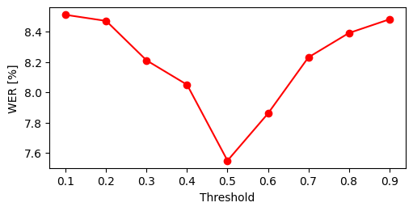

# 通过置信度测量和提示技术，架起大型语言模型与自动语音识别系统之间的桥梁。

发布时间：2024年07月31日

`LLM应用` `语音识别` `人工智能`

> Towards interfacing large language models with ASR systems using confidence measures and prompting

# 摘要

> 随着 LLM 的参数和交互能力提升，它们为 ASR 系统提供了新的接口方式，不再局限于重新评分 n-最佳列表。本研究探索了利用 LLM 对 ASR 转录进行事后校正的方法，并提出了一系列基于置信度的过滤策略，以避免在准确转录中引入错误。实验结果显示，这些方法能有效提升性能较弱的 ASR 系统。

> As large language models (LLMs) grow in parameter size and capabilities, such as interaction through prompting, they open up new ways of interfacing with automatic speech recognition (ASR) systems beyond rescoring n-best lists. This work investigates post-hoc correction of ASR transcripts with LLMs. To avoid introducing errors into likely accurate transcripts, we propose a range of confidence-based filtering methods. Our results indicate that this can improve the performance of less competitive ASR systems.

[Arxiv](https://arxiv.org/abs/2407.21414)