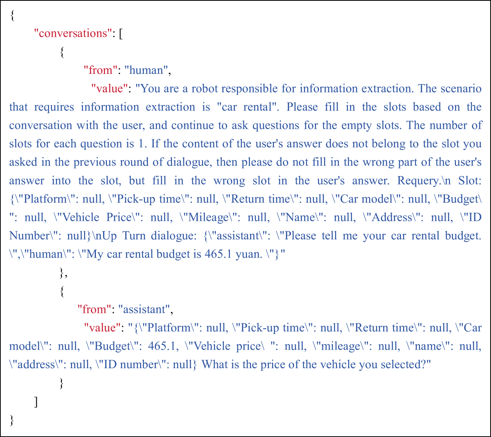

# TransferTOD：一款具备迁移能力、适用于多领域的中文任务导向对话系统

发布时间：2024年07月31日

`LLM应用` `服务行业` `人工智能`

> TransferTOD: A Generalizable Chinese Multi-Domain Task-Oriented Dialogue System with Transfer Capabilities

# 摘要

> 面向任务的对话系统（TOD）致力于高效处理任务导向的对话，特别是信息收集。近期研究显示，大型语言模型（LLMs）在对话、指令生成和推理方面表现卓越，通过微调能大幅提升TOD性能。然而，现有数据集多服务于用户主导系统，且局限于特定预设场景，亟需提升TOD的主动性、多样性和能力。本研究详细介绍了多领域任务导向对话数据构建流程，并基于此生成了中文对话数据集**TransferTOD**，真实模拟了30个生活服务场景的人机对话。通过全参数微调，我们训练了**TransferTOD-7B**模型，显著提升了槽位填充和提问能力。该工作在多下游场景中展现了强大泛化能力，大幅提升了数据利用效率和系统性能。数据已发布于https://github.com/KongLongGeFDU/TransferTOD。

> Task-oriented dialogue (TOD) systems aim to efficiently handle task-oriented conversations, including information gathering. How to utilize ToD accurately, efficiently and effectively for information gathering has always been a critical and challenging task. Recent studies have demonstrated that Large Language Models (LLMs) excel in dialogue, instruction generation, and reasoning, and can significantly enhance the performance of TOD through fine-tuning. However, current datasets primarily cater to user-led systems and are limited to predefined specific scenarios and slots, thereby necessitating improvements in the proactiveness, diversity, and capabilities of TOD. In this study, we present a detailed multi-domain task-oriented data construction process for conversations, and a Chinese dialogue dataset generated based on this process, \textbf{TransferTOD}, which authentically simulates human-machine dialogues in 30 popular life service scenarios. Leveraging this dataset, we trained a \textbf{TransferTOD-7B} model using full-parameter fine-tuning, showcasing notable abilities in slot filling and questioning. Our work has demonstrated its strong generalization capabilities in various downstream scenarios, significantly enhancing both data utilization efficiency and system performance. The data is released in https://github.com/KongLongGeFDU/TransferTOD.

[Arxiv](https://arxiv.org/abs/2407.21693)