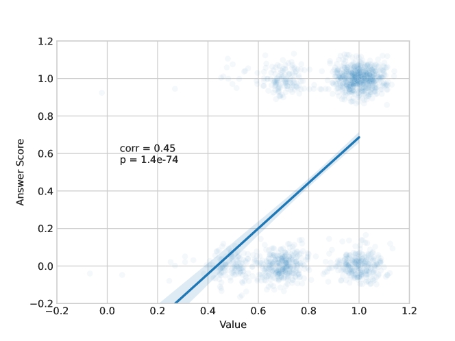

# Tree-of-Traversals：一种结合知识图谱，提升黑盒语言模型零-shot 推理能力的算法。

发布时间：2024年07月31日

`LLM应用` `知识图谱` `问答系统`

> Tree-of-Traversals: A Zero-Shot Reasoning Algorithm for Augmenting Black-box Language Models with Knowledge Graphs

# 摘要

> 知识图谱 (KGs) 为大型语言模型 (LLMs) 提供了可靠、结构化、领域特定且最新的外部知识，从而进行补充。然而，KGs 和 LLMs 通常独立开发，需在训练后集成。我们提出的 Tree-of-Traversals 是一种创新的零-shot 推理算法，它使黑盒 LLMs 能够通过一个或多个 KGs 进行增强。该算法赋予 LLM 与 KG 交互的能力，并支持 LLM 在可能的思想和操作上进行树搜索，以发现高置信度的推理路径。实验结果表明，Tree-of-Traversals 在问答和 KG 问答任务上显著提升了性能。相关代码已公开在 \url{https://github.com/amazon-science/tree-of-traversals}。

> Knowledge graphs (KGs) complement Large Language Models (LLMs) by providing reliable, structured, domain-specific, and up-to-date external knowledge. However, KGs and LLMs are often developed separately and must be integrated after training. We introduce Tree-of-Traversals, a novel zero-shot reasoning algorithm that enables augmentation of black-box LLMs with one or more KGs. The algorithm equips a LLM with actions for interfacing a KG and enables the LLM to perform tree search over possible thoughts and actions to find high confidence reasoning paths. We evaluate on two popular benchmark datasets. Our results show that Tree-of-Traversals significantly improves performance on question answering and KG question answering tasks. Code is available at \url{https://github.com/amazon-science/tree-of-traversals}

[Arxiv](https://arxiv.org/abs/2407.21358)