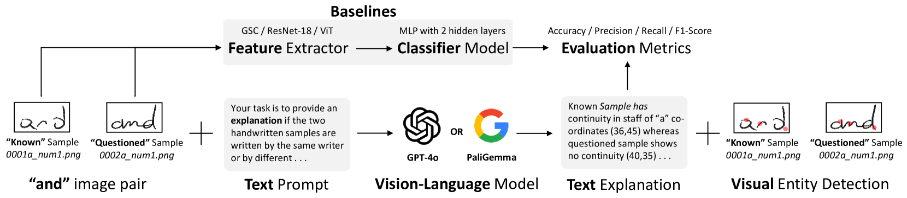

# 基于视觉-语言模型的手写识别技术

发布时间：2024年07月31日

`LLM应用` `文档取证` `人工智能`

> Vision-Language Model Based Handwriting Verification

# 摘要

> 手写验证在文档取证领域极为关键。深度学习方法因缺乏透明度和对大量训练数据的依赖，常遭质疑。本文探索利用视觉语言模型（如OpenAI的GPT-4o和Google的PaliGemma）来解决这些问题。通过视觉问答和零-shot思维链推理，我们旨在提供直观易懂的决策解释。实验显示，VLMs增强了可解释性，减少了对庞大数据集的依赖，并能更好地适应各种手写风格。尽管如此，基于CNN的ResNet-18架构在准确性上仍领先，达到84%，而GPT-4o和PaliGemma分别为70%和71%。这表明VLMs虽有潜力，但仍需进步以媲美专用深度学习模型的性能。

> Handwriting Verification is a critical in document forensics. Deep learning based approaches often face skepticism from forensic document examiners due to their lack of explainability and reliance on extensive training data and handcrafted features. This paper explores using Vision Language Models (VLMs), such as OpenAI's GPT-4o and Google's PaliGemma, to address these challenges. By leveraging their Visual Question Answering capabilities and 0-shot Chain-of-Thought (CoT) reasoning, our goal is to provide clear, human-understandable explanations for model decisions. Our experiments on the CEDAR handwriting dataset demonstrate that VLMs offer enhanced interpretability, reduce the need for large training datasets, and adapt better to diverse handwriting styles. However, results show that the CNN-based ResNet-18 architecture outperforms the 0-shot CoT prompt engineering approach with GPT-4o (Accuracy: 70%) and supervised fine-tuned PaliGemma (Accuracy: 71%), achieving an accuracy of 84% on the CEDAR AND dataset. These findings highlight the potential of VLMs in generating human-interpretable decisions while underscoring the need for further advancements to match the performance of specialized deep learning models.

[Arxiv](https://arxiv.org/abs/2407.21788)