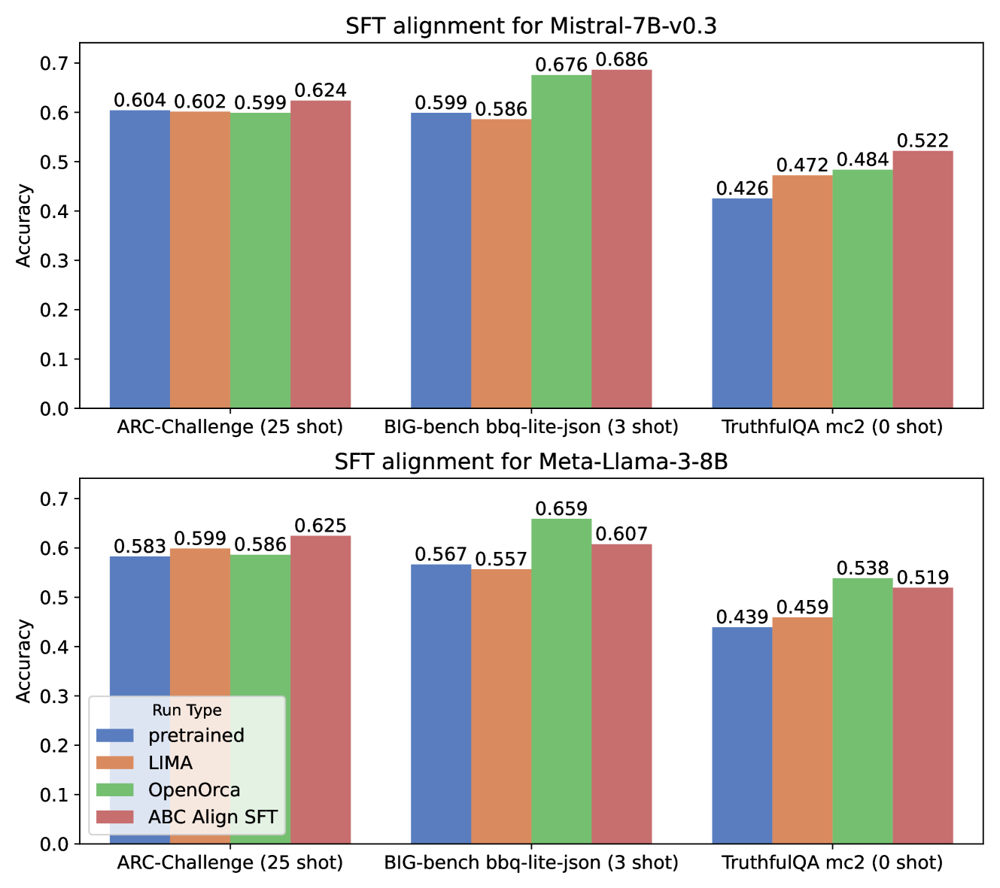
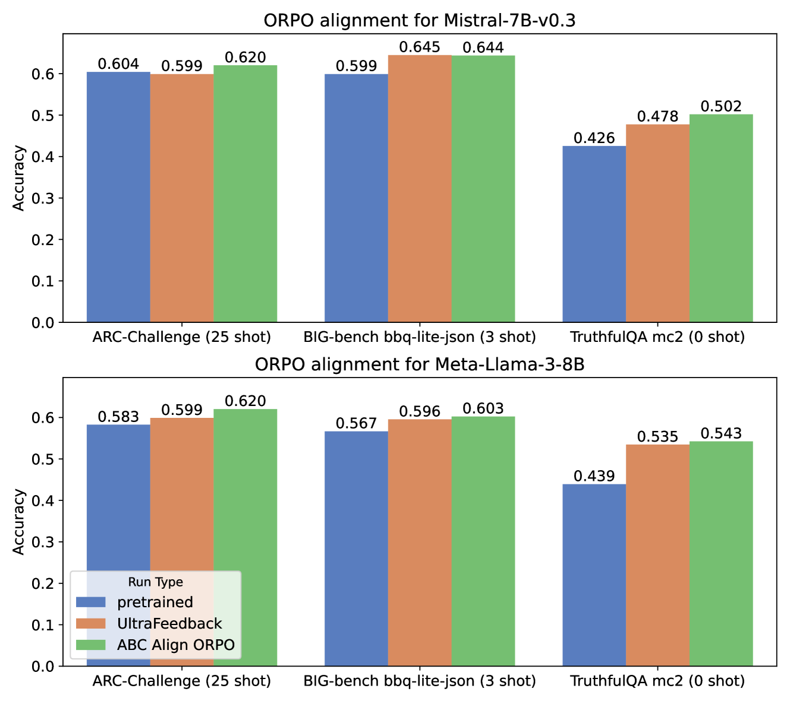
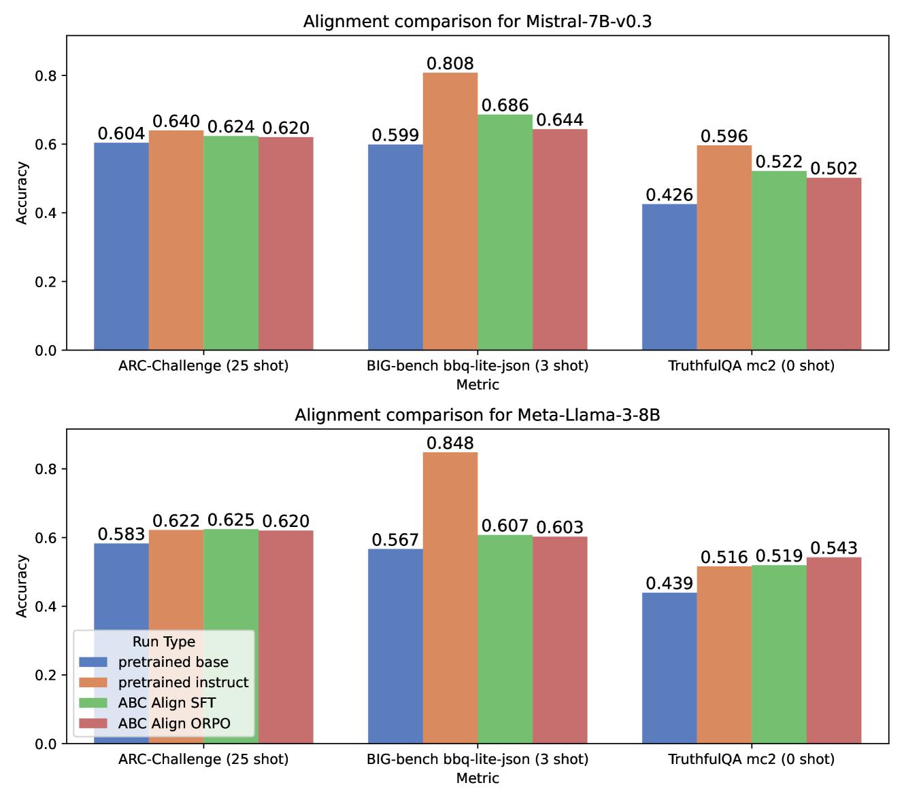

# ABC Align：专为提升安全和准确性而设计的大型语言模型对齐方案

发布时间：2024年08月01日

`LLM应用` `人工智能`

> ABC Align: Large Language Model Alignment for Safety & Accuracy

# 摘要

> 大型语言模型的对齐问题尚未解决。人类偏好多样且多层次，从个体到群体皆可捕捉。组织偏好通过标准和原则体现，旨在降低声誉风险或履行法律义务。本文介绍的 ABC Align 方法，能将大型媒体组织的标准与偏好融入 LLM，结合合成数据生成、偏好优化及训练后量化等前沿技术，有效减少偏见，提升准确性，同时保持推理能力，通过标准测试验证。

> Alignment of Large Language Models (LLMs) remains an unsolved problem. Human preferences are highly distributed and can be captured at multiple levels of abstraction, from the individual to diverse populations. Organisational preferences, represented by standards and principles, are defined to mitigate reputational risk or meet legislative obligations. In this paper, we present ABC Align, a novel alignment methodology for LLMs that enables integration of the standards and preferences of a large media organisation into the LLM itself. We combine a set of data and methods that build on recent breakthroughs in synthetic data generation, preference optimisation, and post-training model quantisation. Our unified approach mitigates bias and improves accuracy, while preserving reasoning capability, as measured against standard benchmarks.

[Arxiv](https://arxiv.org/abs/2408.00307)