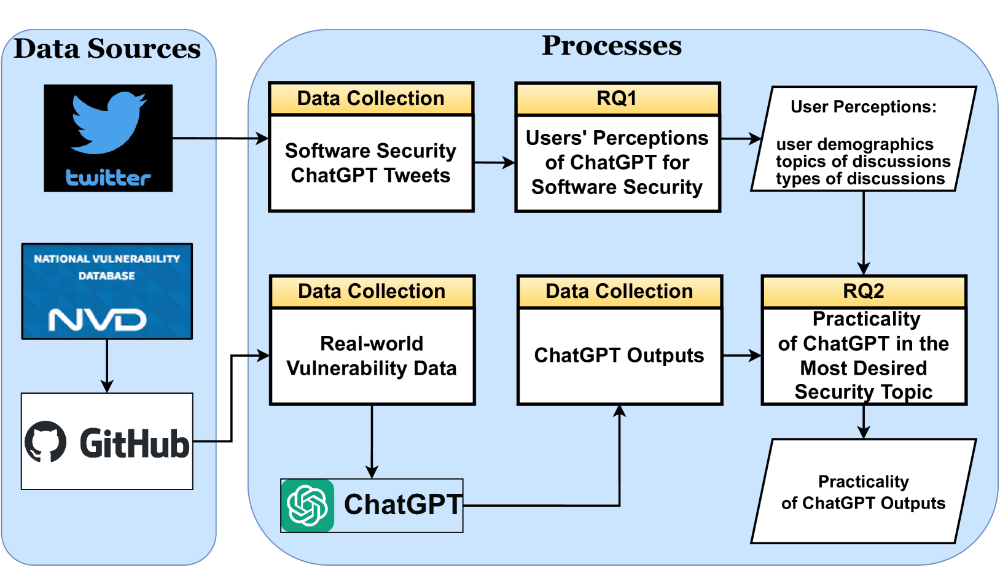
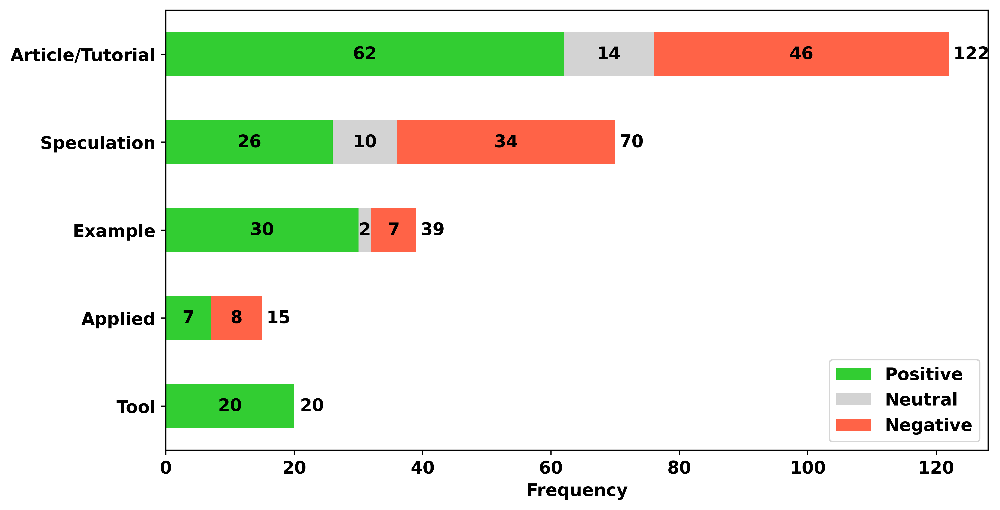
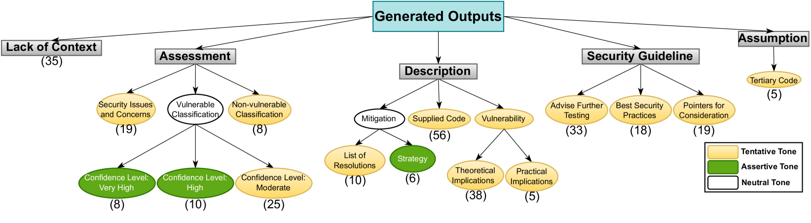

# 探究 ChatGPT 在软件安全中的应用：感知与实际性的对比研究

发布时间：2024年08月01日

`LLM应用` `软件安全` `人工智能`

> A Qualitative Study on Using ChatGPT for Software Security: Perception vs. Practicality

# 摘要

> AI 的进步催生了能够出色完成多种任务的大型语言模型（LLMs），如 ChatGPT 因其强大的知识密集型任务辅助能力而备受瞩目。鉴于软件安全工程的高度知识密集性，ChatGPT 在软件开发与演进中的安全任务辅助潜力值得深入探索。为此，我们采取了双重研究策略：首先，通过分析 Twitter 上关于 ChatGPT 在安全任务应用的讨论，了解安全专家的看法，发现他们普遍认为 ChatGPT 在漏洞检测、信息检索及渗透测试等任务中颇具价值。其次，我们设计实验，评估 ChatGPT 在实际环境中作为漏洞检测工具的表现，结果显示其输出多为通用安全信息，可能不适用于专业领域。为确保数据安全，我们使用的漏洞数据集涵盖了 40 种漏洞类型和 12 种编程语言，且在 OpenAI 数据截止后编制。本研究成果将为未来专门针对软件安全的 LLMs 开发与评估研究提供重要参考。

> Artificial Intelligence (AI) advancements have enabled the development of Large Language Models (LLMs) that can perform a variety of tasks with remarkable semantic understanding and accuracy. ChatGPT is one such LLM that has gained significant attention due to its impressive capabilities for assisting in various knowledge-intensive tasks. Due to the knowledge-intensive nature of engineering secure software, ChatGPT's assistance is expected to be explored for security-related tasks during the development/evolution of software. To gain an understanding of the potential of ChatGPT as an emerging technology for supporting software security, we adopted a two-fold approach. Initially, we performed an empirical study to analyse the perceptions of those who had explored the use of ChatGPT for security tasks and shared their views on Twitter. It was determined that security practitioners view ChatGPT as beneficial for various software security tasks, including vulnerability detection, information retrieval, and penetration testing. Secondly, we designed an experiment aimed at investigating the practicality of this technology when deployed as an oracle in real-world settings. In particular, we focused on vulnerability detection and qualitatively examined ChatGPT outputs for given prompts within this prominent software security task. Based on our analysis, responses from ChatGPT in this task are largely filled with generic security information and may not be appropriate for industry use. To prevent data leakage, we performed this analysis on a vulnerability dataset compiled after the OpenAI data cut-off date from real-world projects covering 40 distinct vulnerability types and 12 programming languages. We assert that the findings from this study would contribute to future research aimed at developing and evaluating LLMs dedicated to software security.

[Arxiv](https://arxiv.org/abs/2408.00435)