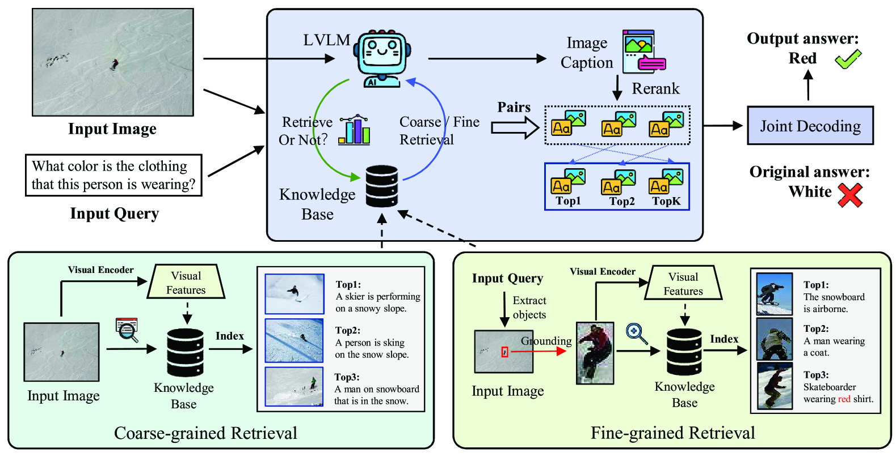

# 通过主动检索增强技术，缓解大型视觉-语言模型中的幻觉现象。

发布时间：2024年08月01日

`RAG` `计算机视觉` `人工智能`

> Alleviating Hallucination in Large Vision-Language Models with Active Retrieval Augmentation

# 摘要

> 尽管大型视觉-语言模型（LVLMs）在图像理解上表现卓越，但它们常生成看似合理却事实错误的回答，即所谓的“幻觉”现象。近期，通过从外部知识源检索信息来增强大语言模型（LLMs）已被证实是减轻幻觉的有效途径。然而，在LVLM领域，检索增强技术的发展却远不及LVLM的广泛应用，甚至在某些情况下加剧了模型的幻觉问题。鉴于此，我们提出了一个创新的框架——主动检索增强大型视觉-语言模型（ARA），旨在通过三个关键维度来解决幻觉问题：（i）基于图像的内在层次结构精准定位检索目标；（ii）筛选最有效的检索方法并确保检索结果的可靠性；（iii）在模型不确定性较低时进行检索，避免在高度确定时进行不必要检索。我们通过在四个基准上测试三种主流LVLM模型（LLaVA-1.5、Qwen-VL和mPLUG-Owl2）来评估ARA模型减少幻觉的效果。实证结果显示，通过优化检索机制和时机，ARA能有效降低幻觉现象。我们期待这项研究能为如何在LVLMs中更高效地应用检索增强技术以减少幻觉提供新的视角。

> Despite the remarkable ability of large vision-language models (LVLMs) in image comprehension, these models frequently generate plausible yet factually incorrect responses, a phenomenon known as hallucination.Recently, in large language models (LLMs), augmenting LLMs by retrieving information from external knowledge resources has been proven as a promising solution to mitigate hallucinations.However, the retrieval augmentation in LVLM significantly lags behind the widespread applications of LVLM. Moreover, when transferred to augmenting LVLMs, sometimes the hallucination degree of the model is even exacerbated.Motivated by the research gap and counter-intuitive phenomenon, we introduce a novel framework, the Active Retrieval-Augmented large vision-language model (ARA), specifically designed to address hallucinations by incorporating three critical dimensions: (i) dissecting the retrieval targets based on the inherent hierarchical structures of images. (ii) pinpointing the most effective retrieval methods and filtering out the reliable retrieval results. (iii) timing the retrieval process to coincide with episodes of low certainty, while circumventing unnecessary retrieval during periods of high certainty. To assess the capability of our proposed ARA model in reducing hallucination, we employ three widely used LVLM models (LLaVA-1.5, Qwen-VL, and mPLUG-Owl2) across four benchmarks. Our empirical observations suggest that by utilizing fitting retrieval mechanisms and timing the retrieval judiciously, we can effectively mitigate the hallucination problem. We hope that this study can provide deeper insights into how to adapt the retrieval augmentation to LVLMs for reducing hallucinations with more effective retrieval and minimal retrieval occurrences.

[Arxiv](https://arxiv.org/abs/2408.00555)