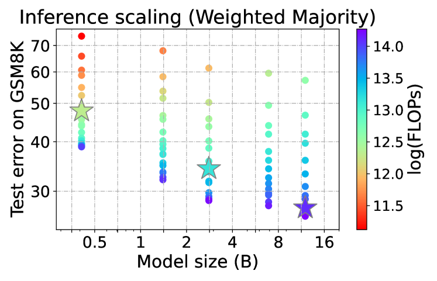
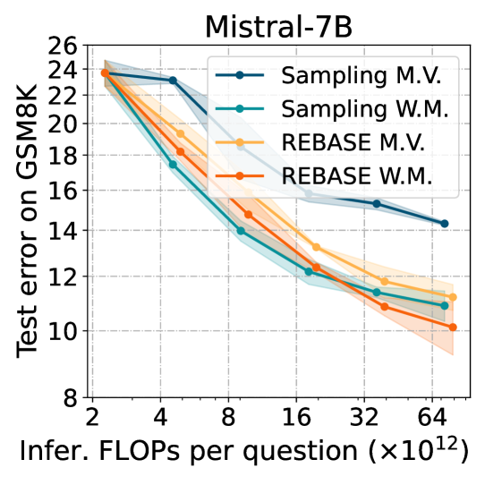

# 实证分析：语言模型在问题解决中的计算最优推理

发布时间：2024年08月01日

`LLM理论` `移动设备` `人工智能`

> An Empirical Analysis of Compute-Optimal Inference for Problem-Solving with Language Models

# 摘要

> 尽管大型语言模型（LLM）的最佳训练配置已广泛研究，但推理过程中的最优配置仍待深入探讨。我们专注于计算最优的推理策略，旨在通过权衡额外的计算资源来提升性能。初步研究显示，结合先进树搜索算法的小型模型能在计算效率和性能间达到理想平衡。这表明，在资源受限环境下，如移动设备，采用此类模型能有效提升问题解决精度。例如，Llemma-7B模型在MATH500任务上，以半数计算量实现了与Llemma-34B相当的精度。这一发现有望推广至各类生成任务，尤其是那些对成功有明确评估标准的场景。

> The optimal training configurations of large language models (LLMs) with respect to model sizes and compute budgets have been extensively studied. But how to optimally configure LLMs during inference has not been explored in sufficient depth. We study compute-optimal inference: designing models and inference strategies that optimally trade off additional inference-time compute for improved performance. As a first step towards understanding and designing compute-optimal inference methods, we assessed the effectiveness and computational efficiency of multiple inference strategies such as Greedy Search, Majority Voting, Best-of-N, Weighted Voting, and their variants on two different Tree Search algorithms, involving different model sizes and computational budgets. We found that a smaller language model with a novel tree search algorithm typically achieves a Pareto-optimal trade-off. These results highlight the potential benefits of deploying smaller models equipped with more sophisticated decoding algorithms in budget-constrained scenarios, e.g., on end-devices, to enhance problem-solving accuracy. For instance, we show that the Llemma-7B model can achieve competitive accuracy to a Llemma-34B model on MATH500 while using $2\times$ less FLOPs. Our findings could potentially apply to any generation task with a well-defined measure of success.

[Arxiv](https://arxiv.org/abs/2408.00724)