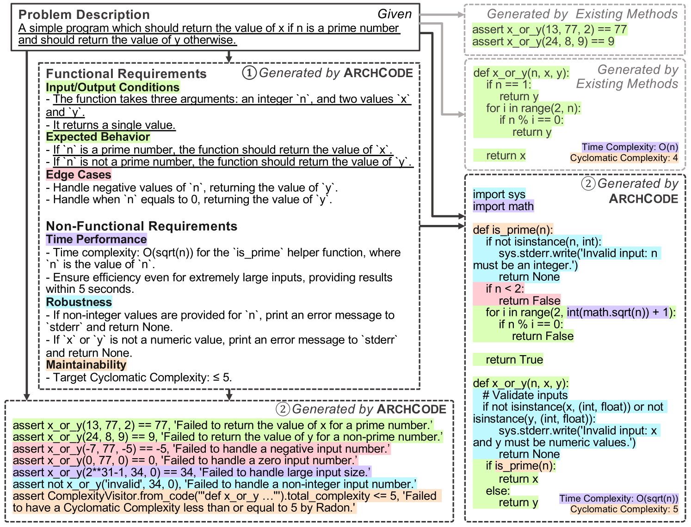

# ArchCode：利用大型语言模型，在代码生成过程中巧妙融入软件需求。

发布时间：2024年08月01日

`LLM应用` `软件开发` `人工智能`

> ArchCode: Incorporating Software Requirements in Code Generation with Large Language Models

# 摘要

> 本文旨在提升大型语言模型（LLM）的代码生成能力，使其能自动处理从文本描述中提取的全面软件需求，涵盖功能性和非功能性需求。我们提出了ARCHCODE框架，该框架利用上下文学习解析文本描述中的需求，并推断未明确表达的需求。ARCHCODE不仅能从描述中生成需求，还能据此生成代码片段和定制测试用例，确保代码质量。公共基准测试表明，ARCHCODE在满足功能需求方面表现出色，大幅提升了Pass@k评分。此外，我们首次推出了HumanEval-NFR评估，专门针对LLM在代码生成中的非功能需求，进一步证明了ARCHCODE的领先地位。ARCHCODE框架和HumanEval-NFR评估均已公开，供业界参考和使用。

> This paper aims to extend the code generation capability of large language models (LLMs) to automatically manage comprehensive software requirements from given textual descriptions. Such requirements include both functional (i.e. achieving expected behavior for inputs) and non-functional (e.g., time/space performance, robustness, maintainability) requirements. However, textual descriptions can either express requirements verbosely or may even omit some of them. We introduce ARCHCODE, a novel framework that leverages in-context learning to organize requirements observed in descriptions and to extrapolate unexpressed requirements from them. ARCHCODE generates requirements from given descriptions, conditioning them to produce code snippets and test cases. Each test case is tailored to one of the requirements, allowing for the ranking of code snippets based on the compliance of their execution results with the requirements. Public benchmarks show that ARCHCODE enhances to satisfy functional requirements, significantly improving Pass@k scores. Furthermore, we introduce HumanEval-NFR, the first evaluation of LLMs' non-functional requirements in code generation, demonstrating ARCHCODE's superiority over baseline methods. The implementation of ARCHCODE and the HumanEval-NFR benchmark are both publicly accessible.

[Arxiv](https://arxiv.org/abs/2408.00994)