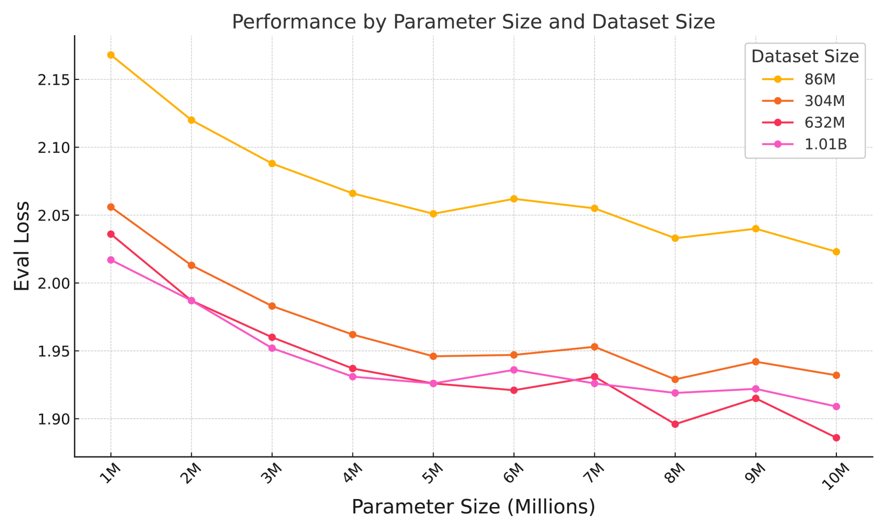
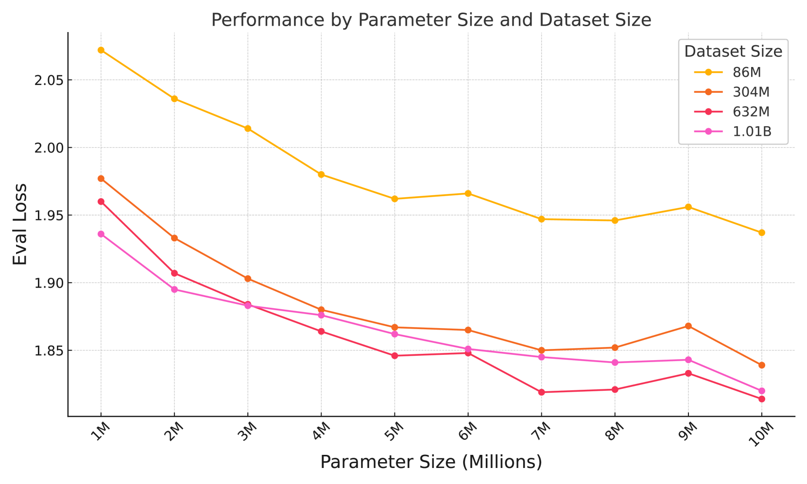
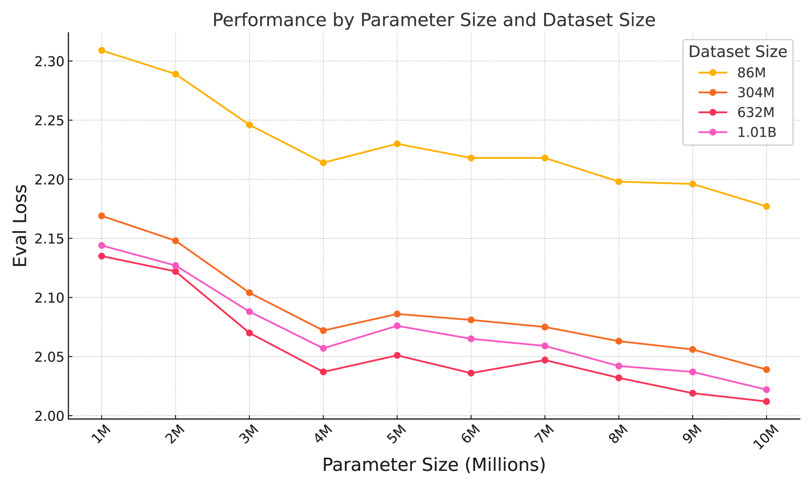

# 视觉大型模型中，编码器越大是否总是越优？

发布时间：2024年08月01日

`LLM理论` `人工智能` `计算机视觉`

> Are Bigger Encoders Always Better in Vision Large Models?

# 摘要

> 近年来，多模态大型语言模型（MLLMs）在实际应用中展现出巨大潜力，尤其在理解多模态信息和强大的认知推理能力方面表现突出。其中，视觉语言模型（VLM）因其对视觉信息的理解能力而备受瞩目。然而，关于VLM在当前主流范式下的扩展趋势研究尚不充分，是否通过训练更大模型能提升性能仍是个谜。为此，我们在MLLMs的预训练阶段进行了实验，采用不同大小的编码器和大型语言模型（LLM）。实验结果显示，单纯扩大编码器尺寸未必能提升VLM性能。同时，我们深入分析了LLM主干参数大小和数据质量对预训练效果的影响，并探讨了LLMs与VLMs在扩展规律上的差异。

> In recent years, multimodal large language models (MLLMs) have shown strong potential in real-world applications. They are developing rapidly due to their remarkable ability to comprehend multimodal information and their inherent powerful cognitive and reasoning capabilities. Among MLLMs, vision language models (VLM) stand out for their ability to understand vision information. However, the scaling trend of VLMs under the current mainstream paradigm has not been extensively studied. Whether we can achieve better performance by training even larger models is still unclear. To address this issue, we conducted experiments on the pretraining stage of MLLMs. We conduct our experiment using different encoder sizes and large language model (LLM) sizes. Our findings indicate that merely increasing the size of encoders does not necessarily enhance the performance of VLMs. Moreover, we analyzed the effects of LLM backbone parameter size and data quality on the pretraining outcomes. Additionally, we explored the differences in scaling laws between LLMs and VLMs.

[Arxiv](https://arxiv.org/abs/2408.00620)