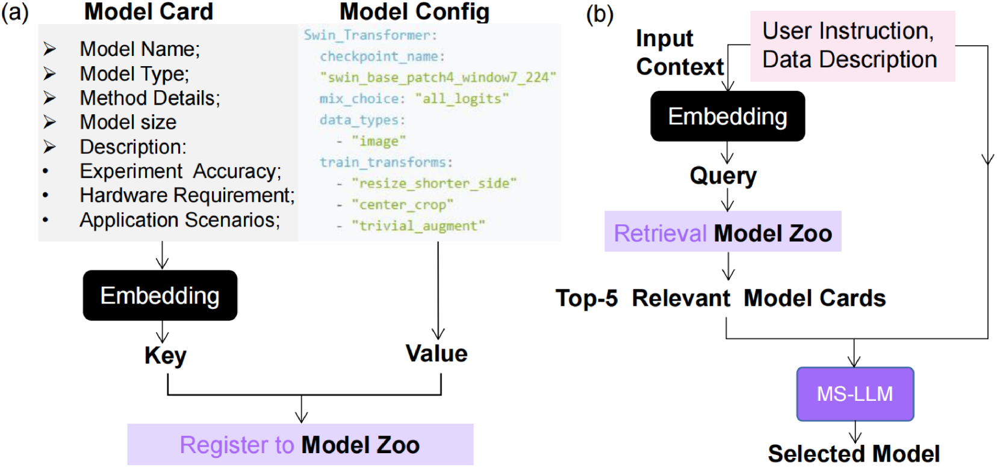

# AutoM3L：一款集成大型语言模型的自动化多模态机器学习框架

发布时间：2024年08月01日

`LLM应用` `自动化` `机器学习`

> AutoM3L: An Automated Multimodal Machine Learning Framework with Large Language Models

# 摘要

> 自动化机器学习（AutoML）为简化模型训练提供了新途径，但现有框架多限于单模态且需繁琐手动配置。大型语言模型（LLM）在推理、交互和代码生成方面的突破，为更自动化、用户友好的框架开发带来契机。我们推出的AutoM3L框架，利用LLM自动构建多模态训练流程，智能识别数据模态并按需选模，实现高度自动化与交互性。该框架免除了手动特征工程和参数调优，简化了用户操作，通过指令定制，突破了传统基于规则的AutoML局限。在涵盖分类、回归、检索的多模态数据集及单模态数据集的广泛测试中，AutoM3L表现优异，性能超越或媲美传统AutoML。用户研究进一步证实了其易用性与实用性。

> Automated Machine Learning (AutoML) offers a promising approach to streamline the training of machine learning models. However, existing AutoML frameworks are often limited to unimodal scenarios and require extensive manual configuration. Recent advancements in Large Language Models (LLMs) have showcased their exceptional abilities in reasoning, interaction, and code generation, presenting an opportunity to develop a more automated and user-friendly framework. To this end, we introduce AutoM3L, an innovative Automated Multimodal Machine Learning framework that leverages LLMs as controllers to automatically construct multimodal training pipelines. AutoM3L comprehends data modalities and selects appropriate models based on user requirements, providing automation and interactivity. By eliminating the need for manual feature engineering and hyperparameter optimization, our framework simplifies user engagement and enables customization through directives, addressing the limitations of previous rule-based AutoML approaches. We evaluate the performance of AutoM3L on six diverse multimodal datasets spanning classification, regression, and retrieval tasks, as well as a comprehensive set of unimodal datasets. The results demonstrate that AutoM3L achieves competitive or superior performance compared to traditional rule-based AutoML methods. Furthermore, a user study highlights the user-friendliness and usability of our framework, compared to the rule-based AutoML methods.

[Arxiv](https://arxiv.org/abs/2408.00665)