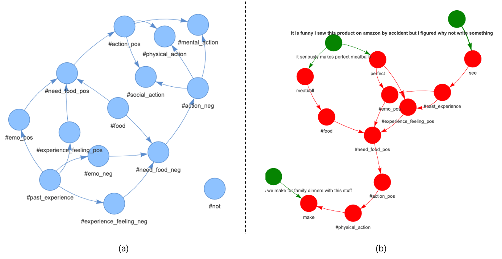
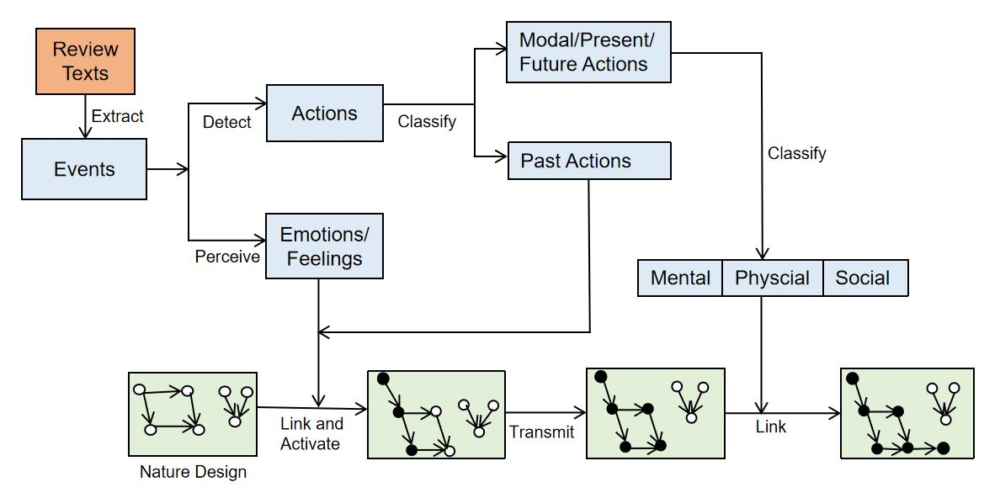
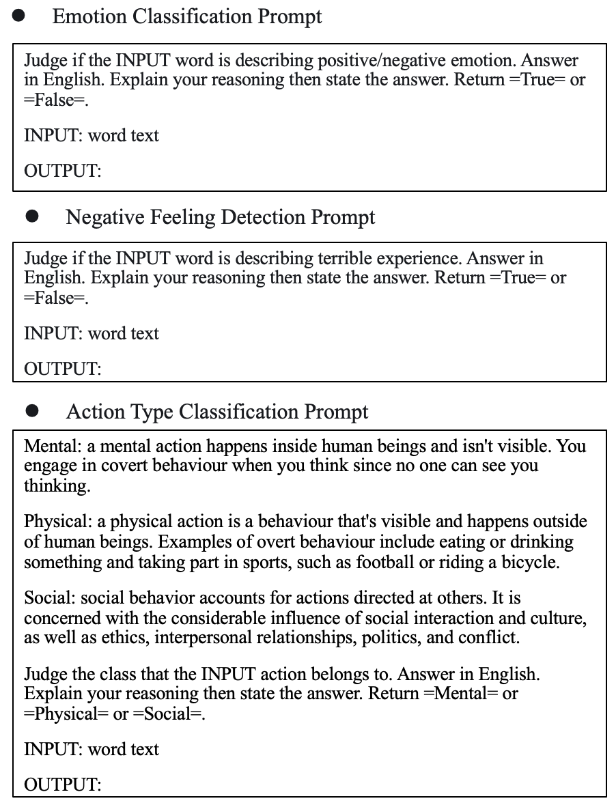
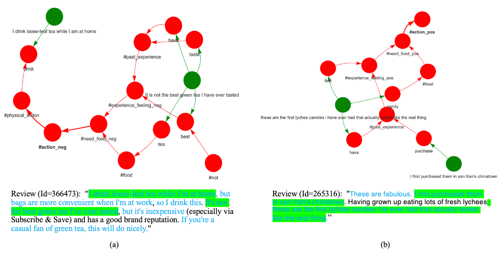
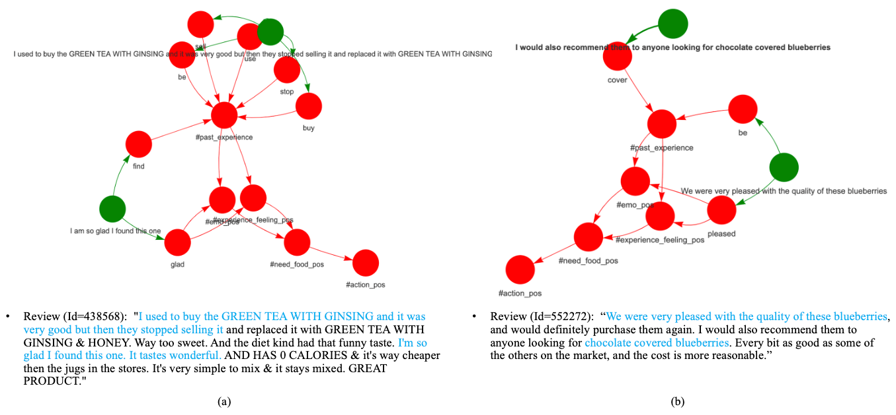
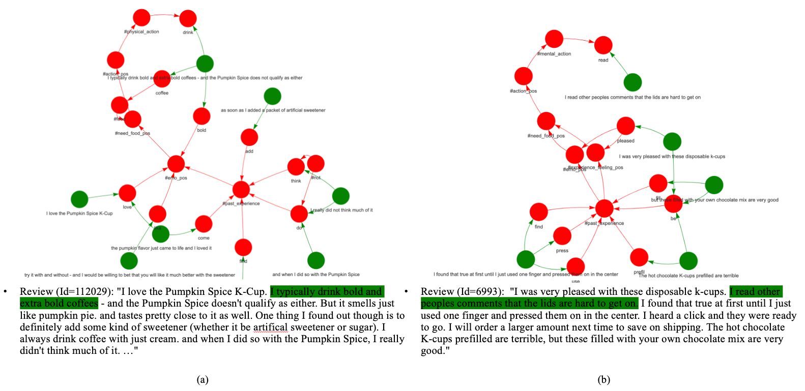
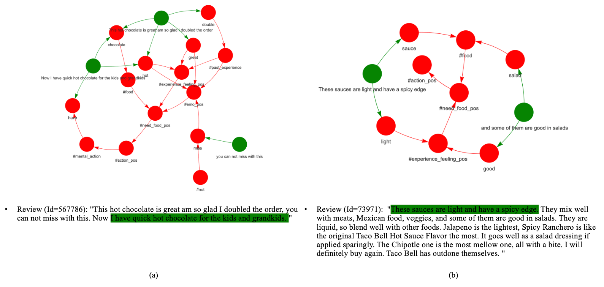
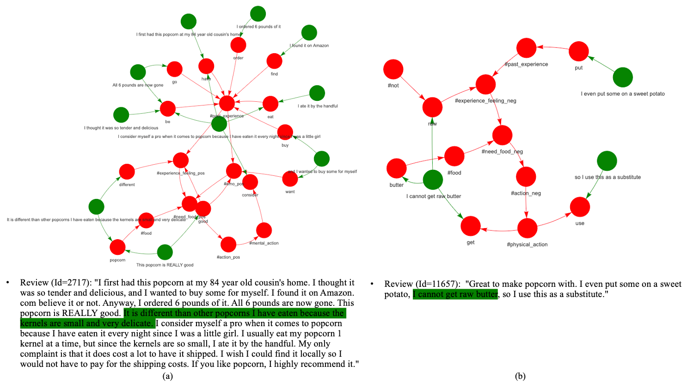
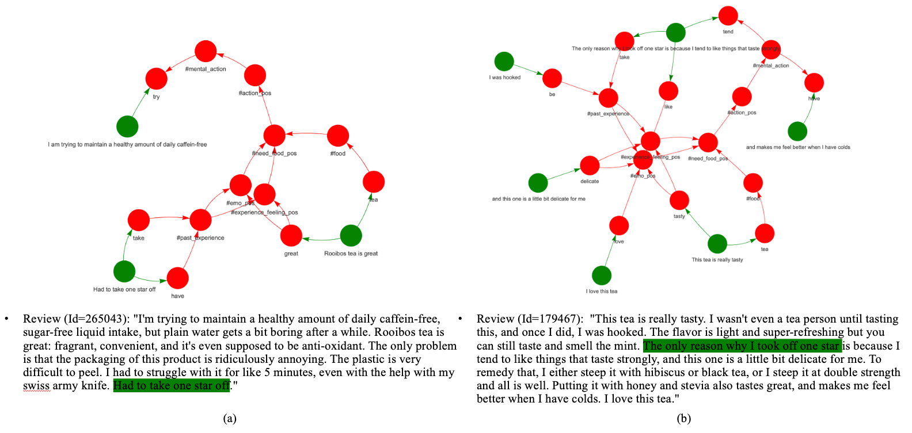
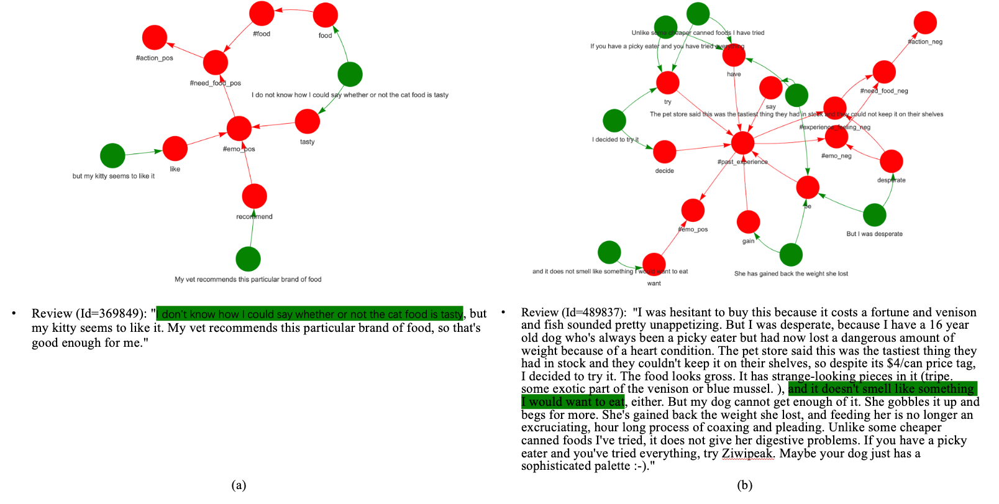

# 自动解析自然语言文本中的动机、情感与行为间的关联

发布时间：2024年08月01日

`LLM应用` `情感分析`

> Automatic Extraction of Relationships among Motivations, Emotions and Actions from Natural Language Texts

# 摘要

> 我们创新性地构建了一个基于图的框架，旨在清晰展现自然语言文本中动机、情绪与行为间的关联。通过设计一个有向无环图，我们描绘了人类本性，并结合培养信念，将外部事件与本性图相连接。得益于大型语言模型的强大能力，本研究无需依赖任何注释资源。我们选取了亚马逊Fine Foods Reviews数据集，聚焦于食物相关动机，成功生成了92,990个关系图，其中63%逻辑自洽。为进一步优化，我们深入分析了错误类型，为未来的研究指明了方向。

> We propose a new graph-based framework to reveal relationships among motivations, emotions and actions explicitly given natural language texts. A directed acyclic graph is designed to describe human's nature. Nurture beliefs are incorporated to connect outside events and the human's nature graph. No annotation resources are required due to the power of large language models. Amazon Fine Foods Reviews dataset is used as corpus and food-related motivations are focused. Totally 92,990 relationship graphs are generated, of which 63% make logical sense. We make further analysis to investigate error types for optimization direction in future research.

[Arxiv](https://arxiv.org/abs/2408.00966)