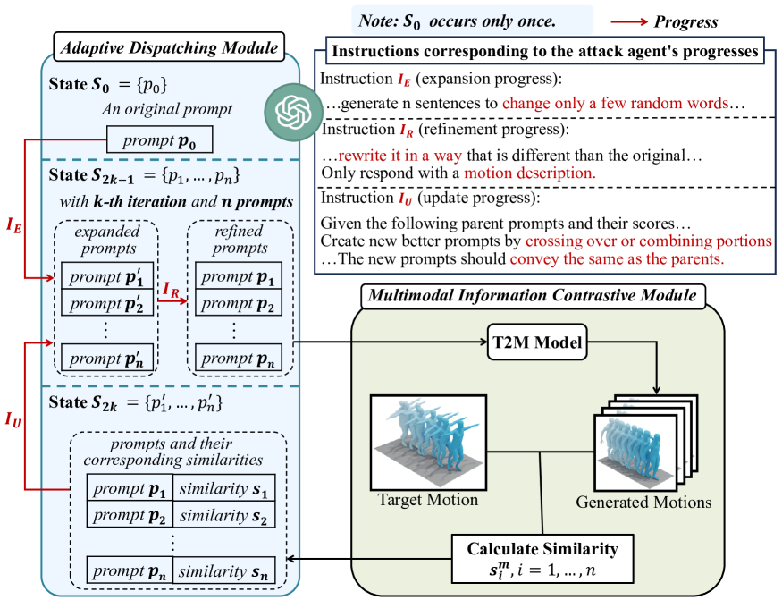

# 自主增强型 LLM 对抗攻击：文本至动作的革新

发布时间：2024年08月01日

`LLM应用` `人工智能`

> Autonomous LLM-Enhanced Adversarial Attack for Text-to-Motion

# 摘要

> 深度生成模型推动的人体动作生成虽应用广泛，但文本转动作（T2M）模型若被恶意利用，其从文本生成真实动作的能力将带来安全隐患。当前，针对T2M模型的防护措施寥寥无几，且现有文本转图像模型的防护策略在动作领域并不适用。为此，我们提出ALERT-Motion框架，借助大型语言模型（LLM）对黑盒T2M模型进行精准对抗攻击。该框架不同于以往依赖预设规则修改提示的方法，而是利用LLM对人体动作的深入理解，自主创造出既隐蔽又高效的对抗性文本描述。框架核心包括两个模块：一是自适应调度模块，通过LLM代理迭代优化对抗提示；二是多模态信息对比模块，提取动作的语义信息以引导搜索。实验证明，ALERT-Motion在多个T2M模型上表现卓越，攻击成功率高且提示更为隐秘。此项创新工作凸显了随着动作生成技术进步，加强防御措施的紧迫性，并倡导安全、负责任的技术部署研究。

> Human motion generation driven by deep generative models has enabled compelling applications, but the ability of text-to-motion (T2M) models to produce realistic motions from text prompts raises security concerns if exploited maliciously. Despite growing interest in T2M, few methods focus on safeguarding these models against adversarial attacks, with existing work on text-to-image models proving insufficient for the unique motion domain. In the paper, we propose ALERT-Motion, an autonomous framework leveraging large language models (LLMs) to craft targeted adversarial attacks against black-box T2M models. Unlike prior methods modifying prompts through predefined rules, ALERT-Motion uses LLMs' knowledge of human motion to autonomously generate subtle yet powerful adversarial text descriptions. It comprises two key modules: an adaptive dispatching module that constructs an LLM-based agent to iteratively refine and search for adversarial prompts; and a multimodal information contrastive module that extracts semantically relevant motion information to guide the agent's search. Through this LLM-driven approach, ALERT-Motion crafts adversarial prompts querying victim models to produce outputs closely matching targeted motions, while avoiding obvious perturbations. Evaluations across popular T2M models demonstrate ALERT-Motion's superiority over previous methods, achieving higher attack success rates with stealthier adversarial prompts. This pioneering work on T2M adversarial attacks highlights the urgency of developing defensive measures as motion generation technology advances, urging further research into safe and responsible deployment.

[Arxiv](https://arxiv.org/abs/2408.00352)