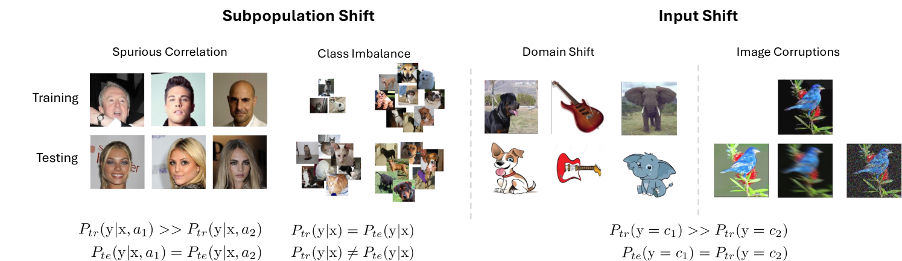
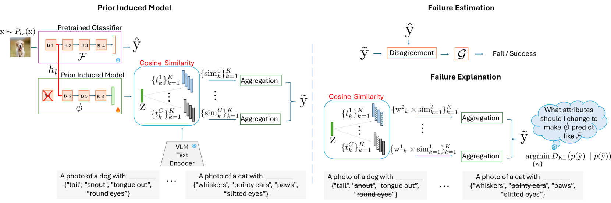
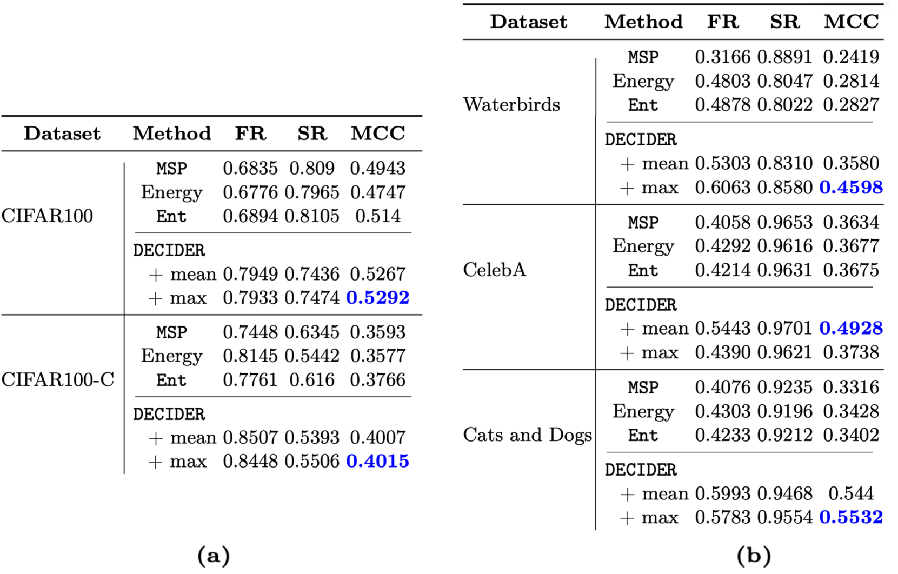
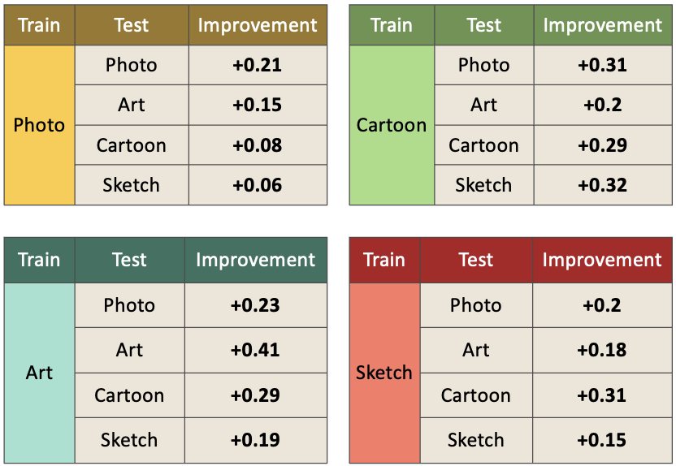
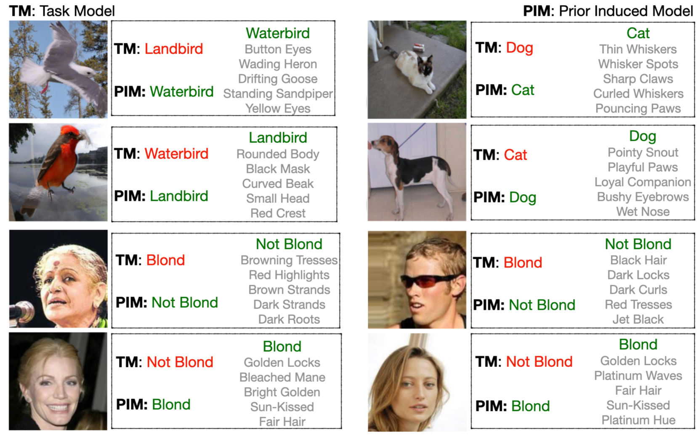
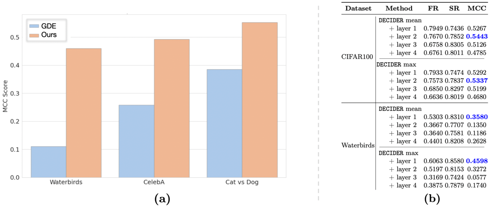

# DECIDER：借助基础模型的先验知识，提升模型故障检测与解释的效能。

发布时间：2024年08月01日

`LLM应用` `机器学习` `计算机视觉`

> DECIDER: Leveraging Foundation Model Priors for Improved Model Failure Detection and Explanation

# 摘要

> 确保机器学习模型在实际应用中的可靠性，关键在于能否准确预测其在特定输入上的失败风险。为此，我们创新性地提出了 DECIDER 方法，该方法结合大型语言模型 (LLM) 和视觉-语言模型 (VLM) 的先验知识，有效识别图像分类模型中的潜在错误。DECIDER 通过 LLM 定义任务核心属性，并利用 VLM 调整分类器视觉特征，构建去偏差模型，进而通过对比原始与去偏差模型的差异来预警失败。此外，DECIDER 还通过创新的属性消融策略，提供易于理解的失败原因。在涵盖多种数据偏移情况的广泛测试中，DECIDER 表现卓越，显著超越现有方法。详细代码请访问~\url{https://github.com/kowshikthopalli/DECIDER/}。

> Reliably detecting when a deployed machine learning model is likely to fail on a given input is crucial for ensuring safe operation. In this work, we propose DECIDER (Debiasing Classifiers to Identify Errors Reliably), a novel approach that leverages priors from large language models (LLMs) and vision-language models (VLMs) to detect failures in image classification models. DECIDER utilizes LLMs to specify task-relevant core attributes and constructs a ``debiased'' version of the classifier by aligning its visual features to these core attributes using a VLM, and detects potential failure by measuring disagreement between the original and debiased models. In addition to proactively identifying samples on which the model would fail, DECIDER also provides human-interpretable explanations for failure through a novel attribute-ablation strategy. Through extensive experiments across diverse benchmarks spanning subpopulation shifts (spurious correlations, class imbalance) and covariate shifts (synthetic corruptions, domain shifts), DECIDER consistently achieves state-of-the-art failure detection performance, significantly outperforming baselines in terms of the overall Matthews correlation coefficient as well as failure and success recall. Our codes can be accessed at~\url{https://github.com/kowshikthopalli/DECIDER/}

[Arxiv](https://arxiv.org/abs/2408.00331)