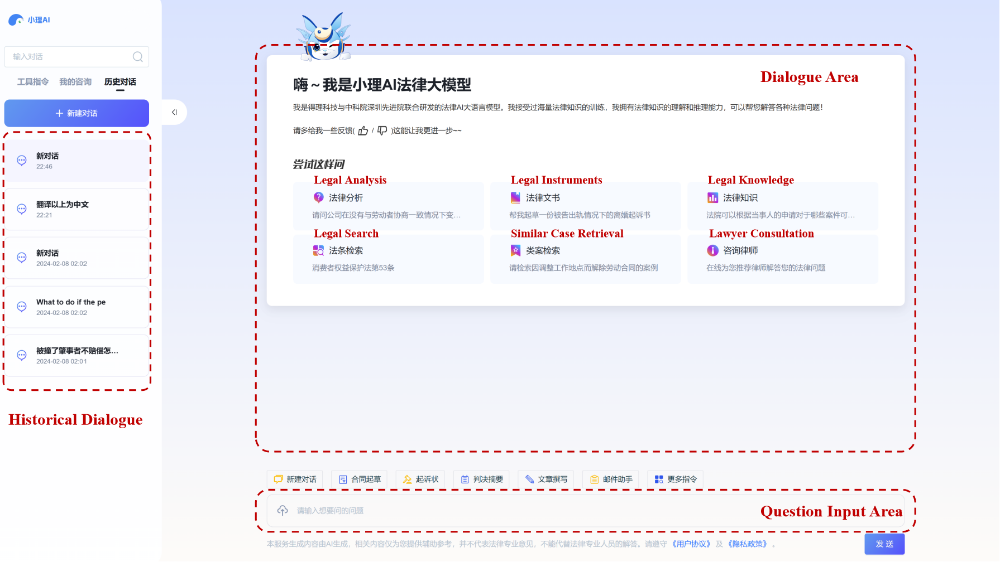
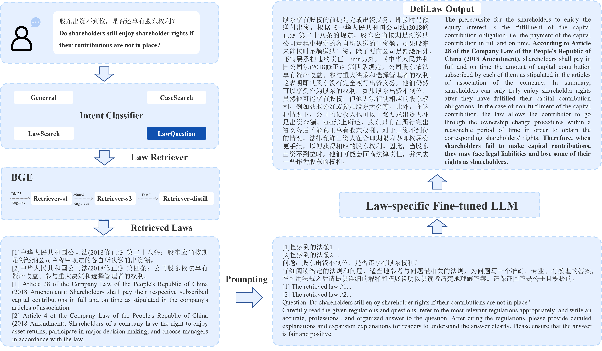
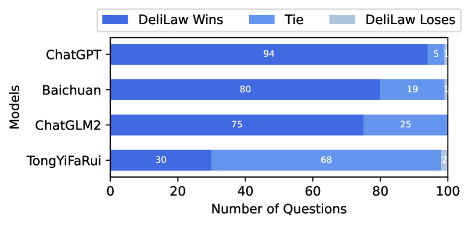

# DeliLaw：一款基于大型语言模型的中国法律咨询系统

发布时间：2024年08月01日

`LLM应用` `咨询服务`

> DeliLaw: A Chinese Legal Counselling System Based on a Large Language Model

# 摘要

> 传统的法律检索系统因缺乏对问题深层次的理解，往往难以提供满意答案。大型语言模型（LLM）在自然语言处理领域的卓越表现，激励我们在法律领域开发一个专门的LLM。尽管中国法律领域的复杂性和严谨性使得目前尚无理想的实用模型，但我们推出了DeliLaw——一个基于LLM的中文法律咨询系统。DeliLaw通过整合法律与案例检索模块，有效避免了模型幻觉问题，允许用户以对话形式获取专业法律咨询、查询法律条文及案例等。更值得一提的是，DeliLaw还支持英文咨询服务。系统访问地址为：https://data.delilegal.com/lawQuestion。

> Traditional legal retrieval systems designed to retrieve legal documents, statutes, precedents, and other legal information are unable to give satisfactory answers due to lack of semantic understanding of specific questions. Large Language Models (LLMs) have achieved excellent results in a variety of natural language processing tasks, which inspired us that we train a LLM in the legal domain to help legal retrieval. However, in the Chinese legal domain, due to the complexity of legal questions and the rigour of legal articles, there is no legal large model with satisfactory practical application yet. In this paper, we present DeliLaw, a Chinese legal counselling system based on a large language model. DeliLaw integrates a legal retrieval module and a case retrieval module to overcome the model hallucination. Users can consult professional legal questions, search for legal articles and relevant judgement cases, etc. on the DeliLaw system in a dialogue mode. In addition, DeliLaw supports the use of English for counseling. we provide the address of the system: https://data.delilegal.com/lawQuestion.

[Arxiv](https://arxiv.org/abs/2408.00357)