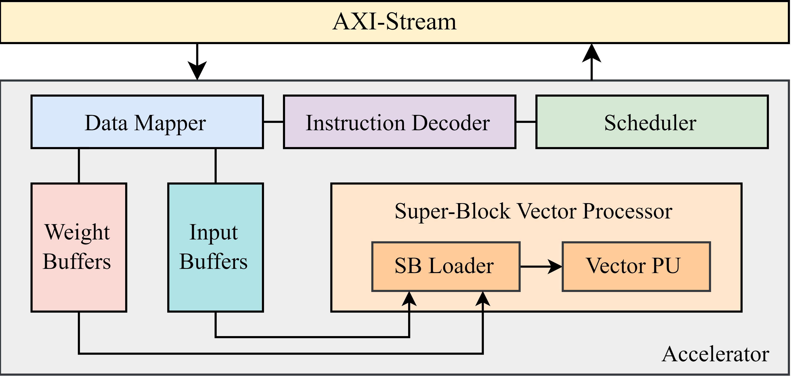

# 为边缘设备打造高效 LLM 加速器

发布时间：2024年08月01日

`LLM应用` `边缘计算` `硬件加速`

> Designing Efficient LLM Accelerators for Edge Devices

# 摘要

> 随着开源大型语言模型（LLM）的普及，用户现在能够在资源受限的边缘设备上部署这些模型，从而减少对网络的依赖并增强隐私保护。然而，LLM 的高计算和内存需求使得在边缘设备上的运行变得困难且效率低下。为此，设计新型高效的 LLM 推理边缘加速器变得至关重要。基于 FPGA 的加速器因其可重配置性，能够进行模型特定优化并提高能效，成为 LLM 加速的理想选择。但创建和集成这些基于 FPGA 的 LLM 加速器（尤其是在边缘设备上）面临挑战，主要原因是现有 FPGA 平台上对 LLM 的硬件设计流程有限。本文中，我们提出了一种名为 SECDA-LLM 的新设计平台，利用 SECDA 方法论简化基于 FPGA 的 LLM 加速器的设计、集成和部署过程，适用于 llama.cpp 推理框架。通过案例研究，我们展示了 SECDA-LLM 的优势，通过设计一个支持块浮点量化操作的新 MatMul 加速器。我们的初步加速器设计在 PYNQ-Z1 板上部署，将 TinyLlama 模型的双核 Arm NEON 基 CPU 执行的延迟降低了 11 倍（每令牌 1.7 秒或每词约 2 秒）。

> The increase in open-source availability of Large Language Models (LLMs) has enabled users to deploy them on more and more resource-constrained edge devices to reduce reliance on network connections and provide more privacy. However, the high computation and memory demands of LLMs make their execution on resource-constrained edge devices challenging and inefficient. To address this issue, designing new and efficient edge accelerators for LLM inference is crucial. FPGA-based accelerators are ideal for LLM acceleration due to their reconfigurability, as they enable model-specific optimizations and higher performance per watt. However, creating and integrating FPGA-based accelerators for LLMs (particularly on edge devices) has proven challenging, mainly due to the limited hardware design flows for LLMs in existing FPGA platforms.
  To tackle this issue, in this paper we first propose a new design platform, named SECDA-LLM, that utilizes the SECDA methodology to streamline the process of designing, integrating, and deploying efficient FPGA-based LLM accelerators for the llama.cpp inference framework. We then demonstrate, through a case study, the potential benefits of SECDA-LLM by creating a new MatMul accelerator that supports block floating point quantized operations for LLMs. Our initial accelerator design, deployed on the PYNQ-Z1 board, reduces latency 1.7 seconds per token or ~2 seconds per word) by 11x over the dual-core Arm NEON-based CPU execution for the TinyLlama model.

[Arxiv](https://arxiv.org/abs/2408.00462)