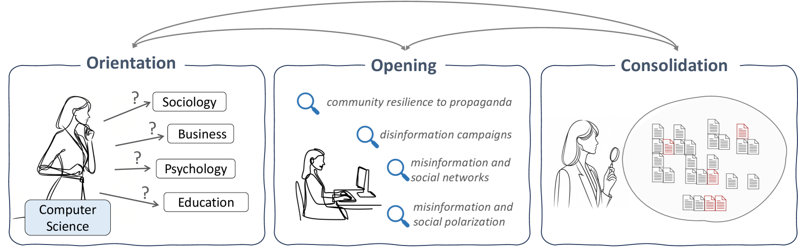
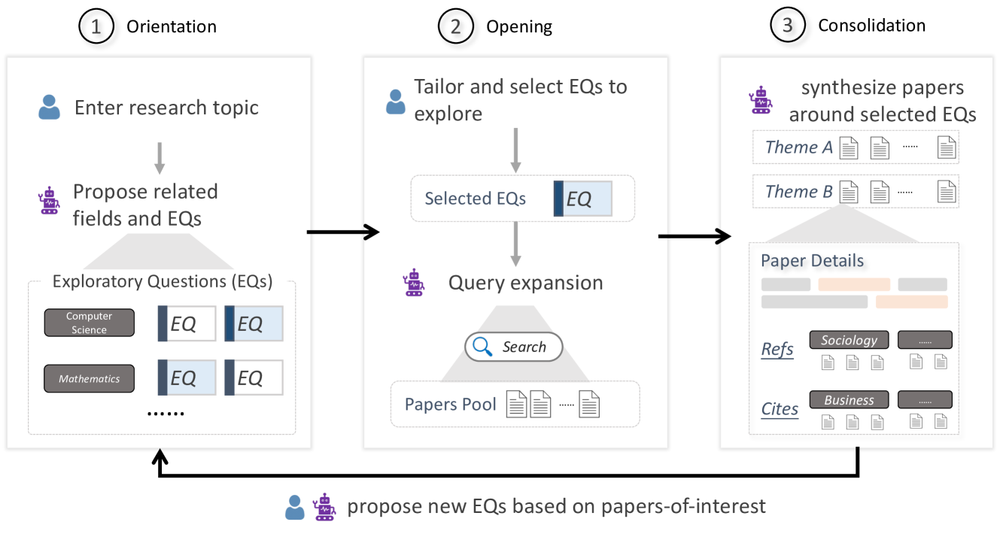
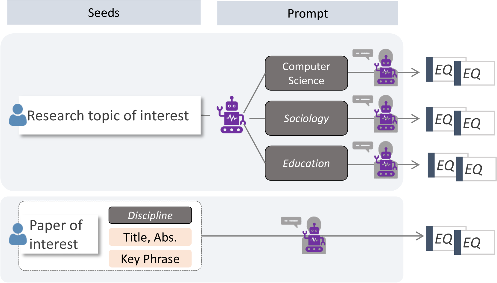
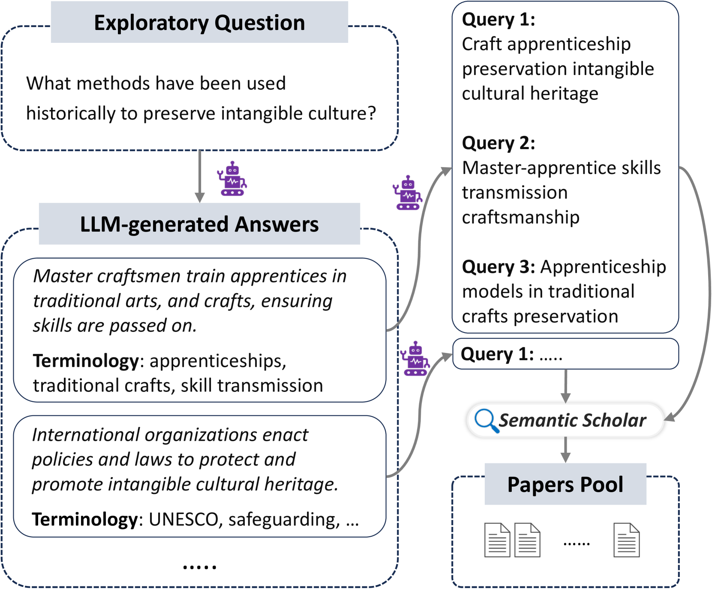
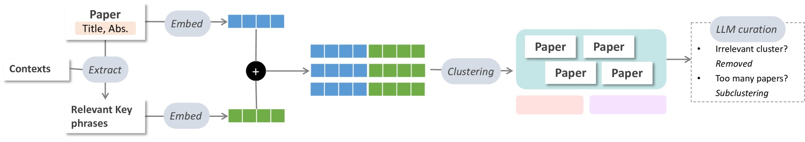
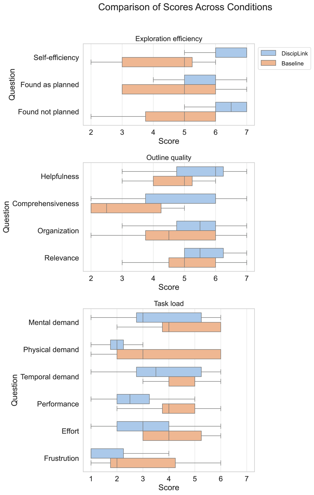
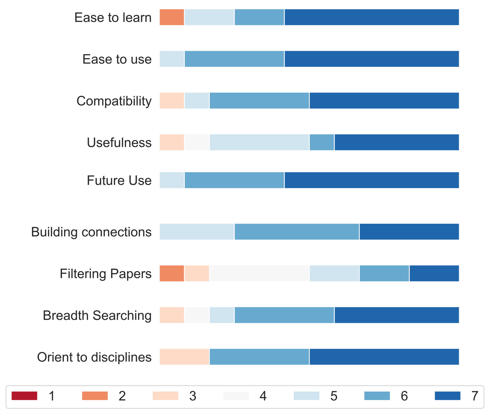

# DiscipLink：携手人机共探，揭秘跨学科信息探索之旅

发布时间：2024年08月01日

`LLM应用` `跨学科研究` `信息检索`

> DiscipLink: Unfolding Interdisciplinary Information Seeking Process via Human-AI Co-Exploration

# 摘要

> 跨学科研究中，探索多领域文献是一大挑战。为此，我们推出了DiscipLink系统，它通过与大型语言模型的互动，助力研究者在跨学科信息搜寻中更高效。DiscipLink根据用户兴趣，从相关学科视角提出问题，并允许用户个性化调整。系统还能自动扩展查询，提取论文主题，并展示论文与问题的关联，帮助用户筛选和搜索论文。实验和探索性研究证实，DiscipLink能有效打破学科壁垒，整合多领域知识。这凸显了LLM技术在推动信息搜寻和跨学科研究中的巨大潜力。

> Interdisciplinary studies often require researchers to explore literature in diverse branches of knowledge. Yet, navigating through the highly scattered knowledge from unfamiliar disciplines poses a significant challenge. In this paper, we introduce DiscipLink, a novel interactive system that facilitates collaboration between researchers and large language models (LLMs) in interdisciplinary information seeking (IIS). Based on users' topics of interest, DiscipLink initiates exploratory questions from the perspectives of possible relevant fields of study, and users can further tailor these questions. DiscipLink then supports users in searching and screening papers under selected questions by automatically expanding queries with disciplinary-specific terminologies, extracting themes from retrieved papers, and highlighting the connections between papers and questions. Our evaluation, comprising a within-subject comparative experiment and an open-ended exploratory study, reveals that DiscipLink can effectively support researchers in breaking down disciplinary boundaries and integrating scattered knowledge in diverse fields. The findings underscore the potential of LLM-powered tools in fostering information-seeking practices and bolstering interdisciplinary research.

[Arxiv](https://arxiv.org/abs/2408.00447)