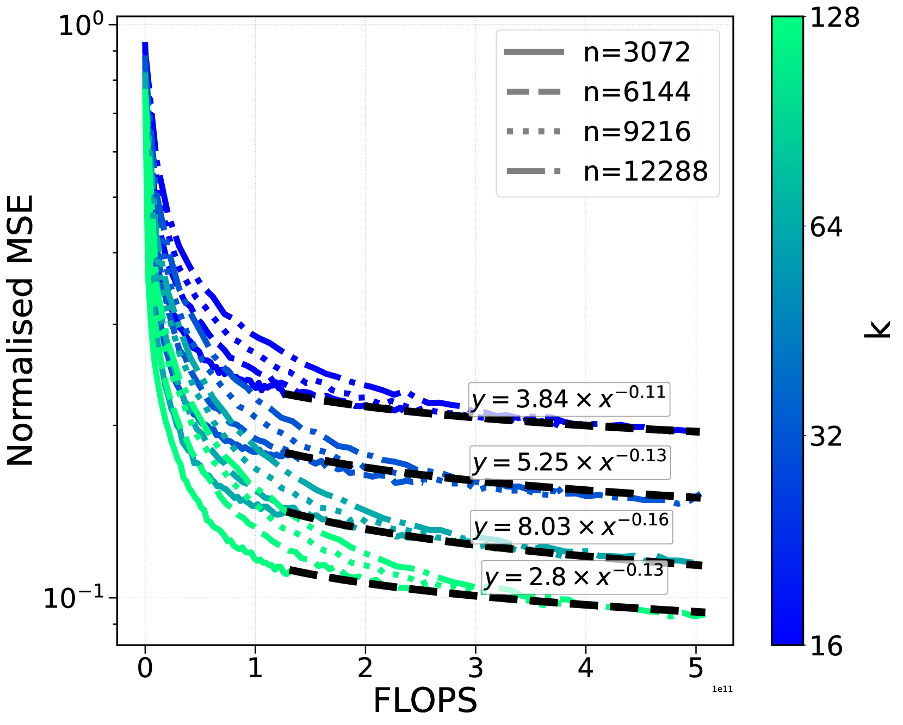
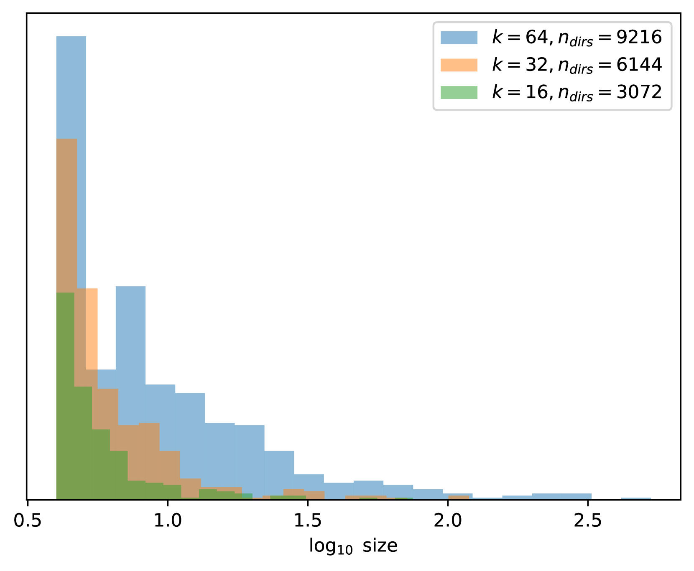

# 稀疏自编码器解密密集嵌入

发布时间：2024年08月01日

`LLM应用` `科学研究` `信息技术`

> Disentangling Dense Embeddings with Sparse Autoencoders

# 摘要

> 稀疏自编码器 (SAEs) 在提取复杂神经网络中的可解释特征方面表现出色。我们首次将 SAEs 应用于大型语言模型的密集文本嵌入，展示了其在解耦语义概念方面的有效性。通过训练 SAEs 处理 420,000 多篇科学论文摘要的嵌入，我们发现生成的稀疏表示不仅保持了语义的准确性，还增强了可解释性。我们深入分析了这些特征，研究了它们在不同模型规模下的表现，并创新性地识别出代表不同抽象层次相关概念的“特征家族”。此外，我们展示了这些可解释特征如何精准地优化语义搜索，为用户提供更细致的查询控制。这项研究不仅填补了密集嵌入与稀疏表示之间的语义与可解释性鸿沟，还通过开源我们的嵌入、训练模型和解释特征，以及一个互动的网络应用，促进了更广泛的应用探索。

> Sparse autoencoders (SAEs) have shown promise in extracting interpretable features from complex neural networks. We present one of the first applications of SAEs to dense text embeddings from large language models, demonstrating their effectiveness in disentangling semantic concepts. By training SAEs on embeddings of over 420,000 scientific paper abstracts from computer science and astronomy, we show that the resulting sparse representations maintain semantic fidelity while offering interpretability. We analyse these learned features, exploring their behaviour across different model capacities and introducing a novel method for identifying ``feature families'' that represent related concepts at varying levels of abstraction. To demonstrate the practical utility of our approach, we show how these interpretable features can be used to precisely steer semantic search, allowing for fine-grained control over query semantics. This work bridges the gap between the semantic richness of dense embeddings and the interpretability of sparse representations. We open source our embeddings, trained sparse autoencoders, and interpreted features, as well as a web app for exploring them.

[Arxiv](https://arxiv.org/abs/2408.00657)