# DynamoLLM：打造高效能与节能的 LLM 推理集群

发布时间：2024年08月01日

`LLM应用` `能源管理` `云计算`

> DynamoLLM: Designing LLM Inference Clusters for Performance and Energy Efficiency

# 摘要

> 随着生成式大型语言模型（LLM）的迅速发展和广泛应用，它们已成为众多应用的核心。当前，LLM推理集群面临大量严格服务级别目标（SLO）的查询。为追求高性能，这些模型依赖于高能耗的GPU，导致能源消耗和碳排放激增。所幸，我们发现通过利用推理计算的异质性和工作负载的波动，能大幅提升能效。然而，这一复杂多变的环境带来了庞大的配置选择空间，涉及实例数量、模型并行性和GPU频率等，这些都影响着能效的权衡。为此，我们推出了DynamoLLM，首个专为LLM推理环境设计的能源管理框架。它自动动态调整集群配置，以在满足性能SLO的同时，优化能源使用和成本。实践证明，DynamoLLM在服务层面实现了53%的能源节约、38%的碳排放减少，并为客户降低了61%的成本，同时确保了延迟SLO的达标。

> The rapid evolution and widespread adoption of generative large language models (LLMs) have made them a pivotal workload in various applications. Today, LLM inference clusters receive a large number of queries with strict Service Level Objectives (SLOs). To achieve the desired performance, these models execute on power-hungry GPUs causing the inference clusters to consume large amount of energy and, consequently, result in excessive carbon emissions. Fortunately, we find that there is a great opportunity to exploit the heterogeneity in inference compute properties and fluctuations in inference workloads, to significantly improve energy-efficiency. However, such a diverse and dynamic environment creates a large search-space where different system configurations (e.g., number of instances, model parallelism, and GPU frequency) translate into different energy-performance trade-offs. To address these challenges, we propose DynamoLLM, the first energy-management framework for LLM inference environments. DynamoLLM automatically and dynamically reconfigures the inference cluster to optimize for energy and cost of LLM serving under the service's performance SLOs. We show that at a service-level, DynamoLLM conserves 53% energy and 38% operational carbon emissions, and reduces 61% cost to the customer, while meeting the latency SLOs.

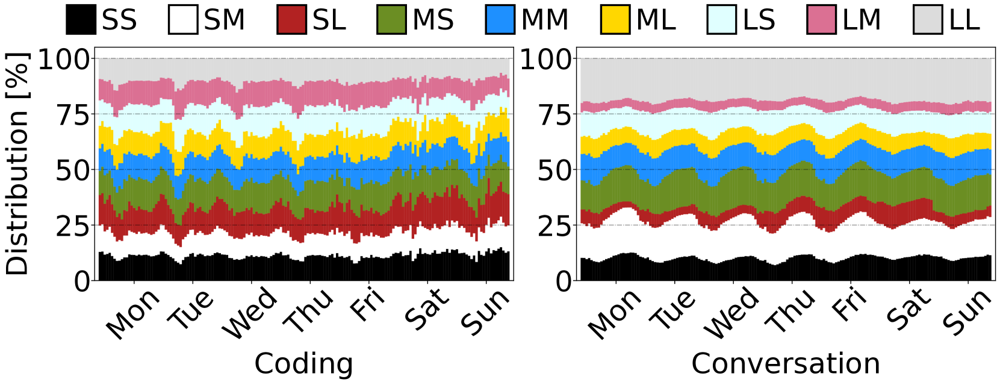

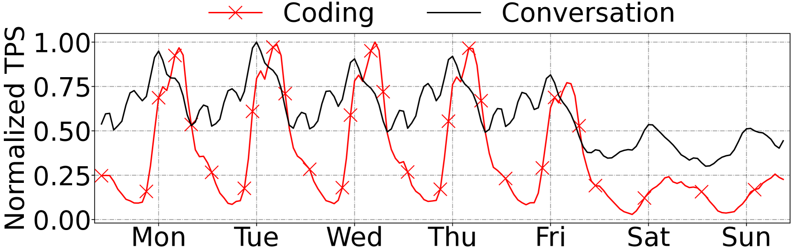

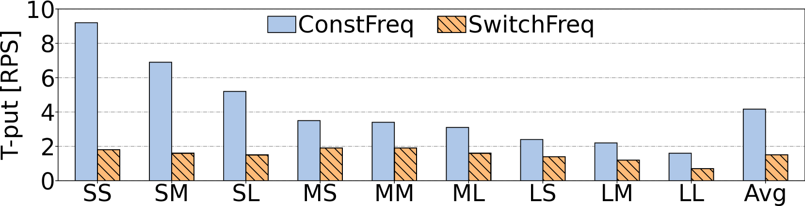

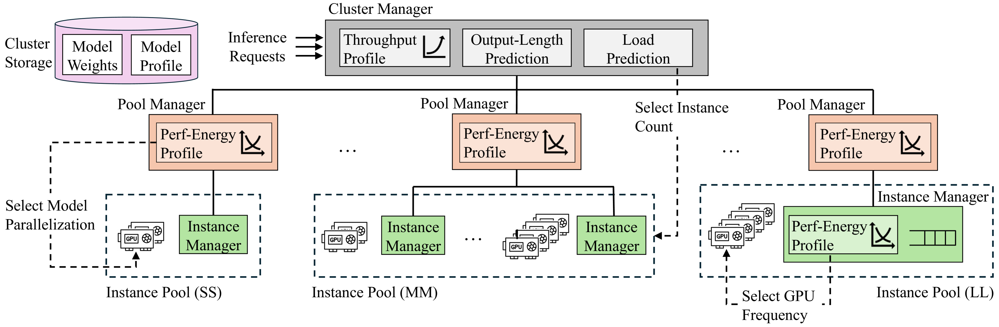

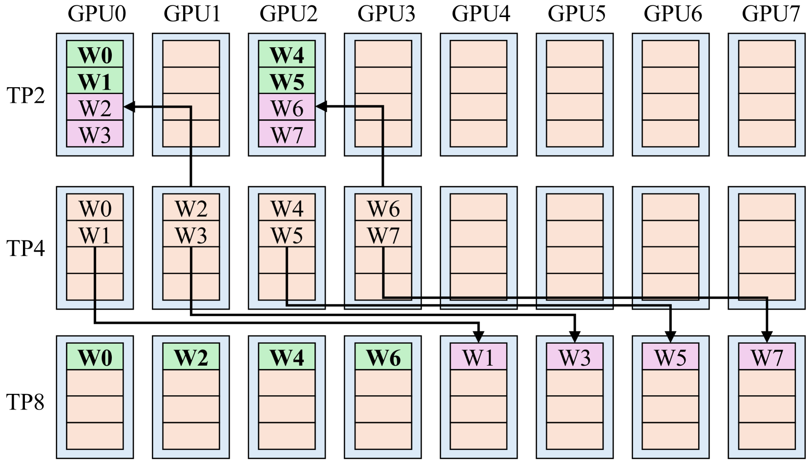

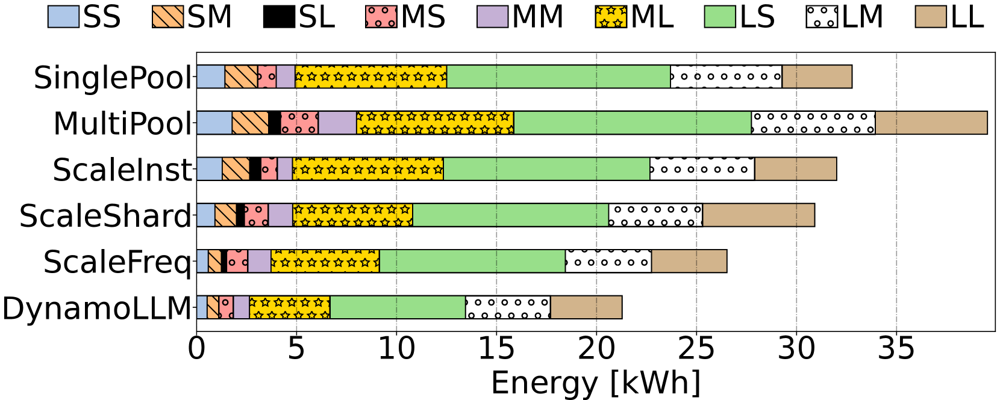

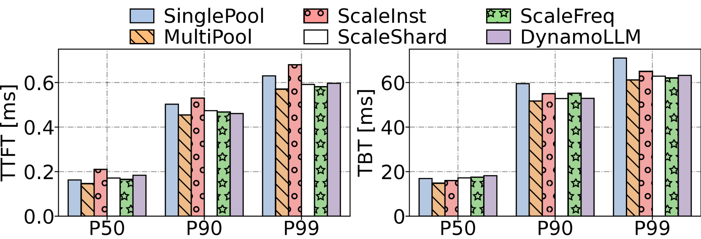

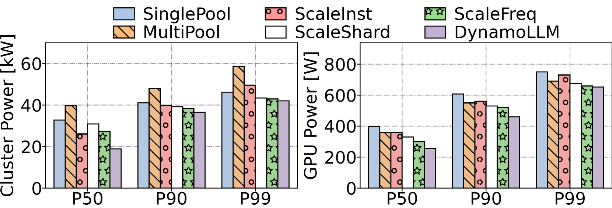

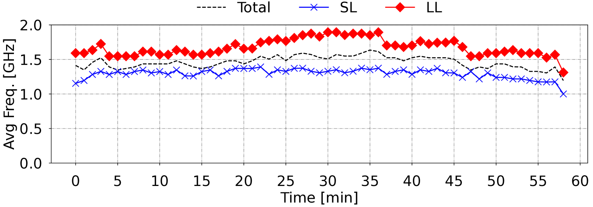

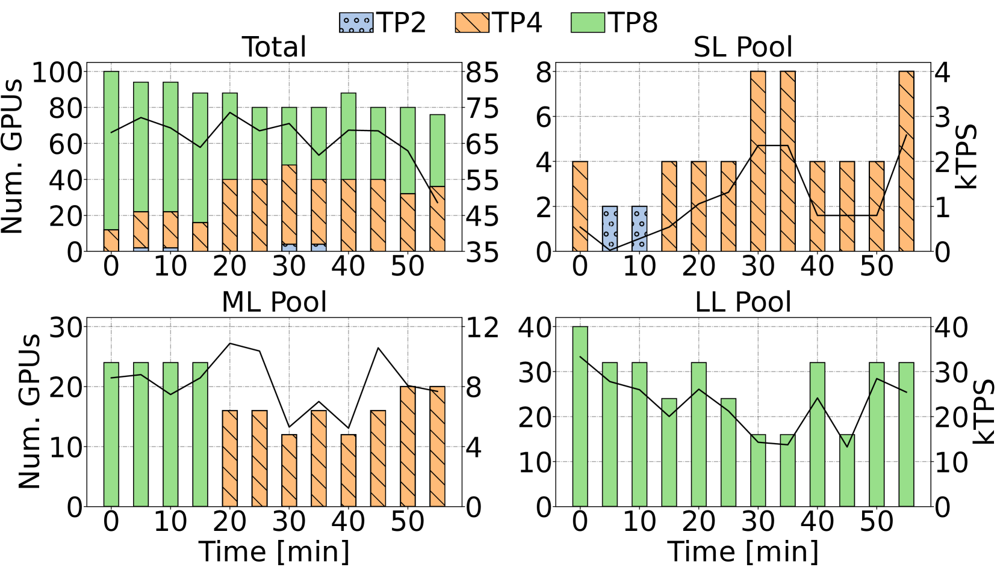

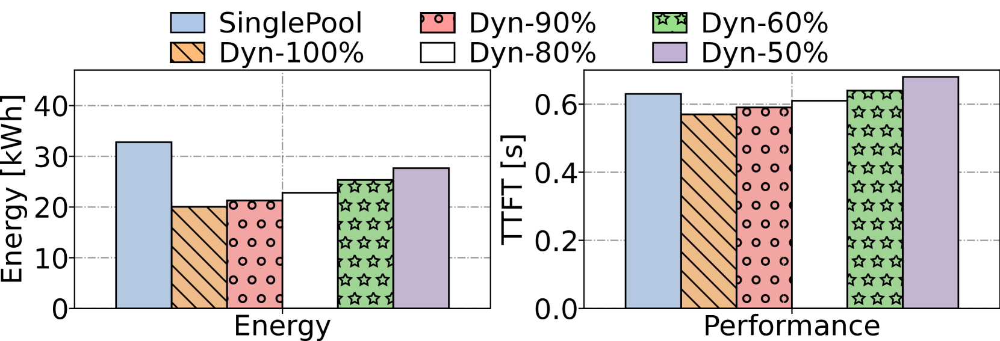

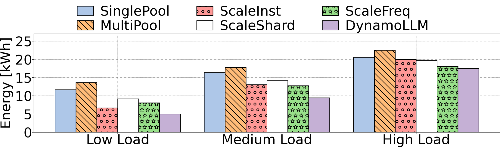

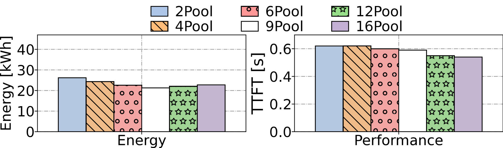

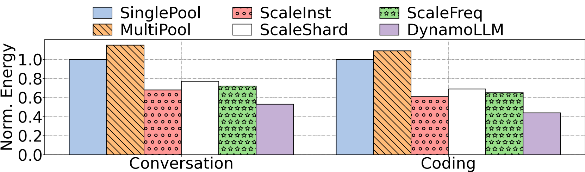

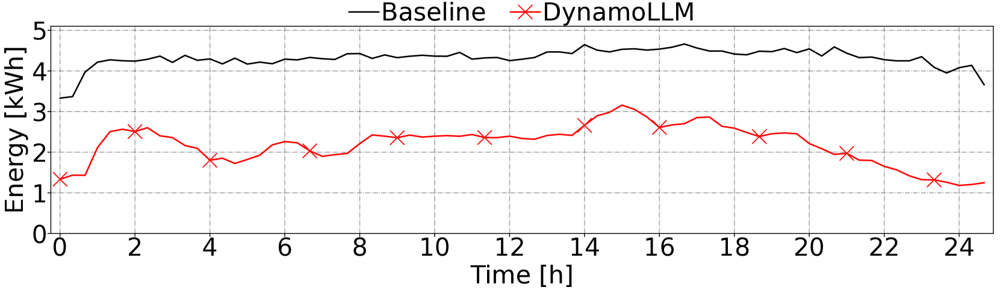

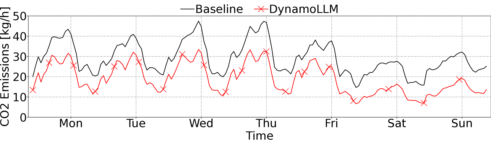

[Arxiv](https://arxiv.org/abs/2408.00741)