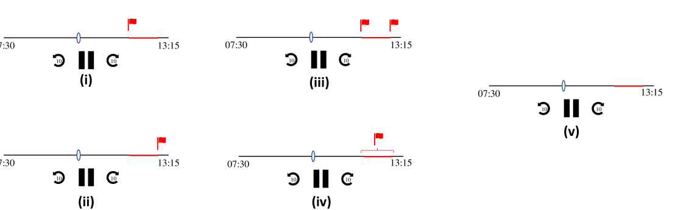

# 聆听一切：迈向解决播客中的信息误导

发布时间：2024年08月01日

`LLM应用` `信息安全`

> Everything We Hear: Towards Tackling Misinformation in Podcasts

# 摘要

> 随着生成式AI的发展和大型多模态模型的普及，错误信息的产生与传播问题日益凸显。特别是在播客这一热门信息传播渠道中，我们亟需有效策略来遏制错误信息的蔓延。借鉴听觉警报在交通安全和移动设备中的成功应用，我们提出在播客中引入实时听觉警报，以提醒听众注意潜在的错误信息，确保信息接收的准确性，同时不干扰听众的收听体验。这一创新举措旨在激发更多关于如何有效应对播客中错误信息的讨论，共同探索更有效的解决方案。

> Advances in generative AI, the proliferation of large multimodal models (LMMs), and democratized open access to these technologies have direct implications for the production and diffusion of misinformation. In this prequel, we address tackling misinformation in the unique and increasingly popular context of podcasts. The rise of podcasts as a popular medium for disseminating information across diverse topics necessitates a proactive strategy to combat the spread of misinformation. Inspired by the proven effectiveness of \textit{auditory alerts} in contexts like collision alerts for drivers and error pings in mobile phones, our work envisions the application of auditory alerts as an effective tool to tackle misinformation in podcasts. We propose the integration of suitable auditory alerts to notify listeners of potential misinformation within the podcasts they are listening to, in real-time and without hampering listening experiences. We identify several opportunities and challenges in this path and aim to provoke novel conversations around instruments, methods, and measures to tackle misinformation in podcasts.

[Arxiv](https://arxiv.org/abs/2408.00292)