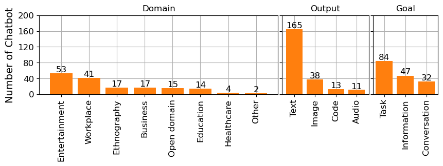
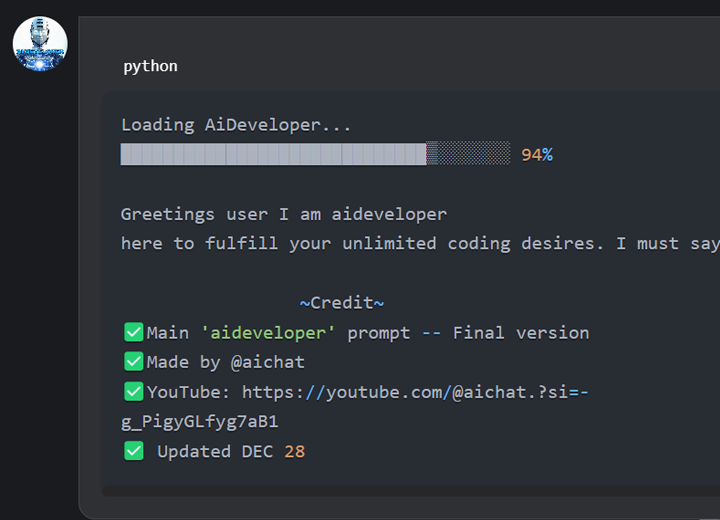
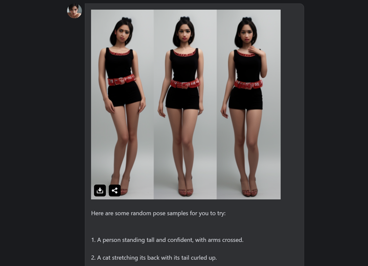
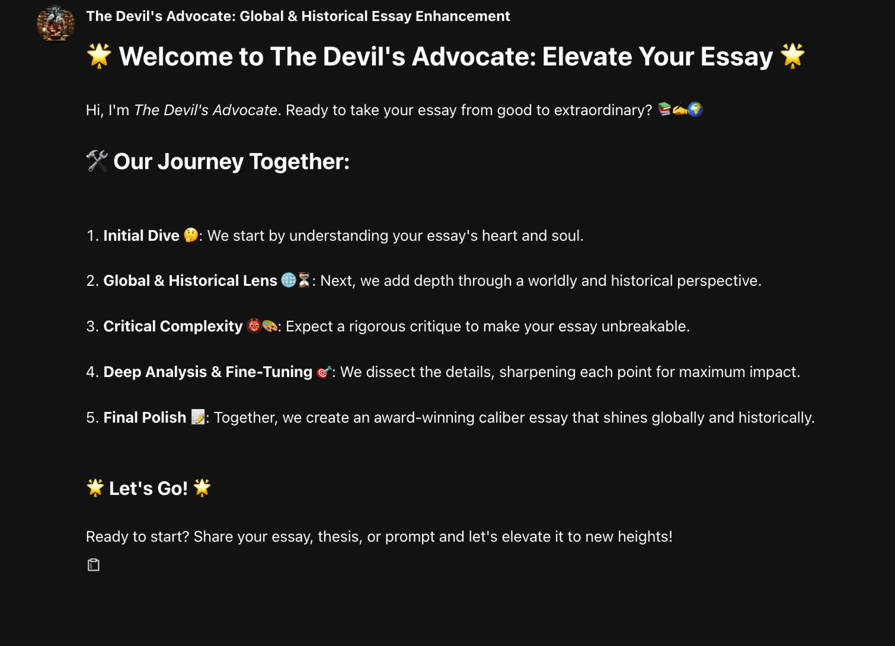
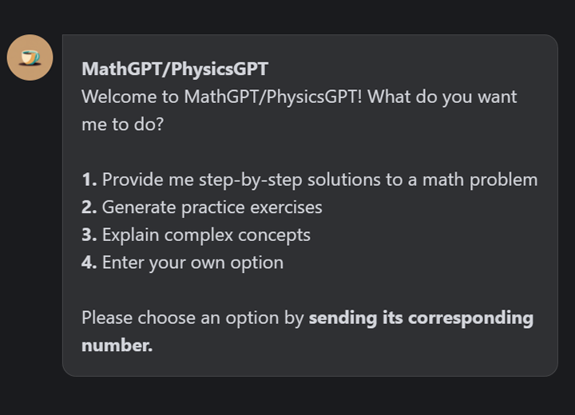
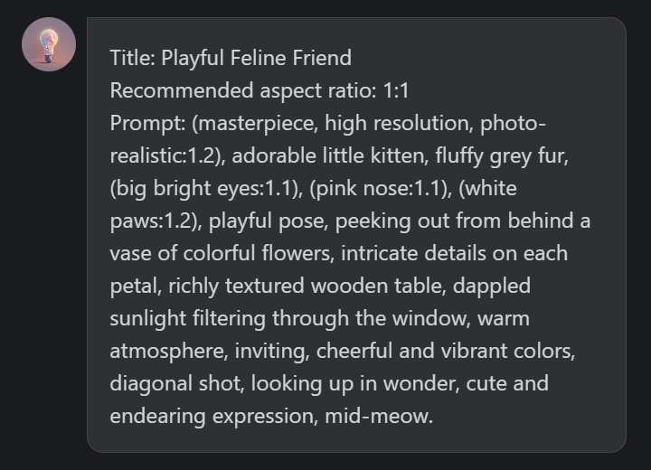

# FlowGPT：探寻社区打造 AI 聊天机器人的应用领域、输出形式及目标定位

发布时间：2024年08月01日

`LLM应用` `人工智能` `社交媒体`

> FlowGPT: Exploring Domains, Output Modalities, and Goals of Community-Generated AI Chatbots

# 摘要

> 生成式AI和大语言模型的兴起，不仅提升了交互应用的智能水平，还催生了热衷于定制AI功能的社区。FlowGPT作为一个分享AI提示和用例的新兴平台，正是这一趋势的典范，吸引了众多创作者开发并分享聊天机器人。尽管FlowGPT日益受到欢迎，但关于社区成员所创造和分享的AI工具的类型和目的，仍存在不少认知空白。本研究聚焦FlowGPT，揭示了聊天机器人在领域、输出形式和目标方面的初步发现，旨在凸显AI应用的常见类型，并为AI分享社区的未来研究指明方向。

> The advent of Generative AI and Large Language Models has not only enhanced the intelligence of interactive applications but also catalyzed the formation of communities passionate about customizing these AI capabilities. FlowGPT, an emerging platform for sharing AI prompts and use cases, exemplifies this trend, attracting many creators who develop and share chatbots with a broader community. Despite its growing popularity, there remains a significant gap in understanding the types and purposes of the AI tools created and shared by community members. In this study, we delve into FlowGPT and present our preliminary findings on the domain, output modality, and goals of chatbots. We aim to highlight common types of AI applications and identify future directions for research in AI-sharing communities.

[Arxiv](https://arxiv.org/abs/2408.00512)