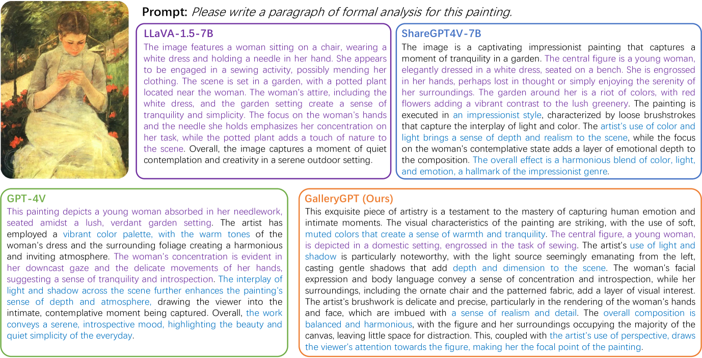

# GalleryGPT：探索大型多模态模型在绘画分析中的应用

发布时间：2024年08月01日

`LLM应用` `人工智能`

> GalleryGPT: Analyzing Paintings with Large Multimodal Models

# 摘要

> 艺术品分析不仅是艺术欣赏的基础技能，还能丰富审美体验并提升批判思维。然而，由于艺术品的主观性、多样解读及复杂视觉元素，深入理解它们颇具挑战，需深厚的艺术史、文化背景及美学理论知识。以往的自动分析多局限于简单的分类与检索任务，远未触及AI的深层目标。本文迈出一步，借鉴大型多模态模型的感知与生成力，提出全面的艺术品分析方法。我们聚焦绘画的视觉特性，提出段落分析任务，以更全面地理解艺术品。为此，我们构建了包含约19k幅画作与50k分析段落的庞大数据集PaintingForm，并基于此，对LLaVA架构进行微调，打造出GalleryGPT模型，专用于绘画分析。实验表明，GalleryGPT在形式分析与零-shot任务中表现卓越，大幅超越现有基线模型，彰显其强大的艺术分析与泛化能力。相关代码与模型已公开于：https://github.com/steven640pixel/GalleryGPT。

> Artwork analysis is important and fundamental skill for art appreciation, which could enrich personal aesthetic sensibility and facilitate the critical thinking ability. Understanding artworks is challenging due to its subjective nature, diverse interpretations, and complex visual elements, requiring expertise in art history, cultural background, and aesthetic theory. However, limited by the data collection and model ability, previous works for automatically analyzing artworks mainly focus on classification, retrieval, and other simple tasks, which is far from the goal of AI. To facilitate the research progress, in this paper, we step further to compose comprehensive analysis inspired by the remarkable perception and generation ability of large multimodal models. Specifically, we first propose a task of composing paragraph analysis for artworks, i.e., painting in this paper, only focusing on visual characteristics to formulate more comprehensive understanding of artworks. To support the research on formal analysis, we collect a large dataset PaintingForm, with about 19k painting images and 50k analysis paragraphs. We further introduce a superior large multimodal model for painting analysis composing, dubbed GalleryGPT, which is slightly modified and fine-tuned based on LLaVA architecture leveraging our collected data. We conduct formal analysis generation and zero-shot experiments across several datasets to assess the capacity of our model. The results show remarkable performance improvements comparing with powerful baseline LMMs, demonstrating its superb ability of art analysis and generalization. \textcolor{blue}{The codes and model are available at: https://github.com/steven640pixel/GalleryGPT.

[Arxiv](https://arxiv.org/abs/2408.00491)