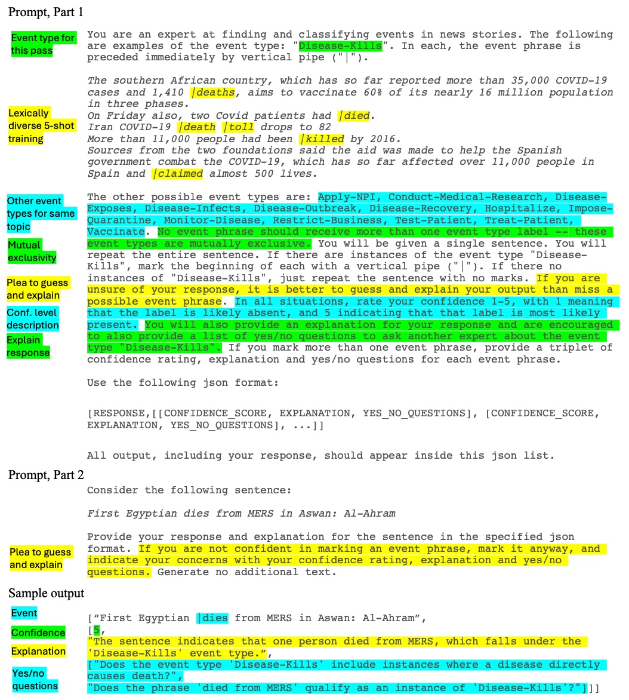
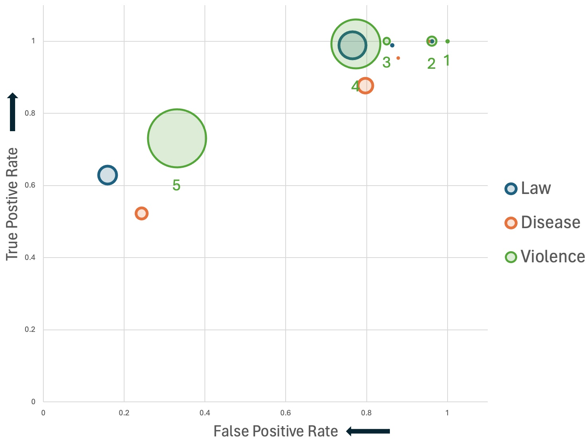
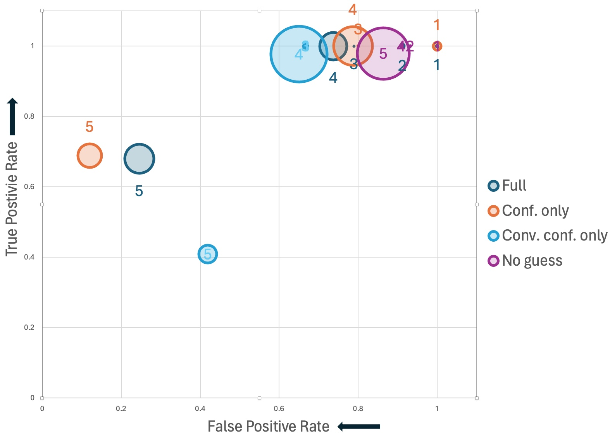

# 赋予 GPT-4 许可与机遇，旨在提升少样本事件检测的精准度与置信评估。

发布时间：2024年08月01日

`LLM应用` `人工智能` `本体工程`

> Granting GPT-4 License and Opportunity: Enhancing Accuracy and Confidence Estimation for Few-Shot Event Detection

# 摘要

> GPT-4等大型语言模型在少样本学习中展现出巨大潜力，可用于生成高质量数据和优化新本体。然而，置信度估计一直是其短板，现有解决方案复杂且耗资源。本研究针对BETTER本体中的事件检测，通过创新性地扩展GPT-4的提示和任务，赋予其在不确定时进行推测并量化解释不确定性的能力（L&O），从而提升准确性并实现无需额外设备的置信度评估（0.759 AUC）。

> Large Language Models (LLMs) such as GPT-4 have shown enough promise in the few-shot learning context to suggest use in the generation of "silver" data and refinement of new ontologies through iterative application and review. Such workflows become more effective with reliable confidence estimation. Unfortunately, confidence estimation is a documented weakness of models such as GPT-4, and established methods to compensate require significant additional complexity and computation. The present effort explores methods for effective confidence estimation with GPT-4 with few-shot learning for event detection in the BETTER ontology as a vehicle. The key innovation is expanding the prompt and task presented to GPT-4 to provide License to speculate when unsure and Opportunity to quantify and explain its uncertainty (L&O). This approach improves accuracy and provides usable confidence measures (0.759 AUC) with no additional machinery.

[Arxiv](https://arxiv.org/abs/2408.00914)