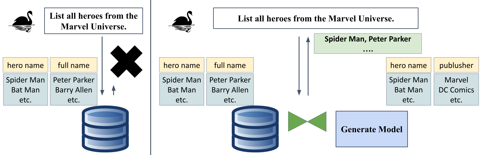

# 关系数据库与大型语言模型间的混合查询探索

发布时间：2024年08月01日

`LLM应用` `数据库` `人工智能`

> Hybrid Querying Over Relational Databases and Large Language Models

# 摘要

> 传统数据库查询基于封闭世界假设，无法回答超出数据库信息的问题。本文通过SQL混合查询，结合关系数据库与大型语言模型（LLM），提出了一种新方法。我们首次推出了跨领域基准SWAN，涵盖120个真实数据库的超出数据库问题。为应对这些复杂问题，我们设计了HQDL，一种混合查询的初步方案，并探讨了未来发展方向。评估结果显示，HQDL结合GPT-4 Turbo和少量提示，在执行准确性和数据事实性上分别达到40.0%和48.2%。这不仅展示了混合查询的潜力，也揭示了其面临的挑战。我们期待这项工作能推动更高效、更准确的数据系统研究，实现关系数据库与LLM的无缝集成，有效解决超出数据库的问题。

> Database queries traditionally operate under the closed-world assumption, providing no answers to questions that require information beyond the data stored in the database. Hybrid querying using SQL offers an alternative by integrating relational databases with large language models (LLMs) to answer beyond-database questions. In this paper, we present the first cross-domain benchmark, SWAN, containing 120 beyond-database questions over four real-world databases. To leverage state-of-the-art language models in addressing these complex questions in SWAN, we present, HQDL, a preliminary solution for hybrid querying, and also discuss potential future directions. Our evaluation demonstrates that HQDL using GPT-4 Turbo with few-shot prompts, achieves 40.0\% in execution accuracy and 48.2\% in data factuality. These results highlights both the potential and challenges for hybrid querying. We believe that our work will inspire further research in creating more efficient and accurate data systems that seamlessly integrate relational databases and large language models to address beyond-database questions.

[Arxiv](https://arxiv.org/abs/2408.00884)