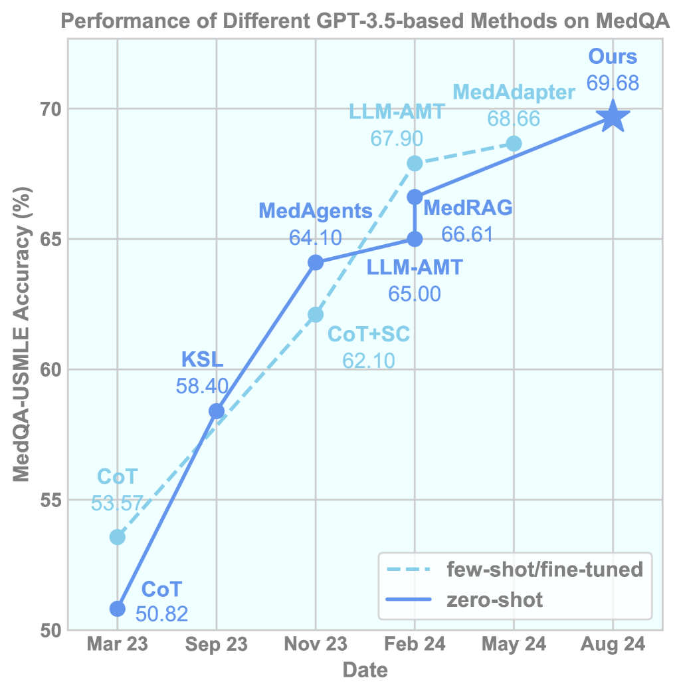
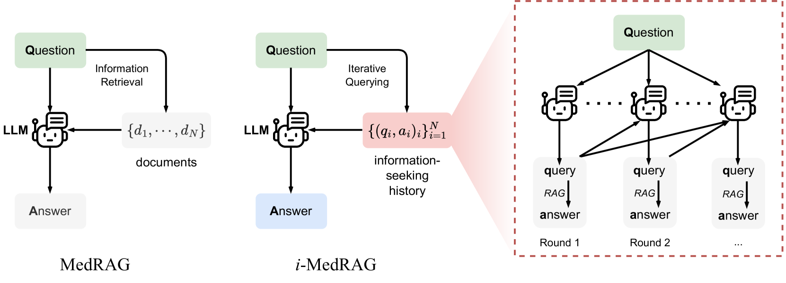

# 通过迭代提问，提升医学领域检索增强生成的质量

发布时间：2024年08月01日

`RAG` `人工智能`

> Improving Retrieval-Augmented Generation in Medicine with Iterative Follow-up Questions

# 摘要

> 大型语言模型 (LLM) 在解决医学问题方面展现出巨大潜力，尽管它们拥有丰富的医学知识，但在知识更新方面仍显僵化。为应对复杂的多轮信息需求场景，我们创新性地提出了医学领域的迭代 RAG (i-MedRAG)，使 LLM 能够基于先前信息寻求尝试，迭代提出后续查询。实验表明，i-MedRAG 在处理复杂医学问题时，显著提升了 LLM 的性能，并在 GPT-3.5 上以零-shot 方式超越了现有技术，实现了 69.68% 的准确率。此外，我们深入分析了 i-MedRAG 的扩展特性，并通过案例研究展示了其灵活构建推理链的能力，为医学问题提供了深入见解。这是首次探索将后续查询融入医学 RAG 的研究。

> The emergent abilities of large language models (LLMs) have demonstrated great potential in solving medical questions. They can possess considerable medical knowledge, but may still hallucinate and are inflexible in the knowledge updates. While Retrieval-Augmented Generation (RAG) has been proposed to enhance the medical question-answering capabilities of LLMs with external knowledge bases, it may still fail in complex cases where multiple rounds of information-seeking are required. To address such an issue, we propose iterative RAG for medicine (i-MedRAG), where LLMs can iteratively ask follow-up queries based on previous information-seeking attempts. In each iteration of i-MedRAG, the follow-up queries will be answered by a vanilla RAG system and they will be further used to guide the query generation in the next iteration. Our experiments show the improved performance of various LLMs brought by i-MedRAG compared with vanilla RAG on complex questions from clinical vignettes in the United States Medical Licensing Examination (USMLE), as well as various knowledge tests in the Massive Multitask Language Understanding (MMLU) dataset. Notably, our zero-shot i-MedRAG outperforms all existing prompt engineering and fine-tuning methods on GPT-3.5, achieving an accuracy of 69.68\% on the MedQA dataset. In addition, we characterize the scaling properties of i-MedRAG with different iterations of follow-up queries and different numbers of queries per iteration. Our case studies show that i-MedRAG can flexibly ask follow-up queries to form reasoning chains, providing an in-depth analysis of medical questions. To the best of our knowledge, this is the first-of-its-kind study on incorporating follow-up queries into medical RAG.

[Arxiv](https://arxiv.org/abs/2408.00727)