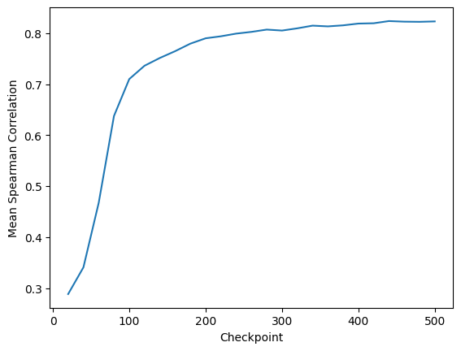
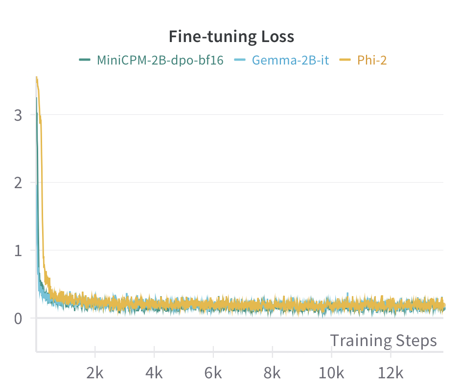

# 通过对比微调提升小型语言模型的文本嵌入效果

发布时间：2024年08月01日

`LLM应用` `机器学习`

> Improving Text Embeddings for Smaller Language Models Using Contrastive Fine-tuning

# 摘要

> 大型语言模型虽在自然语言理解上表现卓越，但其高资源需求限制了普及性。小型语言模型如MiniCPM虽更可持续，但性能常显不足。本文通过优化文本嵌入，探索了小型模型的增强之道。我们选取MiniCPM、Phi-2和Gemma三模型，在NLI数据集上进行对比微调，结果显示，此法显著提升了各模型文本嵌入质量，MiniCPM平均性能跃升56.33%。相关微调代码已公开于GitHub。

> While Large Language Models show remarkable performance in natural language understanding, their resource-intensive nature makes them less accessible. In contrast, smaller language models such as MiniCPM offer more sustainable scalability, but often underperform without specialized optimization. In this paper, we explore the enhancement of smaller language models through the improvement of their text embeddings. We select three language models, MiniCPM, Phi-2, and Gemma, to conduct contrastive fine-tuning on the NLI dataset. Our results demonstrate that this fine-tuning method enhances the quality of text embeddings for all three models across various benchmarks, with MiniCPM showing the most significant improvements of an average 56.33\% performance gain. The contrastive fine-tuning code is publicly available at https://github.com/trapoom555/Language-Model-STS-CFT.

[Arxiv](https://arxiv.org/abs/2408.00690)