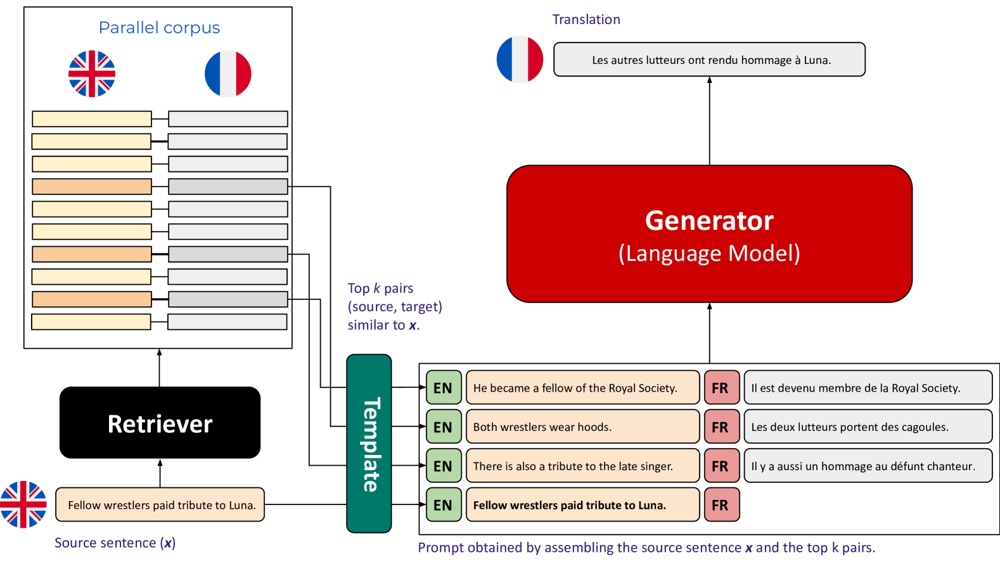
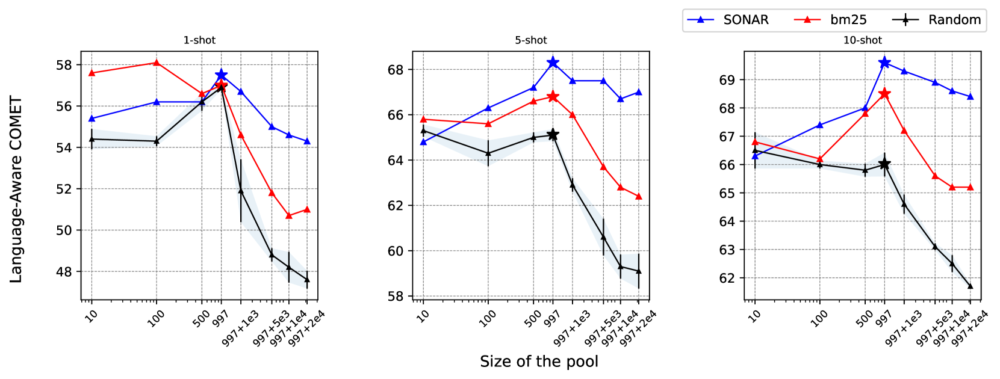
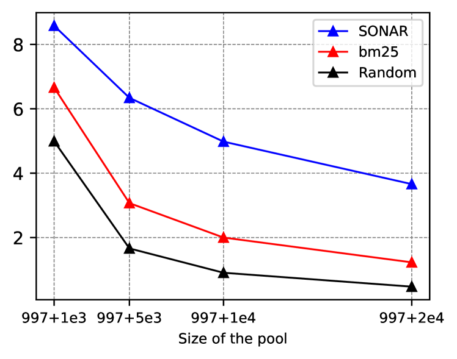
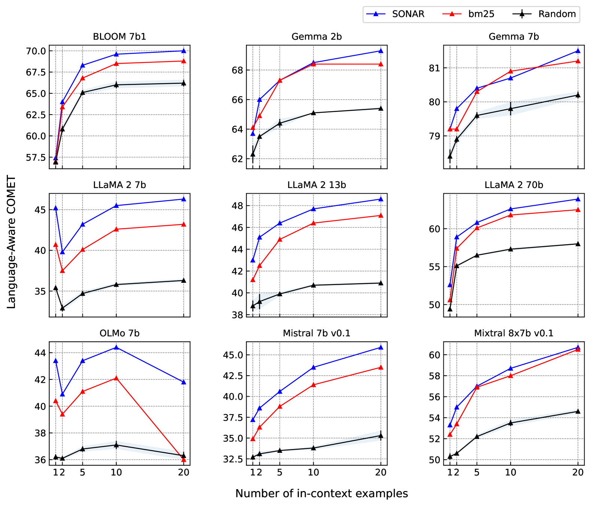
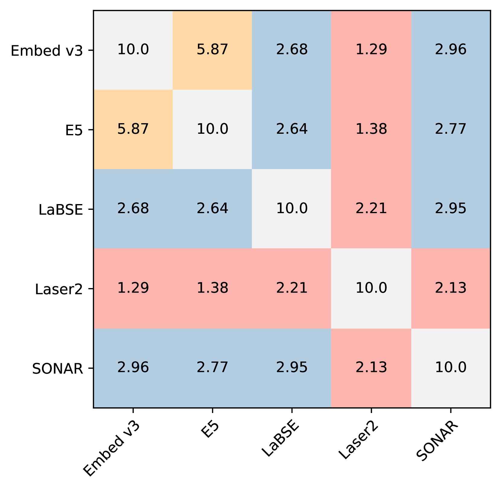
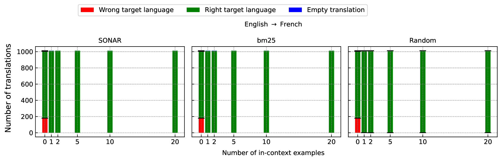
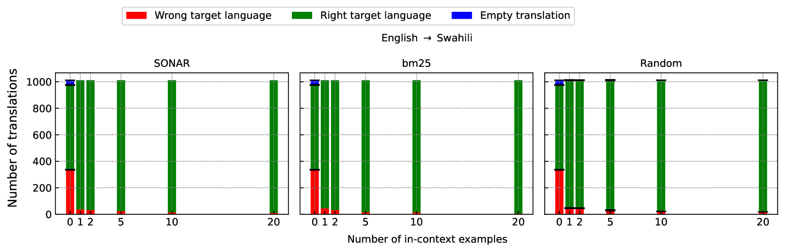
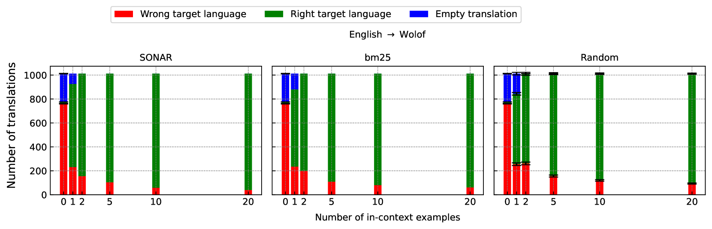

# 利用相似性搜索挑选上下文示例，显著提升了低资源环境下的机器翻译质量。

发布时间：2024年08月01日

`LLM应用` `机器翻译`

> In-Context Example Selection via Similarity Search Improves Low-Resource Machine Translation

# 摘要

> 生成型大型语言模型 (LLM) 的上下文学习能力激发了大量研究，探讨如何为各种自然语言处理任务提供最佳提示。本文聚焦于机器翻译 (MT)，该任务已证实能从上下文翻译示例中获益。然而，关于如何精选示例的系统研究尚属空白，且基于相似性与随机选择的有效性存在争议。我们的研究横跨多个 LLM，采用多种上下文示例检索策略，对比多语言句子嵌入，涉及从英语到法语、德语、斯瓦希里语和沃洛夫语等多个语言方向。与先前研究不同，我们发现句子嵌入相似性显著提升 MT 质量，尤其在资源匮乏的语言方向上，并探讨了选择池多样性与质量的平衡。此外，我们指出了基于 LLM 的 MT 评估中的潜在问题，并建议改进评估方法，将 COMET 指标应用于 LLM 评估。相关代码与输出已公开于 https://github.com/ArmelRandy/ICL-MT。

> The ability of generative large language models (LLMs) to perform in-context learning has given rise to a large body of research into how best to prompt models for various natural language processing tasks. In this paper, we focus on machine translation (MT), a task that has been shown to benefit from in-context translation examples. However no systematic studies have been published on how best to select examples, and mixed results have been reported on the usefulness of similarity-based selection over random selection. We provide a study covering multiple LLMs and multiple in-context example retrieval strategies, comparing multilingual sentence embeddings. We cover several language directions, representing different levels of language resourcedness (English into French, German, Swahili and Wolof). Contrarily to previously published results, we find that sentence embedding similarity can improve MT, especially for low-resource language directions, and discuss the balance between selection pool diversity and quality. We also highlight potential problems with the evaluation of LLM-based MT and suggest a more appropriate evaluation protocol, adapting the COMET metric to the evaluation of LLMs. Code and outputs are freely available at https://github.com/ArmelRandy/ICL-MT.

[Arxiv](https://arxiv.org/abs/2408.00397)