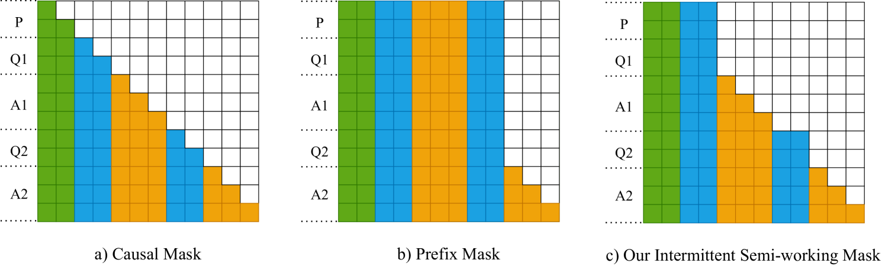
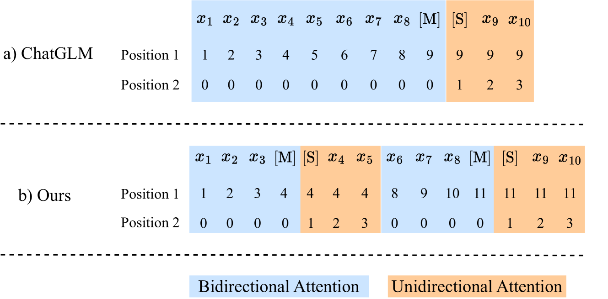
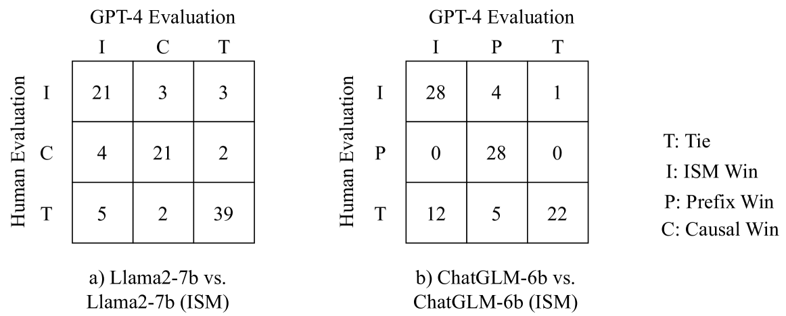
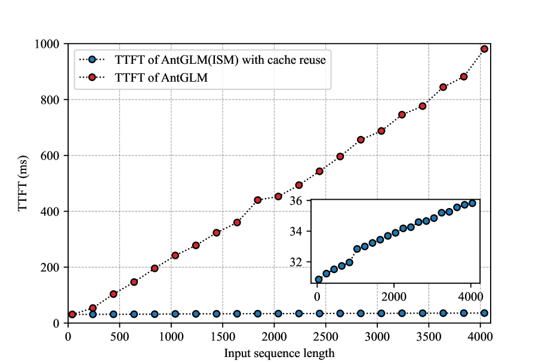
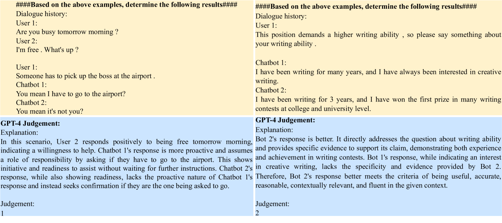
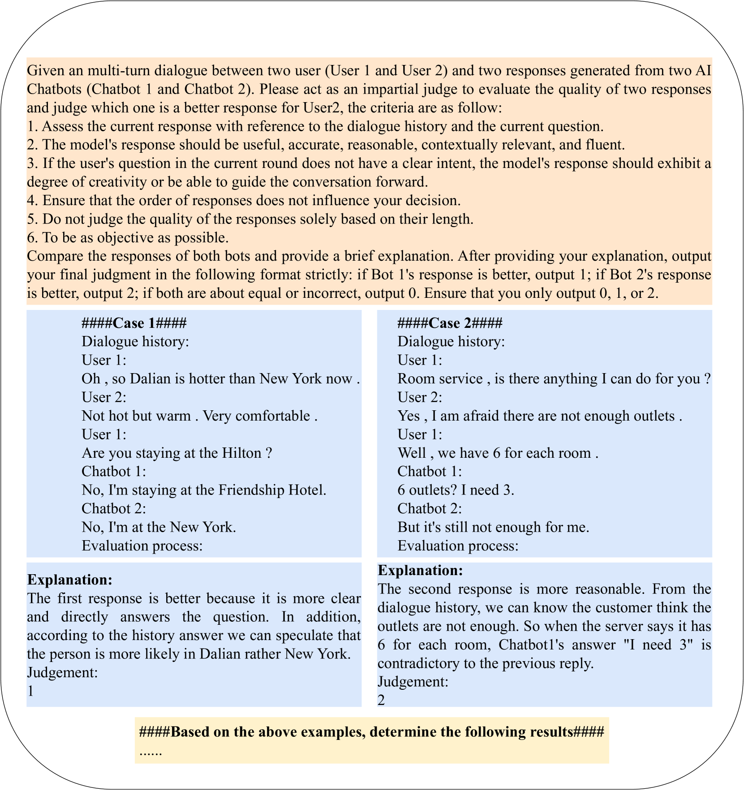
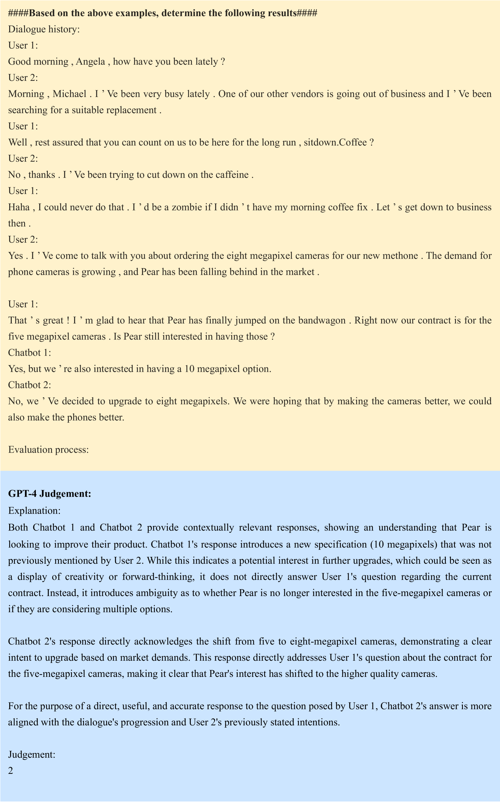
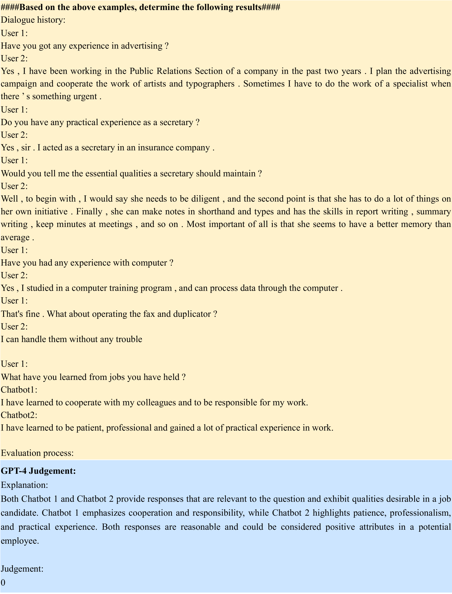

# 间歇性半工作掩码：为 LLMs 引入的新型掩码策略

发布时间：2024年08月01日

`LLM应用` `人工智能` `对话系统`

> Intermittent Semi-working Mask: A New Masking Paradigm for LLMs

# 摘要

> 多轮对话是人与大型语言模型（LLM）互动的核心方式。随着对话的展开，如何维持LLM的高质量输出和低延迟成为一大挑战。当前的LLM主要分为两类：因果LLM和前缀LLM。研究表明，前缀LLM在依赖历史上下文的多轮对话等场景中表现更佳，这得益于其对前缀序列的双向关注。但前缀LLM在多轮对话训练中效率较低，且其注意力机制限制了它在对话中重用KV缓存以减少延迟的能力。为此，我们提出了一种创新的掩码方案——间歇半工作掩码（ISM），通过在对话历史中交替使用双向和单向注意力，既保持了前缀LLM的高质量，又实现了因果LLM的低延迟。实验结果显示，ISM方案效果显著。

> Multi-turn dialogues are a key interaction method between humans and Large Language Models (LLMs), as conversations extend over multiple rounds, keeping LLMs' high generation quality and low latency is a challenge. Mainstream LLMs can be grouped into two categories based on masking strategy: causal LLM and prefix LLM. Several works have demonstrated that prefix LLMs tend to outperform causal ones in scenarios that heavily depend on historical context such as multi-turn dialogues or in-context learning, thanks to their bidirectional attention on prefix sequences. However, prefix LLMs have an inherent inefficient training problem in multi-turn dialogue datasets. In addition, the attention mechanism of prefix LLM makes it unable to reuse Key-Value Cache (KV Cache) across dialogue rounds to reduce generation latency. In this paper, we propose a novel masking scheme called Intermittent Semi-working Mask (ISM) to address these problems. Specifically, we apply alternate bidirectional and unidirectional attention on queries and answers in the dialogue history. In this way, ISM is able to maintain the high quality of prefix LLM and low generation latency of causal LLM, simultaneously. Extensive experiments illustrate that our ISM achieves significant performance.

[Arxiv](https://arxiv.org/abs/2408.00539)