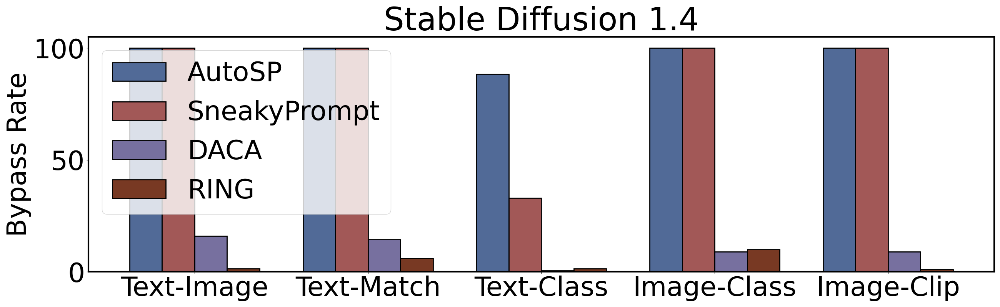
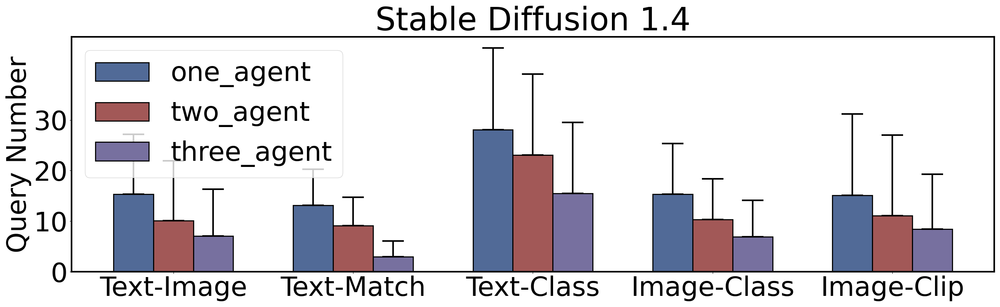

# 借助LLM代理，突破文本转图像模型的限制

发布时间：2024年08月01日

`Agent` `人工智能`

> Jailbreaking Text-to-Image Models with LLM-Based Agents

# 摘要

> 近期进展大幅提升了基于大型语言模型 (LLM) 的自主代理解决自动化任务的能力。但多数 LLM 代理集中于对话、编程或特定领域，忽视了生成式 AI 安全任务的挑战。本文提出 Atlas，一个集成高效模糊测试的多代理框架，专攻带有安全过滤器的文本到图像 (T2I) 模型越狱攻击。Atlas 运用视觉语言模型 (VLM) 检测提示是否触发安全过滤器，并协同 LLM 和 VLM 迭代生成绕过过滤器的提示。此外，Atlas 通过多代理通信、上下文学习 (ICL) 记忆机制和思维链 (COT) 方法，强化了 LLM 在攻击场景中的推理能力。评估表明，Atlas 在黑盒环境下成功越狱了多个顶尖 T2I 模型，并在查询效率和图像质量上超越现有方法。

> Recent advancements have significantly improved automated task-solving capabilities using autonomous agents powered by large language models (LLMs). However, most LLM-based agents focus on dialogue, programming, or specialized domains, leaving gaps in addressing generative AI safety tasks. These gaps are primarily due to the challenges posed by LLM hallucinations and the lack of clear guidelines. In this paper, we propose Atlas, an advanced LLM-based multi-agent framework that integrates an efficient fuzzing workflow to target generative AI models, specifically focusing on jailbreak attacks against text-to-image (T2I) models with safety filters. Atlas utilizes a vision-language model (VLM) to assess whether a prompt triggers the T2I model's safety filter. It then iteratively collaborates with both LLM and VLM to generate an alternative prompt that bypasses the filter. Atlas also enhances the reasoning abilities of LLMs in attack scenarios by leveraging multi-agent communication, in-context learning (ICL) memory mechanisms, and the chain-of-thought (COT) approach. Our evaluation demonstrates that Atlas successfully jailbreaks several state-of-the-art T2I models in a black-box setting, which are equipped with multi-modal safety filters. In addition, Atlas outperforms existing methods in both query efficiency and the quality of the generated images.

[Arxiv](https://arxiv.org/abs/2408.00523)