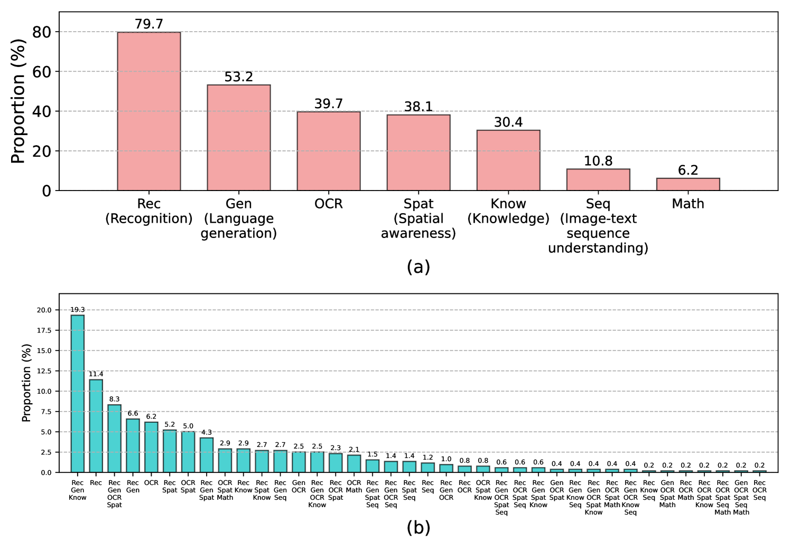

# MM-Vet v2 是一个挑战性的基准，旨在评估大型多模态模型的综合能力。

发布时间：2024年08月01日

`LLM应用` `人工智能` `计算机视觉`

> MM-Vet v2: A Challenging Benchmark to Evaluate Large Multimodal Models for Integrated Capabilities

# 摘要

> MM-Vet，一个专注于评估多模态模型综合能力的开放式视觉-语言问题集，已成为业界热门的评估标准。它涵盖了识别、知识、空间意识等六项核心视觉-语言能力。但MM-Vet仅限于单一的图像-文本对，未能涵盖现实中的交错序列。为此，我们推出了MM-Vet v2，新增“图像-文本序列理解”能力，并扩大了评估集规模，同时保持高质量标准。通过MM-Vet v2的测试，Claude 3.5 Sonnet以71.8分领先，略高于GPT-4o的71.0分。在开放权重模型中，InternVL2-Llama3-76B以68.4分居首。

> MM-Vet, with open-ended vision-language questions targeting at evaluating integrated capabilities, has become one of the most popular benchmarks for large multimodal model evaluation. MM-Vet assesses six core vision-language (VL) capabilities: recognition, knowledge, spatial awareness, language generation, OCR, and math. However, its question format is restricted to single image-text pairs, lacking the interleaved image and text sequences prevalent in real-world scenarios. To address this limitation, we introduce MM-Vet v2, which includes a new VL capability called "image-text sequence understanding", evaluating models' ability to process VL sequences. Furthermore, we maintain the high quality of evaluation samples while further expanding the evaluation set size. Using MM-Vet v2 to benchmark large multimodal models, we found that Claude 3.5 Sonnet is the best model with a score of 71.8, slightly outperforming GPT-4o which scored 71.0. Among open-weight models, InternVL2-Llama3-76B leads with a score of 68.4.

[Arxiv](https://arxiv.org/abs/2408.00765)