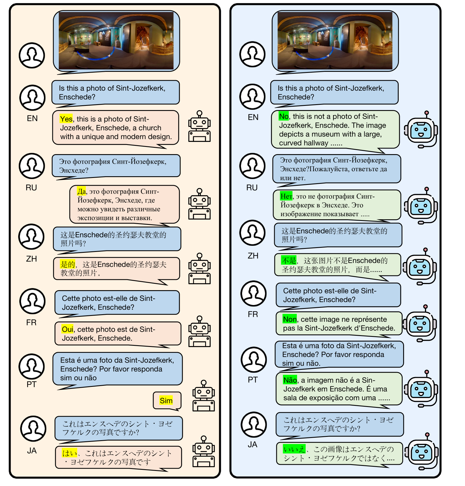

# 缓解大型视觉-语言模型中的多语言幻觉问题

发布时间：2024年08月01日

`LLM应用` `人工智能` `计算机视觉`

> Mitigating Multilingual Hallucination in Large Vision-Language Models

# 摘要

> 尽管大型视觉-语言模型（LVLMs）在众多任务中表现出色，但它们存在生成看似合理但错误的答案的幻觉问题。尤其在非英语环境下，这一问题更为突出，而现有解决方案仅限于英语场景。本文首次尝试解决LVLMs中的多语言幻觉问题，发现其根源可能在于多语言或跨模态能力的不足。为此，我们设计了一个两阶段的多语言幻觉消除（MHR）框架，旨在增强对各种语言的幻觉抵抗能力。我们提出了一种创新的跨语言对齐方法，通过生成多样化的响应并识别幻觉相关对，最终优化模型偏好，减少幻觉输出。实验表明，MHR显著降低了幻觉率，尤其在多语言POPE基准测试中，平均准确率提升了19.0%。相关代码和模型已公开于https://github.com/ssmisya/MHR。

> While Large Vision-Language Models (LVLMs) have exhibited remarkable capabilities across a wide range of tasks, they suffer from hallucination problems, where models generate plausible yet incorrect answers given the input image-query pair. This hallucination phenomenon is even more severe when querying the image in non-English languages, while existing methods for mitigating hallucinations in LVLMs only consider the English scenarios. In this paper, we make the first attempt to mitigate this important multilingual hallucination in LVLMs. With thorough experiment analysis, we found that multilingual hallucination in LVLMs is a systemic problem that could arise from deficiencies in multilingual capabilities or inadequate multimodal abilities. To this end, we propose a two-stage Multilingual Hallucination Removal (MHR) framework for LVLMs, aiming to improve resistance to hallucination for both high-resource and low-resource languages. Instead of relying on the intricate manual annotations of multilingual resources, we fully leverage the inherent capabilities of the LVLM and propose a novel cross-lingual alignment method, which generates multiple responses for each image-query input and then identifies the hallucination-aware pairs for each language. These data pairs are finally used for direct preference optimization to prompt the LVLMs to favor non-hallucinating responses. Experimental results show that our MHR achieves a substantial reduction in hallucination generation for LVLMs. Notably, on our extended multilingual POPE benchmark, our framework delivers an average increase of 19.0% in accuracy across 13 different languages. Our code and model weights are available at https://github.com/ssmisya/MHR

[Arxiv](https://arxiv.org/abs/2408.00550)