# 利用 LLM 查询分解与方面融合技术，实现多维度评论项目的精准检索。

发布时间：2024年08月01日

`RAG` `电子商务`

> Multi-Aspect Reviewed-Item Retrieval via LLM Query Decomposition and Aspect Fusion

# 摘要

> 用户生成的商品评论虽信息丰富，但在处理自然语言查询时效果有限，关键难题在于检索时需整合多来源评论至商品层面。现有RIR方法多采用后期融合（LF），简单平均前K个查询-评论相似度得分。我们发现，面对多方面查询与商品，LF对评论中方面分布极为敏感。为此，我们创新提出方面融合（AF）策略，包括LLM查询提取与生成式重排序，实验表明，AF在不平衡评论语料中显著提升MAP@10至0.52，平衡语料中亦表现卓越。

> While user-generated product reviews often contain large quantities of information, their utility in addressing natural language product queries has been limited, with a key challenge being the need to aggregate information from multiple low-level sources (reviews) to a higher item level during retrieval. Existing methods for reviewed-item retrieval (RIR) typically take a late fusion (LF) approach which computes query-item scores by simply averaging the top-K query-review similarity scores for an item. However, we demonstrate that for multi-aspect queries and multi-aspect items, LF is highly sensitive to the distribution of aspects covered by reviews in terms of aspect frequency and the degree of aspect separation across reviews. To address these LF failures, we propose several novel aspect fusion (AF) strategies which include Large Language Model (LLM) query extraction and generative reranking. Our experiments show that for imbalanced review corpora, AF can improve over LF by a MAP@10 increase from 0.36 to 0.52, while achieving equivalent performance for balanced review corpora.

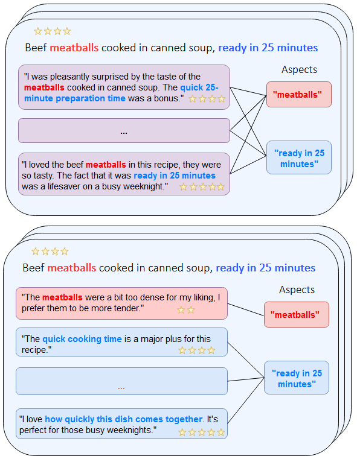

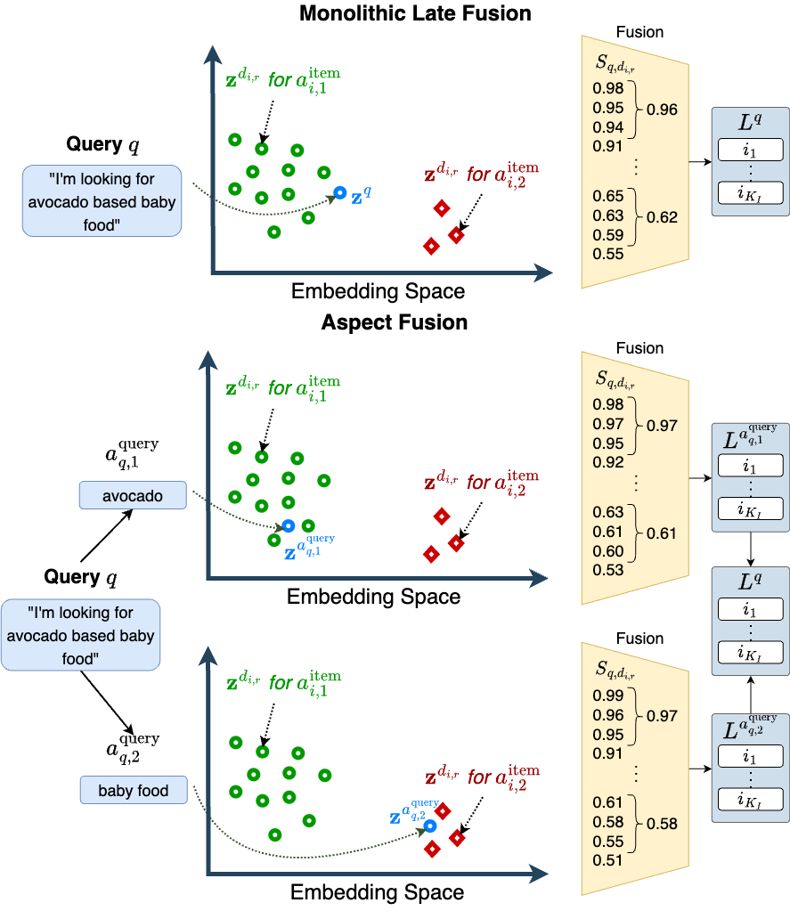

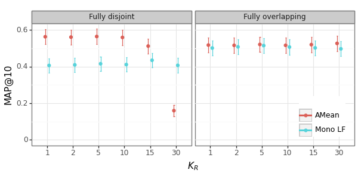

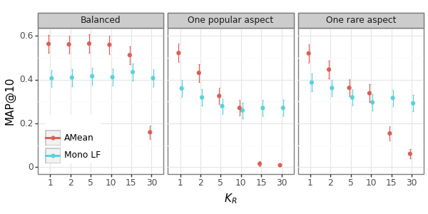

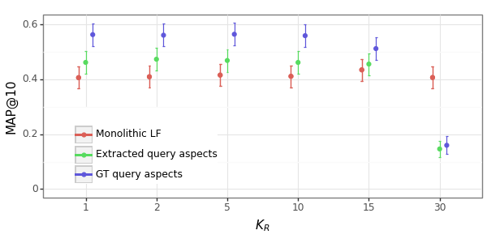

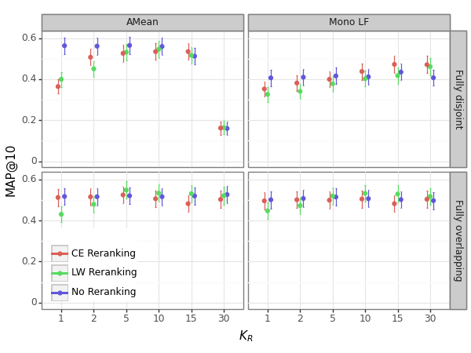

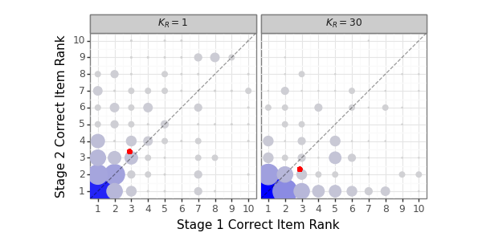

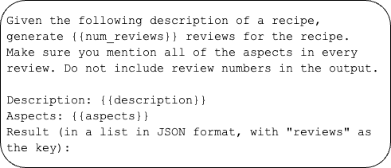

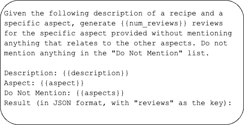

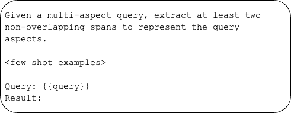

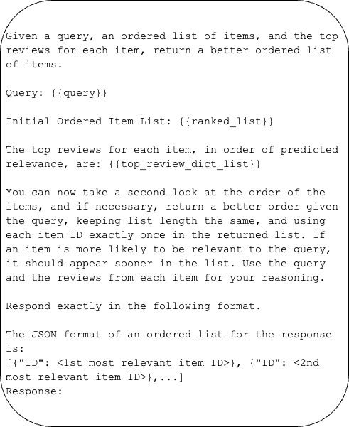

[Arxiv](https://arxiv.org/abs/2408.00878)