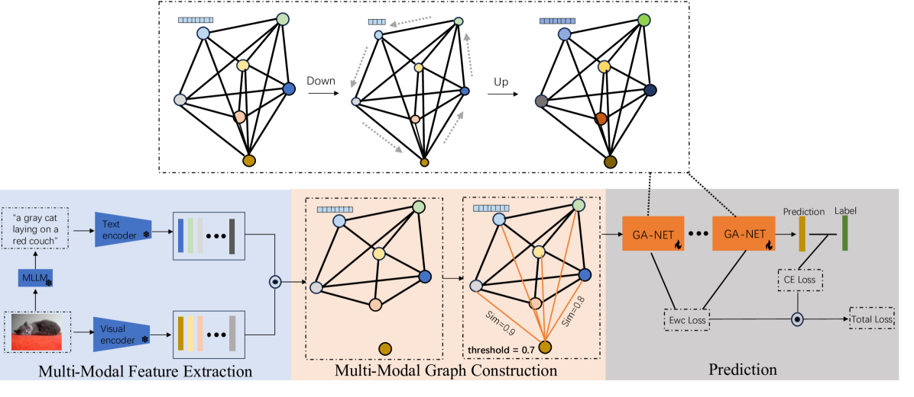
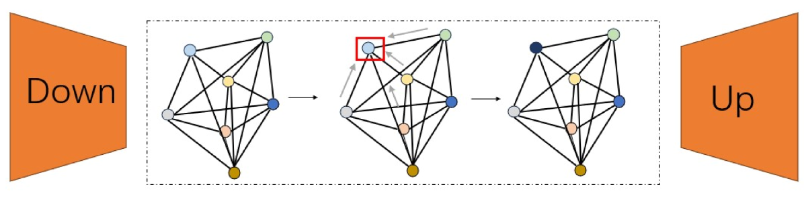
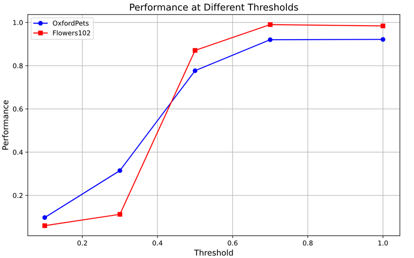

# 借助图神经网络实现多模态参数高效微调

发布时间：2024年08月01日

`LLM应用` `计算机视觉`

> Multi-Modal Parameter-Efficient Fine-tuning via Graph Neural Network

# 摘要

> 随着基础模型时代的兴起，预训练与微调已成为行业标配。近期，参数高效微调因其能在参数数量与性能间取得更佳平衡而备受瞩目。然而，现有方法多局限于单一模态，未能充分利用下游任务中的结构知识。为此，本文创新性地提出了一种基于图网络的多模态参数高效微调策略。该方法通过多模态大型语言模型（MLLM）为每张图像生成文本描述，进而利用冻结的图像与文本编码器分别提取图像与文本特征。基于这些特征节点的相似性构建图结构，并从中提炼相关知识和关系。同时，引入弹性权重合并（EWC）正则化以减轻学习过程中的遗忘效应。实验表明，该模型在OxfordPets、Flowers102和Food101数据集上的测试准确率分别提升了4.45%、2.92%和0.23%。相关代码已公开于https://github.com/yunche0/GA-Net/tree/master。

> With the advent of the era of foundation models, pre-training and fine-tuning have become common paradigms. Recently, parameter-efficient fine-tuning has garnered widespread attention due to its better balance between the number of learnable parameters and performance. However, some current parameter-efficient fine-tuning methods only model a single modality and lack the utilization of structural knowledge in downstream tasks. To address this issue, this paper proposes a multi-modal parameter-efficient fine-tuning method based on graph networks. Each image is fed into a multi-modal large language model (MLLM) to generate a text description. The image and its corresponding text description are then processed by a frozen image encoder and text encoder to generate image features and text features, respectively. A graph is constructed based on the similarity of the multi-modal feature nodes, and knowledge and relationships relevant to these features are extracted from each node. Additionally, Elastic Weight Consolidation (EWC) regularization is incorporated into the loss function to mitigate the problem of forgetting during task learning. The proposed model achieves test accuracies on the OxfordPets, Flowers102, and Food101 datasets that improve by 4.45%, 2.92%, and 0.23%, respectively. The code is available at https://github.com/yunche0/GA-Net/tree/master.

[Arxiv](https://arxiv.org/abs/2408.00290)