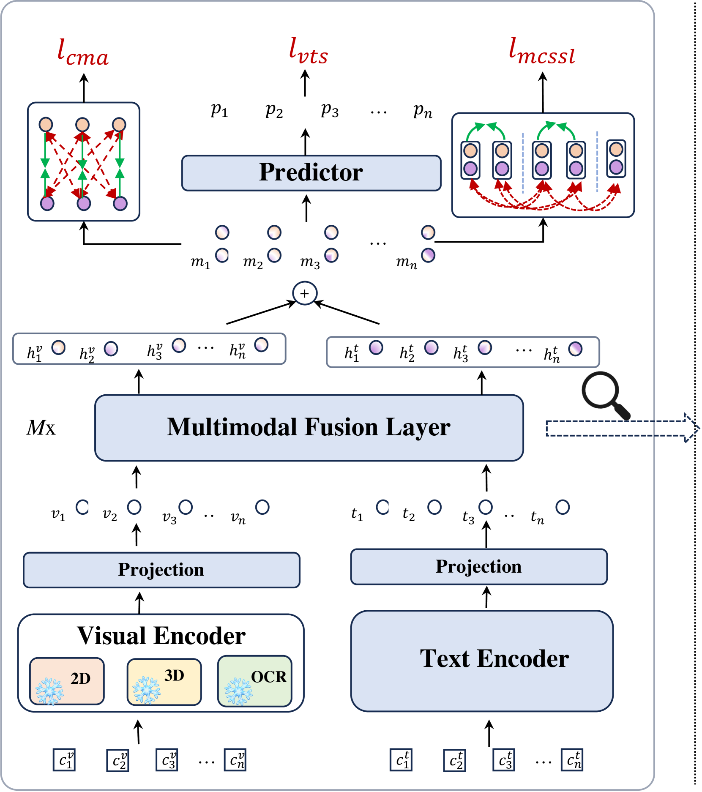

# 视频主题分割中的多模态融合与连贯性建模

发布时间：2024年08月01日

`LLM应用` `视频处理`

> Multimodal Fusion and Coherence Modeling for Video Topic Segmentation

# 摘要

> 视频主题分割（VTS）任务旨在将视频划分为清晰、不重叠的主题，从而提升视频内容的理解和检索效率。VTS在视频理解领域扮演着关键角色。传统方法依赖浅层特征或无监督技术，难以精确捕捉主题转换的细微之处。近期，监督学习方法在视频分割任务中表现出色。本研究通过深入探索多模态融合与一致性建模，优化了监督VTS方法。具体而言，我们（1）通过交叉注意和专家混合技术，改进了多模态融合架构；（2）采用多模态对比学习进行模型预训练和微调，以增强多模态对齐与融合；（3）针对VTS任务设计了新的预训练和微调任务，以提升多模态一致性建模。我们在教育视频（如讲座）上验证了这些方法的有效性，并引入了一个大规模的中文讲座视频数据集，以推动VTS研究的深入发展。实验结果显示，我们的模型在VTS性能上超越了现有的无监督和监督方法。

> The video topic segmentation (VTS) task segments videos into intelligible, non-overlapping topics, facilitating efficient comprehension of video content and quick access to specific content. VTS is also critical to various downstream video understanding tasks. Traditional VTS methods using shallow features or unsupervised approaches struggle to accurately discern the nuances of topical transitions. Recently, supervised approaches have achieved superior performance on video action or scene segmentation over unsupervised approaches. In this work, we improve supervised VTS by thoroughly exploring multimodal fusion and multimodal coherence modeling. Specifically, (1) we enhance multimodal fusion by exploring different architectures using cross-attention and mixture of experts. (2) To generally strengthen multimodality alignment and fusion, we pre-train and fine-tune the model with multimodal contrastive learning. (3) We propose a new pre-training task tailored for the VTS task, and a novel fine-tuning task for enhancing multimodal coherence modeling for VTS. We evaluate the proposed approaches on educational videos, in the form of lectures, due to the vital role of topic segmentation of educational videos in boosting learning experiences. Additionally, we introduce a large-scale Chinese lecture video dataset to augment the existing English corpus, promoting further research in VTS. Experiments on both English and Chinese lecture datasets demonstrate that our model achieves superior VTS performance compared to competitive unsupervised and supervised baselines.

[Arxiv](https://arxiv.org/abs/2408.00365)