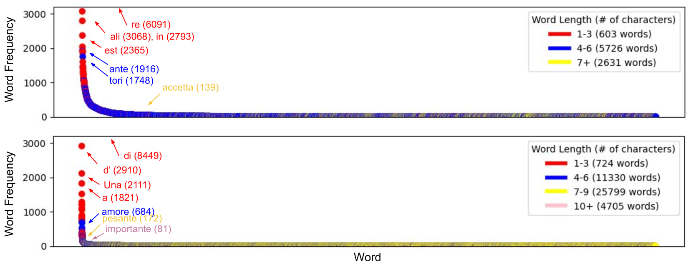

# 大型语言模型虽强，但在解谜意大利谜语时却显得力不从心，这揭示了它们在实物而非言辞理解上的短板。

发布时间：2024年08月01日

`LLM应用`

> Non Verbis, Sed Rebus: Large Language Models are Weak Solvers of Italian Rebuses

# 摘要

> Rebuses 是一种谜题，要求通过受限的多步骤推理从一组图像和字母中找出隐藏短语。我们为意大利语创建了一个庞大的口头化 rebuses 集合，并用它来测试最先进的大型语言模型的 rebus 解决能力。虽然通用系统如 LLaMA-3 和 GPT-4o 表现不佳，但特定调优似乎有所改善。然而，我们发现性能提升主要源于记忆。这表明，rebus 解决仍是评估大型语言模型语言能力和顺序指令遵循技能的挑战性测试。

> Rebuses are puzzles requiring constrained multi-step reasoning to identify a hidden phrase from a set of images and letters. In this work, we introduce a large collection of verbalized rebuses for the Italian language and use it to assess the rebus-solving capabilities of state-of-the-art large language models. While general-purpose systems such as LLaMA-3 and GPT-4o perform poorly on this task, ad-hoc fine-tuning seems to improve models' performance. However, we find that performance gains from training are largely motivated by memorization. Our results suggest that rebus solving remains a challenging test bed to evaluate large language models' linguistic proficiency and sequential instruction-following skills.

[Arxiv](https://arxiv.org/abs/2408.00584)