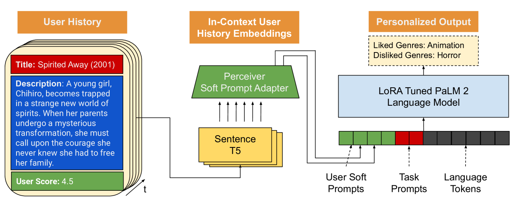

# PERSOMA：一种个性化软提示适配器架构，专为个性化语言提示设计

发布时间：2024年08月01日

`LLM应用` `个性化服务`

> PERSOMA: PERsonalized SOft ProMpt Adapter Architecture for Personalized Language Prompting

# 摘要

> 为了构建能够适应用户偏好变化的自然语言系统，理解用户交互历史的细微之处至关重要。为此，我们推出了PERSOMA，一种个性化软提示适配器架构。PERSOMA不同于以往的个性化提示方法，它通过将用户交互转化为表达性的软提示嵌入，有效捕捉用户历史。我们通过对比多种适配器架构和调优技术，证实了PERSOMA在处理复杂用户数据方面的优越性。实验结果表明，PERSOMA在处理大规模用户历史时，性能优于传统技术。

> Understanding the nuances of a user's extensive interaction history is key to building accurate and personalized natural language systems that can adapt to evolving user preferences. To address this, we introduce PERSOMA, Personalized Soft Prompt Adapter architecture. Unlike previous personalized prompting methods for large language models, PERSOMA offers a novel approach to efficiently capture user history. It achieves this by resampling and compressing interactions as free form text into expressive soft prompt embeddings, building upon recent research utilizing embedding representations as input for LLMs. We rigorously validate our approach by evaluating various adapter architectures, first-stage sampling strategies, parameter-efficient tuning techniques like LoRA, and other personalization methods. Our results demonstrate PERSOMA's superior ability to handle large and complex user histories compared to existing embedding-based and text-prompt-based techniques.

[Arxiv](https://arxiv.org/abs/2408.00960)