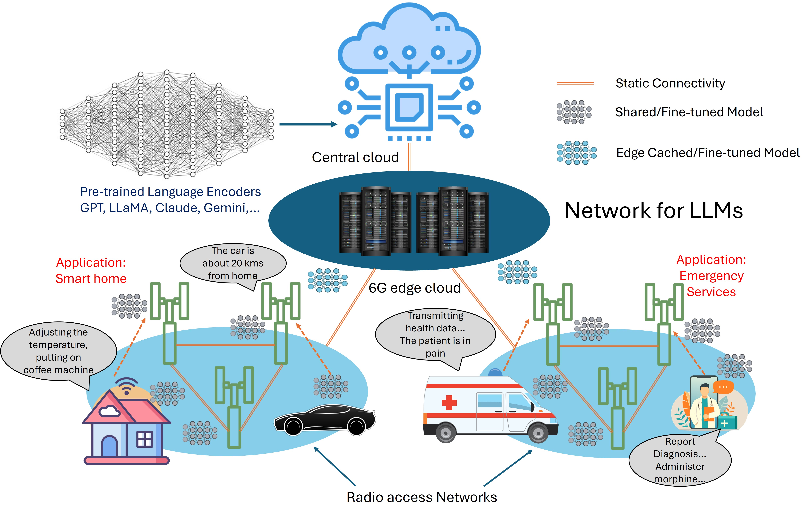
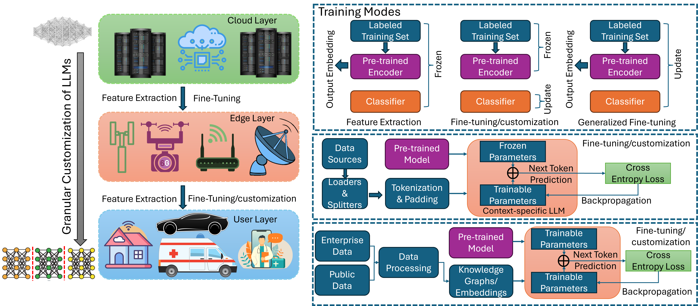
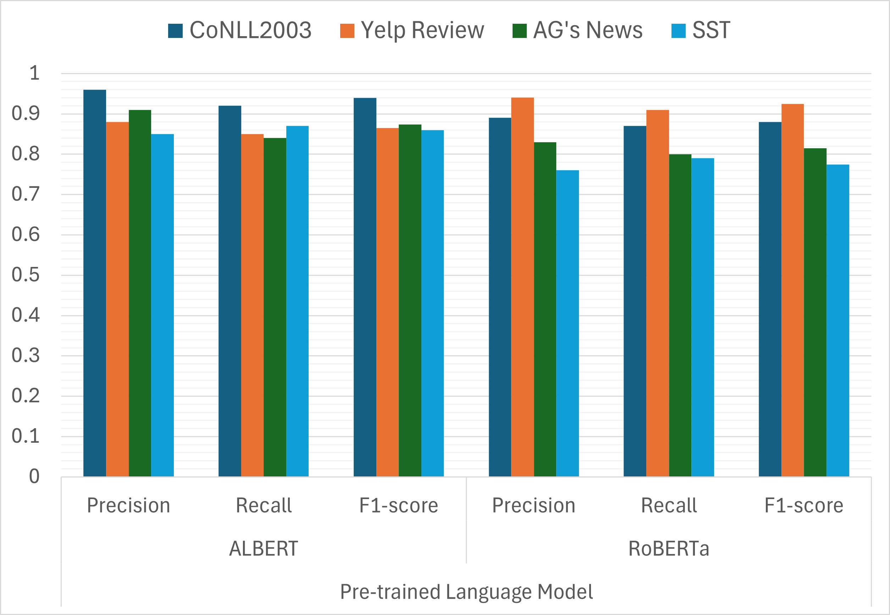
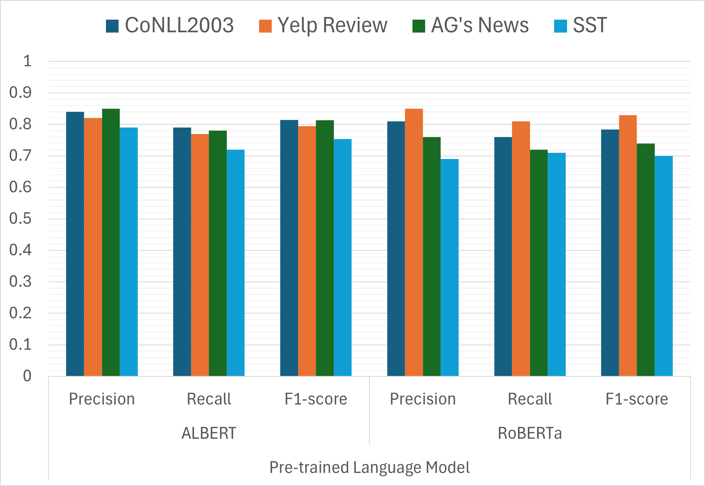
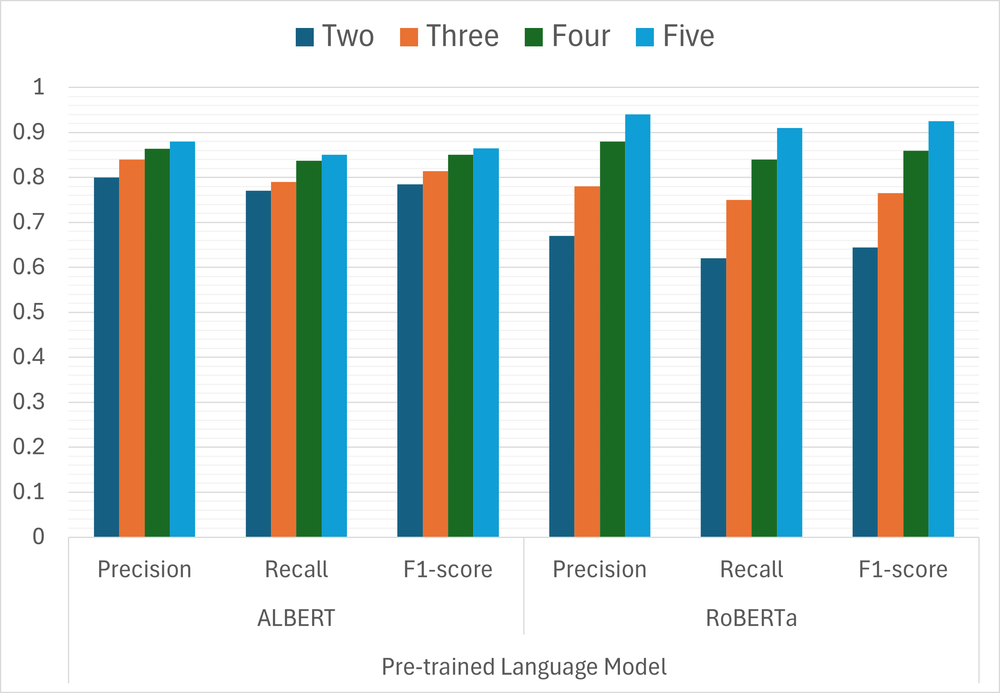

# 迈向安全可信的6G：探讨LLM面临的攻击、防御策略及潜在机遇

发布时间：2024年08月01日

`LLM应用` `通信网络` `网络安全`

> Pathway to Secure and Trustworthy 6G for LLMs: Attacks, Defense, and Opportunities

# 摘要

> 近期，大型语言模型（LLMs）因其在新兴应用中的适应性与扩展性而备受瞩目，尤其是在通信网络领域。展望未来，6G移动边缘计算网络有望将LLMs作为服务提供，凭借其超可靠的低延迟通信和闭环大规模连接能力。然而，LLMs在数据与模型隐私方面的脆弱性，对其在用户服务中的可信度构成了挑战。本文深入探讨了6G网络中微调LLMs所面临的安全隐患，特别是成员推理攻击。我们详细描述了攻击者若能接触到针对特定下游任务微调的模型，其可能发起的成员推理攻击网络的特征。研究显示，此类攻击对任何下游任务均构成威胁，使用LLM服务时可能导致个人数据泄露。实验表明，在命名实体识别任务中，攻击成功率高达92%。基于此，我们探讨了潜在的防御策略，并提出了增强LLMs在6G网络中信任度的研究方向。

> Recently, large language models (LLMs) have been gaining a lot of interest due to their adaptability and extensibility in emerging applications, including communication networks. It is anticipated that 6G mobile edge computing networks will be able to support LLMs as a service, as they provide ultra reliable low-latency communications and closed loop massive connectivity. However, LLMs are vulnerable to data and model privacy issues that affect the trustworthiness of LLMs to be deployed for user-based services. In this paper, we explore the security vulnerabilities associated with fine-tuning LLMs in 6G networks, in particular the membership inference attack. We define the characteristics of an attack network that can perform a membership inference attack if the attacker has access to the fine-tuned model for the downstream task. We show that the membership inference attacks are effective for any downstream task, which can lead to a personal data breach when using LLM as a service. The experimental results show that the attack success rate of maximum 92% can be achieved on named entity recognition task. Based on the experimental analysis, we discuss possible defense mechanisms and present possible research directions to make the LLMs more trustworthy in the context of 6G networks.

[Arxiv](https://arxiv.org/abs/2408.00722)