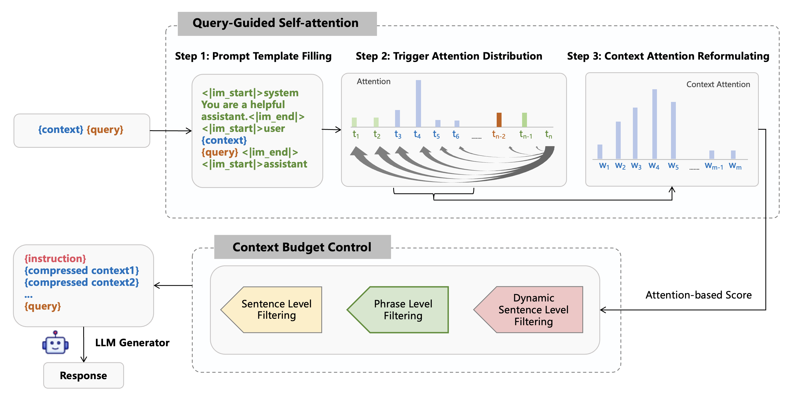

# QUITO 技术通过查询引导的上下文压缩，有效加速长上下文推理过程。

发布时间：2024年08月01日

`LLM应用` `问答系统`

> QUITO: Accelerating Long-Context Reasoning through Query-Guided Context Compression

# 摘要

> ICL 能力是 LLM 成功的关键。近期，上下文压缩因其能大幅降低推理复杂性和计算成本而备受关注。本文介绍了一种名为 QUITO 的新方法，通过问题对上下文的注意力来过滤无用信息。我们采用触发令牌计算上下文对问题的注意力分布，并基于此提出了三种过滤方法以满足上下文长度的预算约束。通过在 NaturalQuestions 和 ASQA 数据集上的实验，QUITO 在各种数据集和下游 LLM 中显著优于基线，展现了其高效性。代码已公开在 https://github.com/Wenshansilvia/attention_compressor。

> In-context learning (ICL) capabilities are foundational to the success of large language models (LLMs). Recently, context compression has attracted growing interest since it can largely reduce reasoning complexities and computation costs of LLMs. In this paper, we introduce a novel Query-gUIded aTtention cOmpression (QUITO) method, which leverages attention of the question over the contexts to filter useless information. Specifically, we take a trigger token to calculate the attention distribution of the context in response to the question. Based on the distribution, we propose three different filtering methods to satisfy the budget constraints of the context length. We evaluate the QUITO using two widely-used datasets, namely, NaturalQuestions and ASQA. Experimental results demonstrate that QUITO significantly outperforms established baselines across various datasets and downstream LLMs, underscoring its effectiveness. Our code is available at https://github.com/Wenshansilvia/attention_compressor.

[Arxiv](https://arxiv.org/abs/2408.00274)