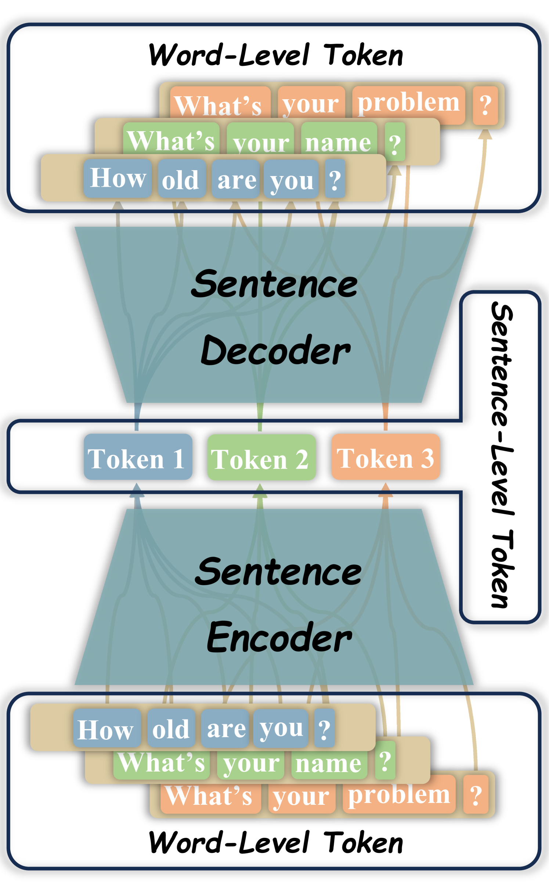
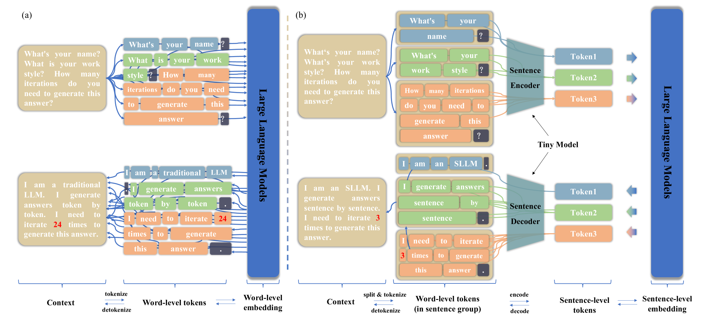
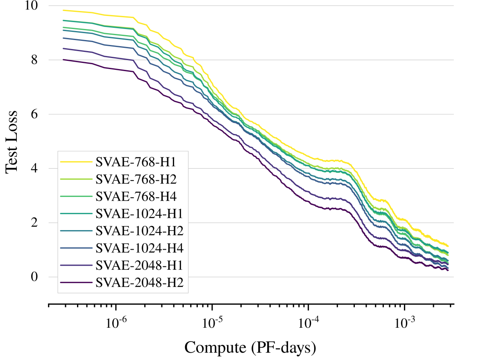
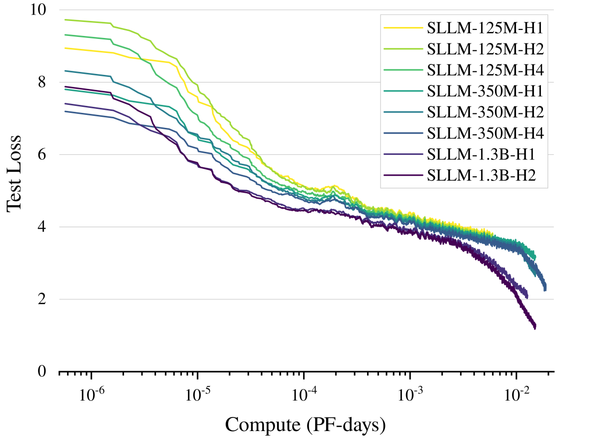

# SentenceVAE 利用下一句话预测技术，大幅提升大型语言模型的推理速度、长度和准确性。

发布时间：2024年08月01日

`LLM理论` `人工智能`

> SentenceVAE: Faster, Longer and More Accurate Inference with Next-sentence Prediction for Large Language Models

# 摘要

> 当前大型语言模型（LLMs）主要依赖于下一个词预测进行推理，这严重影响了处理速度。为此，我们提出了一种创新的推理方法——下一个句子预测，旨在提升LLMs的推理效率。我们设计的SentenceVAE模型，包含编码器和解码器，能将句子信息压缩成单一词，并重建回原始句子。通过将SentenceVAE融入LLMs的输入输出层，我们创建了句子级LLMs（SLLMs），实现逐句推理，大幅提升推理速度。此外，SentenceVAE通过句子分割保持语义完整，确保速度提升的同时不失准确性。相较于传统LLMs，SLLMs在相同上下文长度下处理更少词，大幅降低自注意力计算的内存需求，增强了对长上下文的处理能力。实验表明，该方法能将推理速度提升204~365%，将困惑度降至原始的46~75%，并减少86~91%的内存开销。随着模型参数的增加，这一方法的优势更加显著。

> Contemporary large language models (LLMs) predominantly utilize a next-token prediction method for inference, which significantly impedes their processing speed. In this paper, we introduce a novel inference methodology termed next-sentence prediction, aimed at enhancing the inference efficiency of LLMs. We present SentenceVAE, a tiny model consisting of an encoder and a decoder. The encoder effectively condenses the information within a sentence into a singular token, while the decoder reconstructs this compressed data back into its original sentential form. By integrating SentenceVAE into the input and output layers of LLMs, we develop Sentence-level LLMs (SLLMs) that employ a sentence-by-sentence inference approach, markedly accelerating inference speeds. SentenceVAE also maintains the integrity of the original semantic content by segmenting the text into sentences, thereby preserving accuracy while boosting inference speeds. Compared to traditional LLMs, SLLMs process fewer tokens over equivalent context lengths, significantly reducing memory demands for Self-Attention computations and facilitating the handling of longer contexts. Our experimental findings reveal that this method can increase inference speeds by 204~365%, reduce perplexity (PPL) to 46~75% of its original metric, and decrease memory overhead by 86~91% for the same context length. The advantages of this approach are further amplified with increases in model parameters.

[Arxiv](https://arxiv.org/abs/2408.00655)