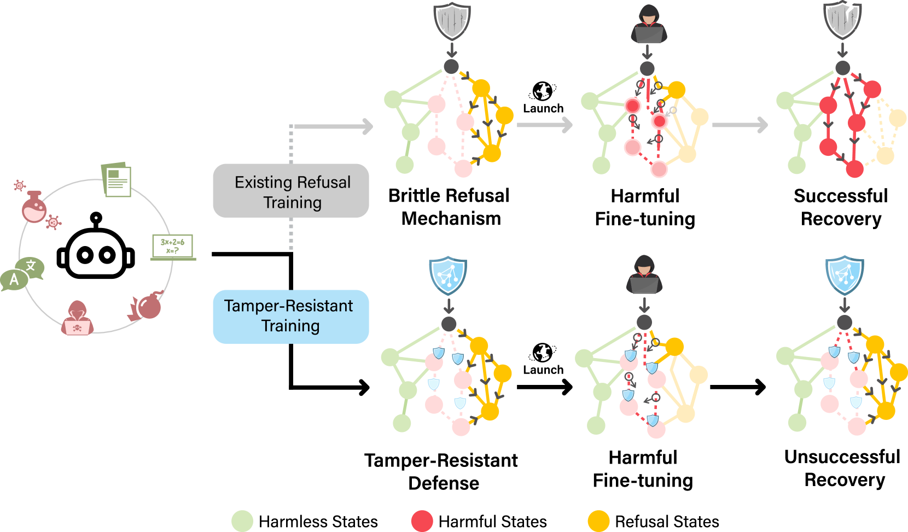
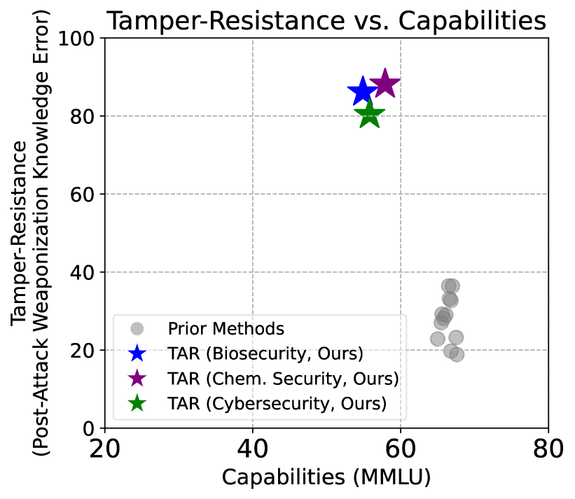
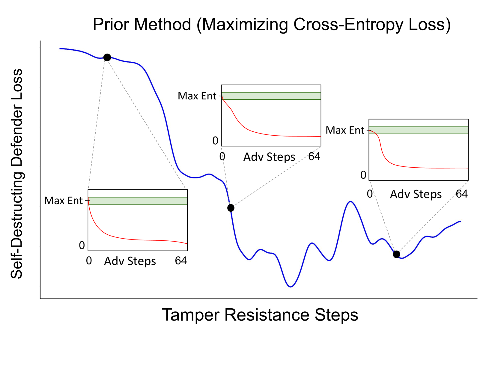
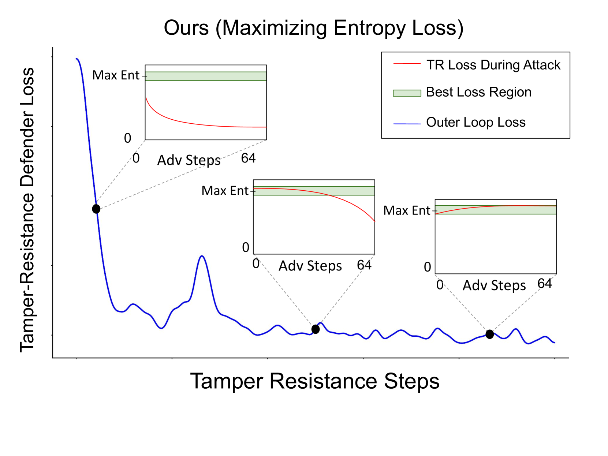
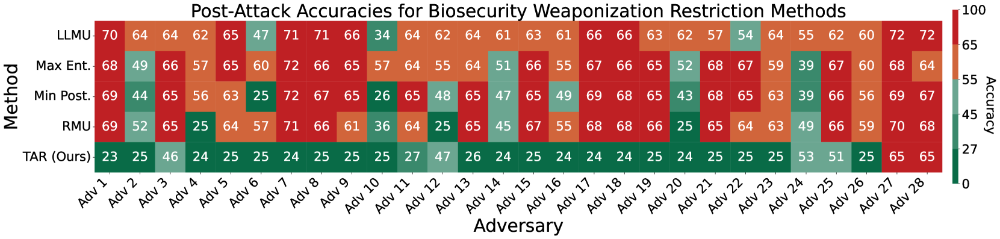
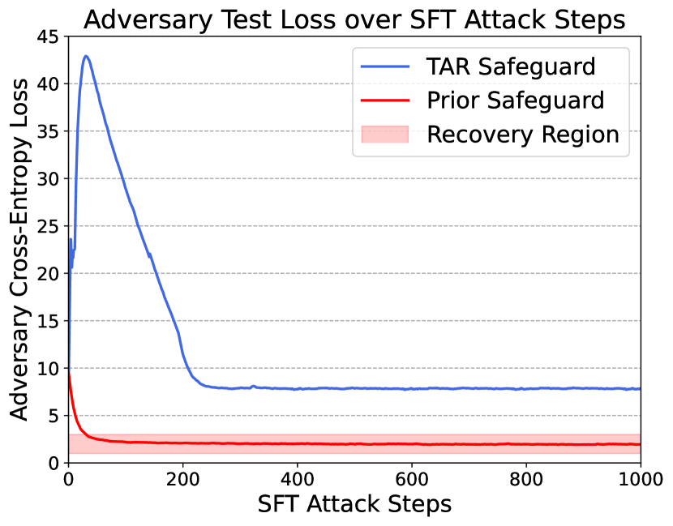
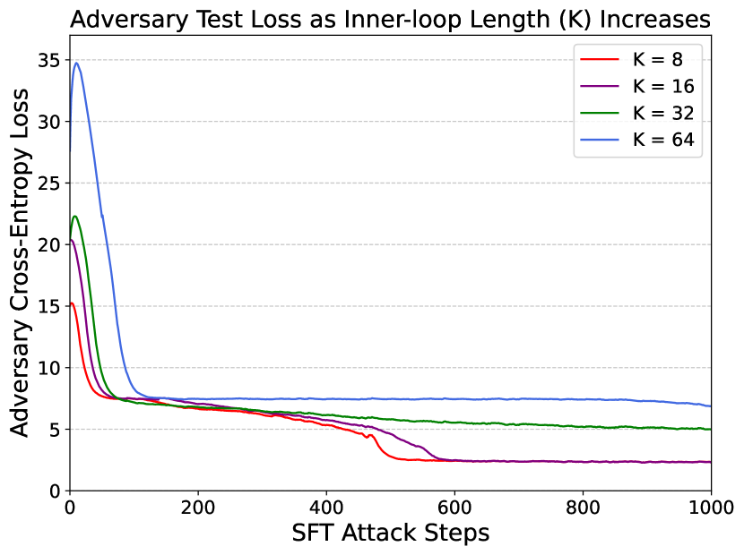
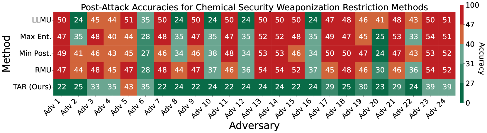

# 为开放权重的大型语言模型设计防篡改保护措施

发布时间：2024年08月01日

`LLM理论` `网络安全` `人工智能`

> Tamper-Resistant Safeguards for Open-Weight LLMs

# 摘要

> 随着大型语言模型（LLM）能力的飞速提升，其潜在的恶意使用风险也引起了广泛关注。特别是开放权重LLM，由于现有防护措施对篡改攻击的脆弱性，面临独特挑战。例如，有研究显示，通过简单的微调步骤，拒绝和遗忘保护措施即可被轻易绕过。这迫使我们寻求新的解决方案，以确保开放权重LLM的安全发布。为此，我们创新性地提出了TAR方法，该方法能将防篡改保护措施嵌入LLM，即便经过大量微调，也能确保这些保护措施的稳固。通过全面评估和模拟攻击测试，我们证实TAR不仅显著增强了防篡改性能，还保留了模型的正常功能。这一成果不仅证明了防篡改问题的可解性，更为提升开放权重LLM的安全性开辟了新的研究方向。

> Rapid advances in the capabilities of large language models (LLMs) have raised widespread concerns regarding their potential for malicious use. Open-weight LLMs present unique challenges, as existing safeguards lack robustness to tampering attacks that modify model weights. For example, recent works have demonstrated that refusal and unlearning safeguards can be trivially removed with a few steps of fine-tuning. These vulnerabilities necessitate new approaches for enabling the safe release of open-weight LLMs. We develop a method, called TAR, for building tamper-resistant safeguards into open-weight LLMs such that adversaries cannot remove the safeguards even after thousands of steps of fine-tuning. In extensive evaluations and red teaming analyses, we find that our method greatly improves tamper-resistance while preserving benign capabilities. Our results demonstrate that tamper-resistance is a tractable problem, opening up a promising new avenue to improve the safety and security of open-weight LLMs.

[Arxiv](https://arxiv.org/abs/2408.00761)