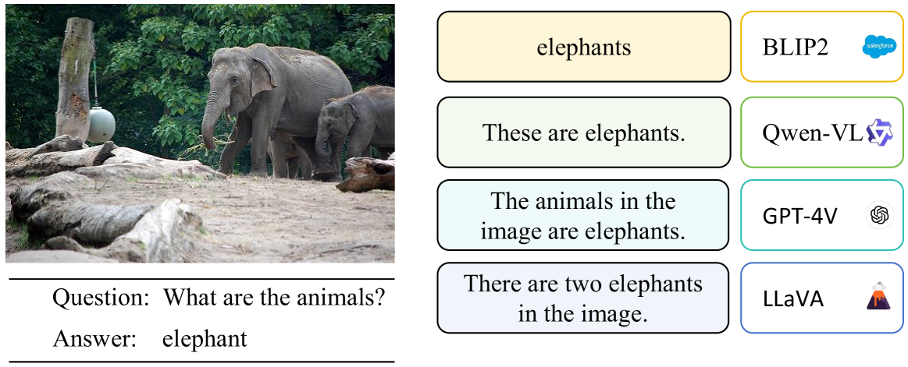
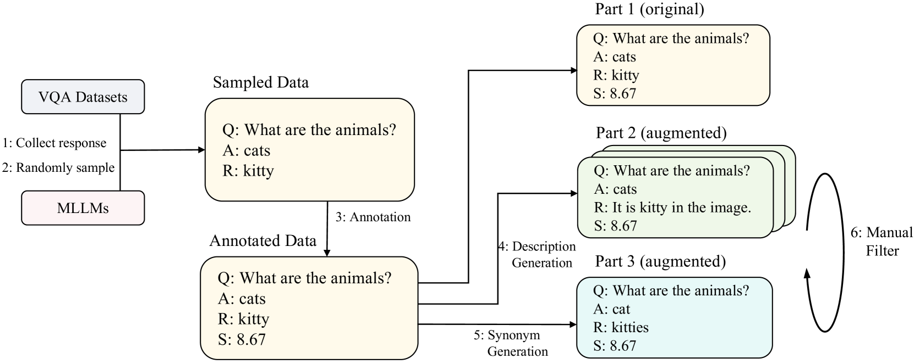
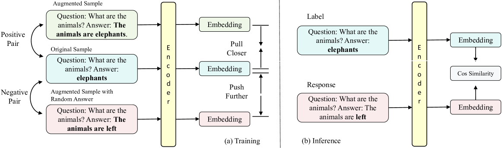
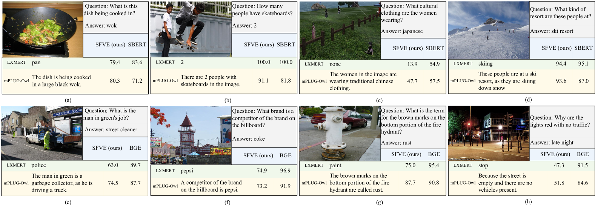
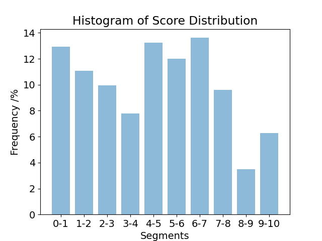

# 灵活评估生成视觉问答的新途径

发布时间：2024年08月01日

`LLM应用` `人工智能` `计算机视觉`

> Towards Flexible Evaluation for Generative Visual Question Answering

# 摘要

> 在多模态大型语言模型的迅猛发展中，公正且准确地评估其多模态理解能力至关重要。尽管视觉问答（VQA）是一个成熟的测试领域，但其评估方法，如僵化的精确匹配，限制了MLLMs的全面展示并抑制了多样性回答。为此，我们提出采用基于语义的评估器来评价VQA数据集上的开放式回答。鉴于VQA的特性与传统语义文本相似性（STS）任务大相径庭，我们定义了三个关键属性——对齐、一致性和泛化，并创建了评估VQA评估器（AVE）数据集，以系统比较各类评估器，包括基于LLM的。此外，我们设计了语义灵活VQA评估器（SFVE），充分考虑了VQA评估的独特性。实验证实了基于模型的VQA评估的可行性，并展示了所提评估器在语义评估方面的显著优势。该训练方案兼容BERT类编码器和仅解码器的LLM。

> Throughout rapid development of multimodal large language models, a crucial ingredient is a fair and accurate evaluation of their multimodal comprehension abilities. Although Visual Question Answering (VQA) could serve as a developed test field, limitations of VQA evaluation, like the inflexible pattern of Exact Match, have hindered MLLMs from demonstrating their real capability and discourage rich responses. Therefore, this paper proposes the use of semantics-based evaluators for assessing unconstrained open-ended responses on VQA datasets. As characteristics of VQA have made such evaluation significantly different than the traditional Semantic Textual Similarity (STS) task, to systematically analyze the behaviour and compare the performance of various evaluators including LLM-based ones, we proposes three key properties, i.e., Alignment, Consistency and Generalization, and a corresponding dataset Assessing VQA Evaluators (AVE) to facilitate analysis. In addition, this paper proposes a Semantically Flexible VQA Evaluator (SFVE) with meticulous design based on the unique features of VQA evaluation. Experimental results verify the feasibility of model-based VQA evaluation and effectiveness of the proposed evaluator that surpasses existing semantic evaluators by a large margin. The proposed training scheme generalizes to both the BERT-like encoders and decoder-only LLM.

[Arxiv](https://arxiv.org/abs/2408.00300)