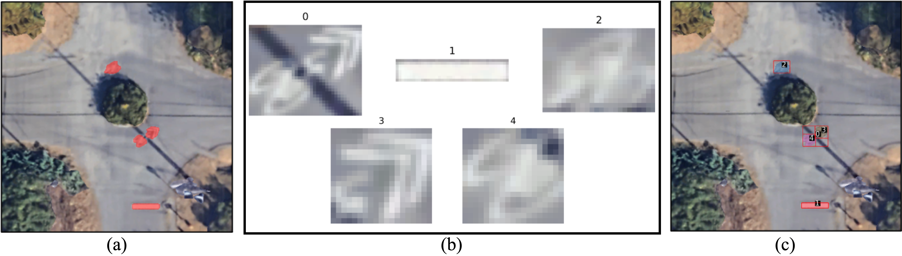

# 探索利用视觉-语言模型实现建筑环境的零-shot 标注（愿景论文）

发布时间：2024年08月01日

`LLM应用` `城市交通` `机器学习`

> Towards Zero-Shot Annotation of the Built Environment with Vision-Language Models (Vision Paper)

# 摘要

> 为了实现公平的城市交通应用，我们需要精确的数字模型来呈现复杂的建筑环境细节，包括自行车道、交通标志、路面状况等。传统方法依赖于昂贵的人工检查和注释，而机器学习则需要大量标注数据。本文探讨了利用视觉语言模型从卫星图像中自动识别城市特征，以减少对人工注释的依赖。尽管这些模型在识别常见物体方面表现出色，但对于建筑环境中较为特殊的元素，其性能尚待验证。我们通过实验展示了结合先进视觉语言模型和分割提示策略的有效性，特别是在识别停止线和凸起台面等特征时，预分割策略显著提高了注释准确率。这些发现为自动注释技术的发展指明了方向，有望在不同环境中提升交通系统的公平性、可达性和安全性。

> Equitable urban transportation applications require high-fidelity digital representations of the built environment: not just streets and sidewalks, but bike lanes, marked and unmarked crossings, curb ramps and cuts, obstructions, traffic signals, signage, street markings, potholes, and more. Direct inspections and manual annotations are prohibitively expensive at scale. Conventional machine learning methods require substantial annotated training data for adequate performance. In this paper, we consider vision language models as a mechanism for annotating diverse urban features from satellite images, reducing the dependence on human annotation to produce large training sets. While these models have achieved impressive results in describing common objects in images captured from a human perspective, their training sets are less likely to include strong signals for esoteric features in the built environment, and their performance in these settings is therefore unclear. We demonstrate proof-of-concept combining a state-of-the-art vision language model and variants of a prompting strategy that asks the model to consider segmented elements independently of the original image. Experiments on two urban features -- stop lines and raised tables -- show that while direct zero-shot prompting correctly annotates nearly zero images, the pre-segmentation strategies can annotate images with near 40% intersection-over-union accuracy. We describe how these results inform a new research agenda in automatic annotation of the built environment to improve equity, accessibility, and safety at broad scale and in diverse environments.

[Arxiv](https://arxiv.org/abs/2408.00932)