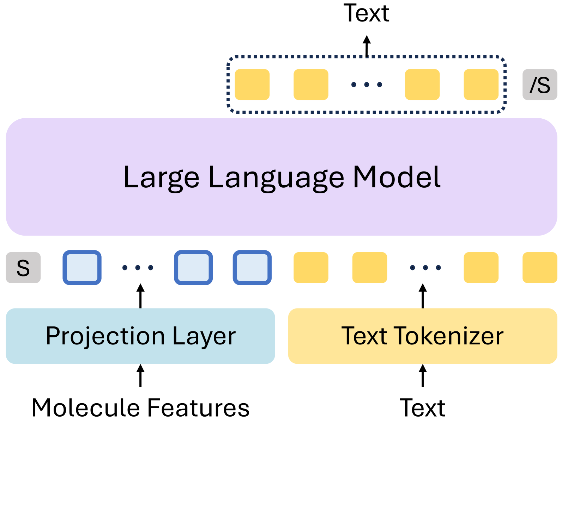
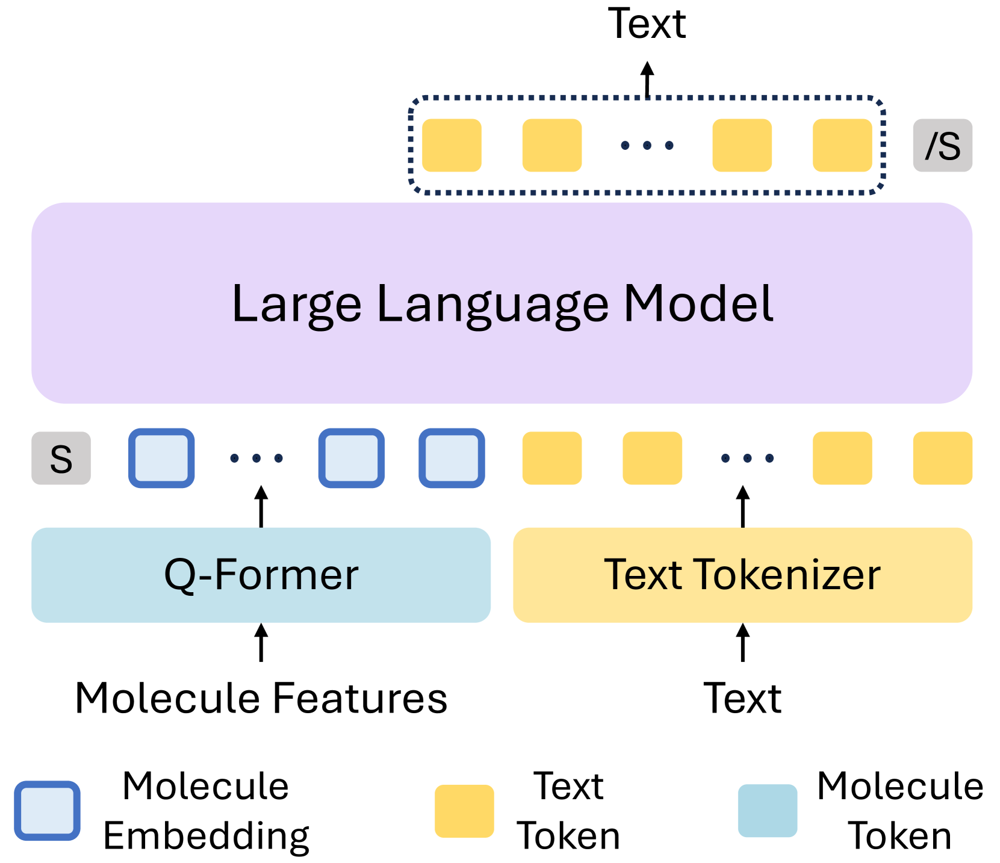
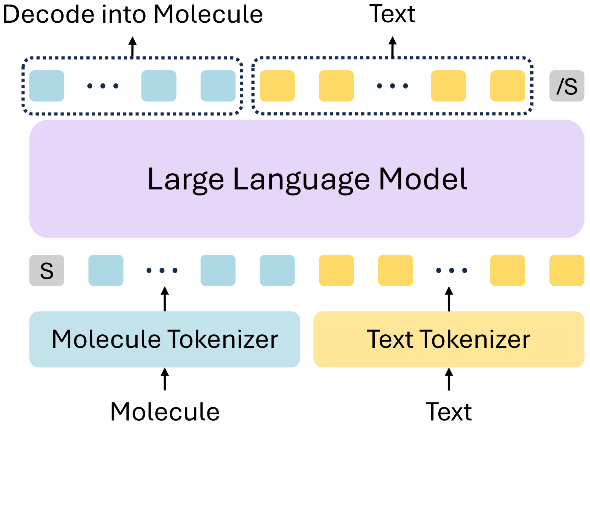
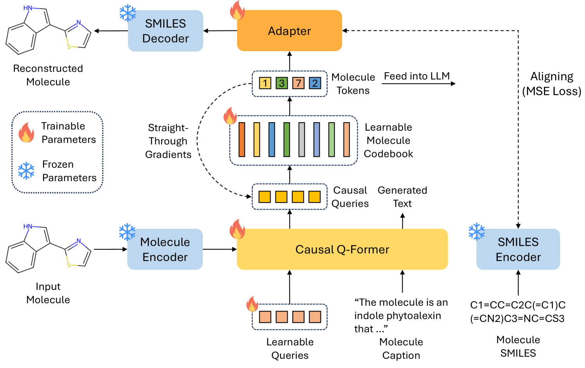
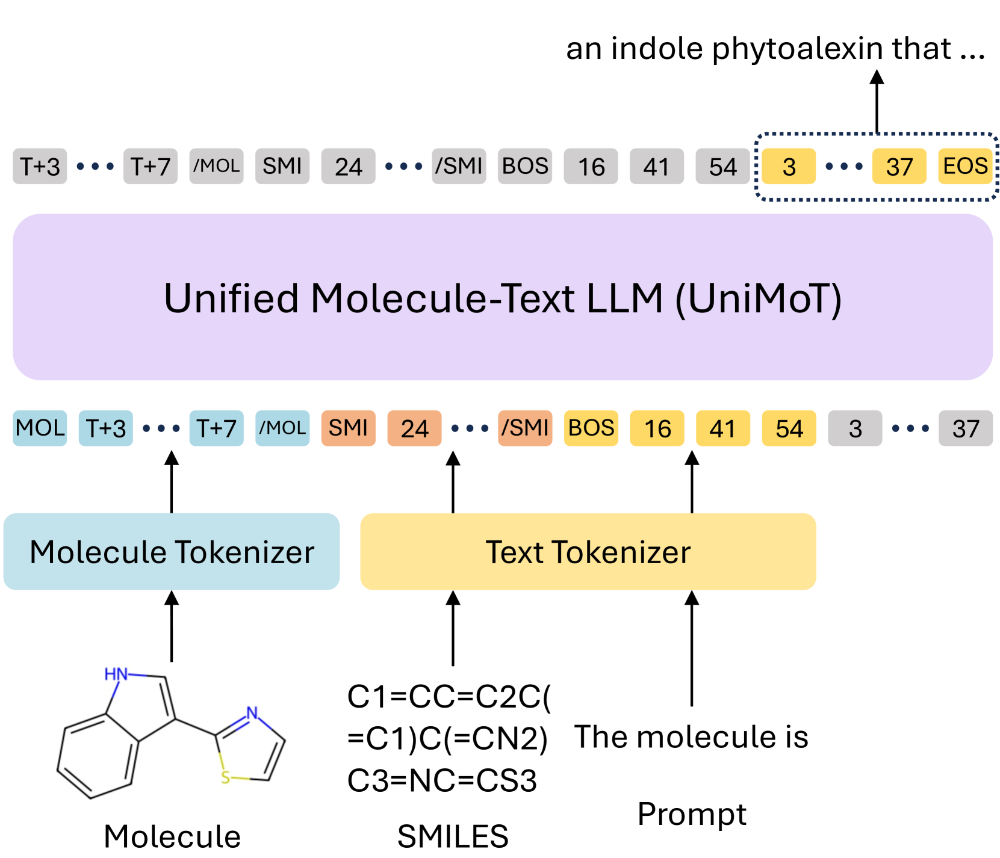
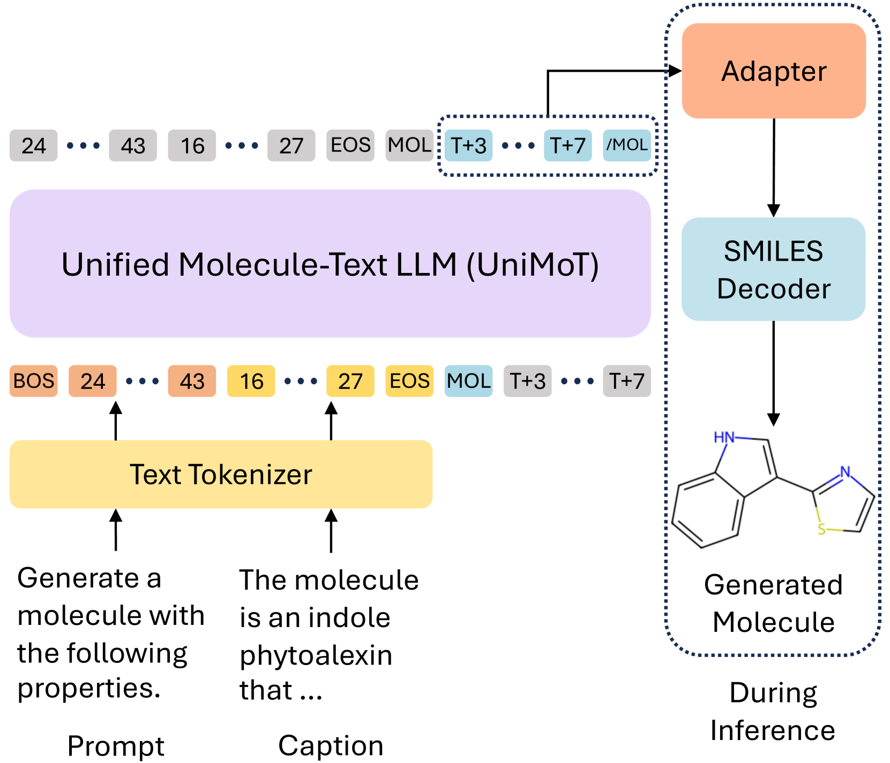
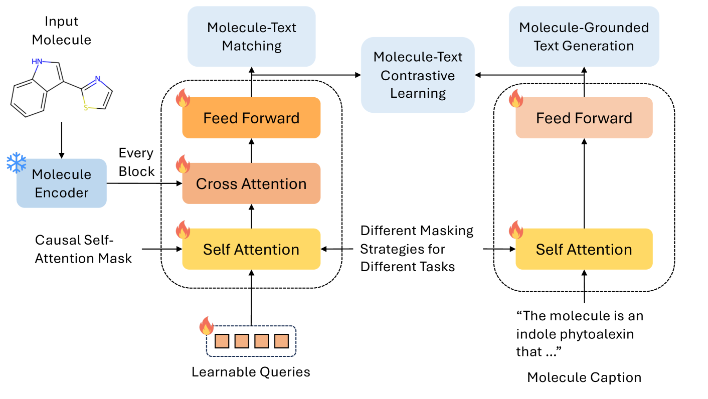

# UniMoT：一款采用离散令牌表示的统一分子与文本语言模型

发布时间：2024年08月01日

`LLM应用` `人工智能`

> UniMoT: Unified Molecule-Text Language Model with Discrete Token Representation

# 摘要

> 大型语言模型 (LLM) 在多领域任务中的卓越表现激发了将其能力拓展至分子应用的研究。然而，多数分子 LLM 采用的适配器架构未能平等处理分子与文本模态，且缺乏对分子模态的有效监督。为此，我们推出了 UniMoT，一种基于分词器架构的统一分子-文本 LLM，通过引入分子令牌扩展了 LLM 的词汇范围。我们特别设计了一种向量量化驱动的分词器，结合 Q-Former 以弥合分子与文本间的模态差异。该分词器将分子转化为带有因果关系的分子令牌序列，有效封装了分子与文本的高级信息。借助这一分词器，UniMoT 能够在共享令牌表示与自回归训练框架下，统一处理分子与文本模态，实现将分子视为外语并生成文本的能力。经过四阶段精心设计的训练流程，UniMoT 展现出多模态通才的特质，能够胜任分子到文本及文本到分子的转换任务。广泛实验验证了 UniMoT 在分子理解与生成领域的领先性能。

> The remarkable success of Large Language Models (LLMs) across diverse tasks has driven the research community to extend their capabilities to molecular applications. However, most molecular LLMs employ adapter-based architectures that do not treat molecule and text modalities equally and lack a supervision signal for the molecule modality. To address these issues, we introduce UniMoT, a Unified Molecule-Text LLM adopting a tokenizer-based architecture that expands the vocabulary of LLM with molecule tokens. Specifically, we introduce a Vector Quantization-driven tokenizer that incorporates a Q-Former to bridge the modality gap between molecule and text. This tokenizer transforms molecules into sequences of molecule tokens with causal dependency, encapsulating high-level molecular and textual information. Equipped with this tokenizer, UniMoT can unify molecule and text modalities under a shared token representation and an autoregressive training paradigm, enabling it to interpret molecules as a foreign language and generate them as text. Following a four-stage training scheme, UniMoT emerges as a multi-modal generalist capable of performing both molecule-to-text and text-to-molecule tasks. Extensive experiments demonstrate that UniMoT achieves state-of-the-art performance across a wide range of molecule comprehension and generation tasks.

[Arxiv](https://arxiv.org/abs/2408.00863)