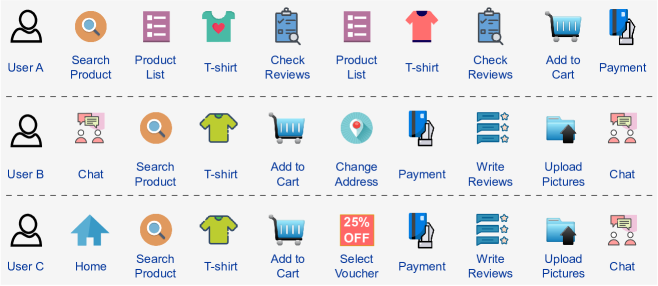
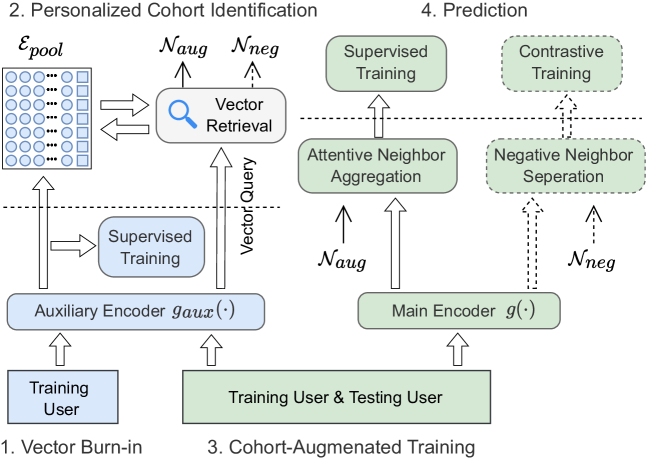
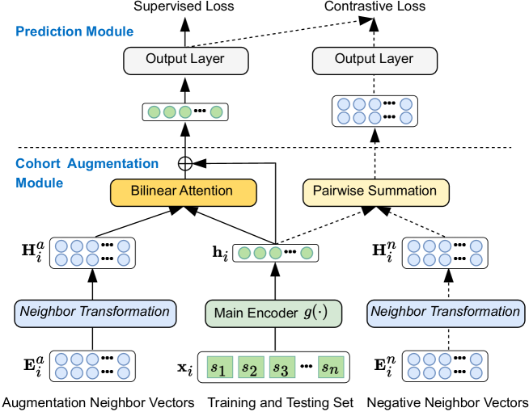
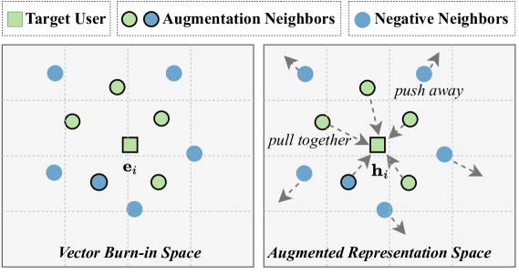
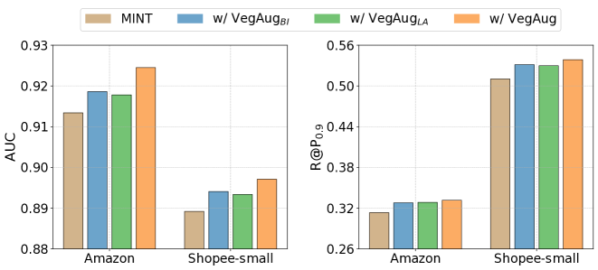
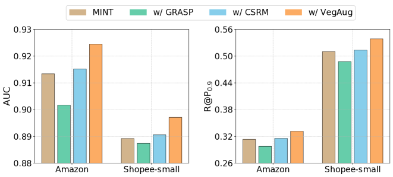
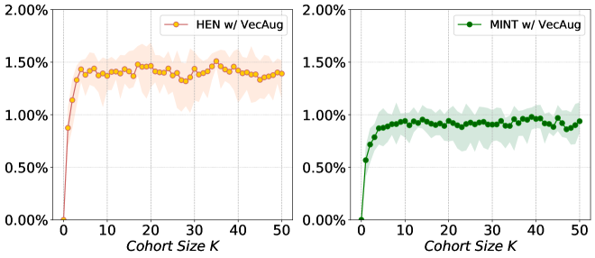
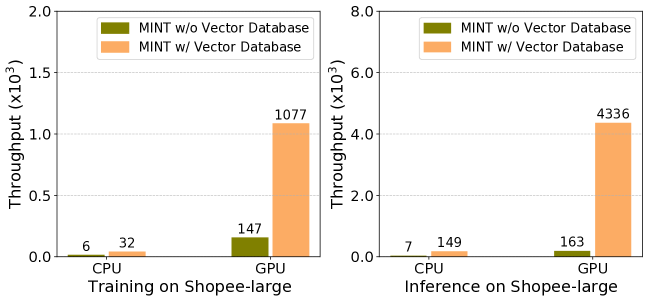
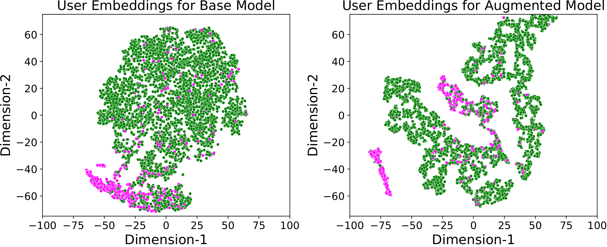

# VecAug：利用队列增强技术，揭露伪装欺诈，提升检测效率。

发布时间：2024年08月01日

`Agent` `电子商务`

> VecAug: Unveiling Camouflaged Frauds with Cohort Augmentation for Enhanced Detection

# 摘要

> 欺诈检测因其不断变化的欺诈模式和稀缺的标记数据而充满挑战。现有方法多采用基于图或基于序列的策略。基于图的方法通过共享实体连接用户，捕捉结构信息，但易受欺诈者操纵。基于序列的方法分析用户行为，抗篡改，但忽视了用户间的交互。本文受队列分析启发，提出VecAug框架，通过个性化队列信息增强用户表示学习，解决上述问题。我们首先提出向量预热技术，自动识别队列，为每个用户匹配特定任务队列。接着，引入注意力队列聚合技术，充分利用队列信息，增强用户表示。为提升鲁棒性，我们还设计了标签感知队列邻居分离机制，优化队列信息。VecAug通过整合队列信息，提升模型建模与泛化能力。该框架灵活，可与现有欺诈检测模型无缝集成。在电子商务平台上的实验表明，VecAug在AUC和R@P$_{0.9}$上分别提升基础模型性能2.48%和22.5%，显著超越现有技术。

> Fraud detection presents a challenging task characterized by ever-evolving fraud patterns and scarce labeled data. Existing methods predominantly rely on graph-based or sequence-based approaches. While graph-based approaches connect users through shared entities to capture structural information, they remain vulnerable to fraudsters who can disrupt or manipulate these connections. In contrast, sequence-based approaches analyze users' behavioral patterns, offering robustness against tampering but overlooking the interactions between similar users. Inspired by cohort analysis in retention and healthcare, this paper introduces VecAug, a novel cohort-augmented learning framework that addresses these challenges by enhancing the representation learning of target users with personalized cohort information. To this end, we first propose a vector burn-in technique for automatic cohort identification, which retrieves a task-specific cohort for each target user. Then, to fully exploit the cohort information, we introduce an attentive cohort aggregation technique for augmenting target user representations. To improve the robustness of such cohort augmentation, we also propose a novel label-aware cohort neighbor separation mechanism to distance negative cohort neighbors and calibrate the aggregated cohort information. By integrating this cohort information with target user representations, VecAug enhances the modeling capacity and generalization capabilities of the model to be augmented. Our framework is flexible and can be seamlessly integrated with existing fraud detection models. We deploy our framework on e-commerce platforms and evaluate it on three fraud detection datasets, and results show that VecAug improves the detection performance of base models by up to 2.48\% in AUC and 22.5\% in R@P$_{0.9}$, outperforming state-of-the-art methods significantly.

[Arxiv](https://arxiv.org/abs/2408.00513)