# Y Social：一款由大型语言模型赋能的社交媒体数字孪生

发布时间：2024年08月01日

`LLM应用` `社交媒体` `数字孪生`

> Y Social: an LLM-powered Social Media Digital Twin

# 摘要

> 本文介绍的 Y，是一款新一代数字孪生，专为复制在线社交媒体平台而设计。作为物理系统的虚拟镜像，数字孪生支持深度分析与实验。在社交媒体领域，Y 为研究者提供了模拟复杂在线互动的强大工具。它借助尖端大型语言模型 (LLM)，精准模拟代理行为，从而实现用户互动、内容传播及网络动态的逼真再现。通过这些整合，Y 深入洞察用户参与、信息流布及政策影响。同时，LLM 的融合使 Y 能细腻生成文本并预判用户反馈，助力在线环境中涌现现象的研究。本文进一步阐述了 Y 的设计理念，展示了其数据分析的潜力，并强调了其跨学科研究的价值。

> In this paper we introduce Y, a new-generation digital twin designed to replicate an online social media platform. Digital twins are virtual replicas of physical systems that allow for advanced analyses and experimentation. In the case of social media, a digital twin such as Y provides a powerful tool for researchers to simulate and understand complex online interactions. {\tt Y} leverages state-of-the-art Large Language Models (LLMs) to replicate sophisticated agent behaviors, enabling accurate simulations of user interactions, content dissemination, and network dynamics. By integrating these aspects, Y offers valuable insights into user engagement, information spread, and the impact of platform policies. Moreover, the integration of LLMs allows Y to generate nuanced textual content and predict user responses, facilitating the study of emergent phenomena in online environments.
  To better characterize the proposed digital twin, in this paper we describe the rationale behind its implementation, provide examples of the analyses that can be performed on the data it enables to be generated, and discuss its relevance for multidisciplinary research.

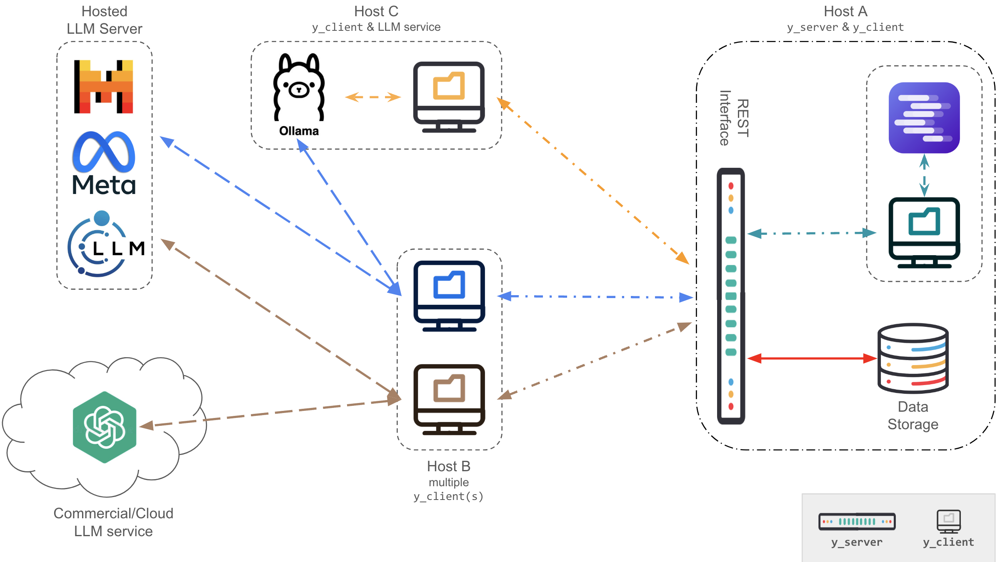

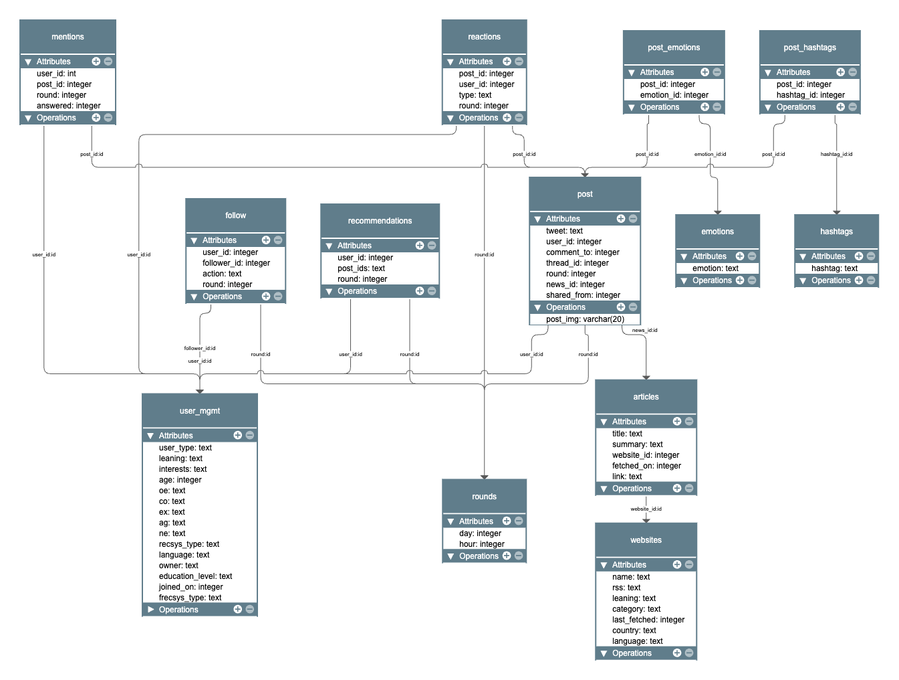

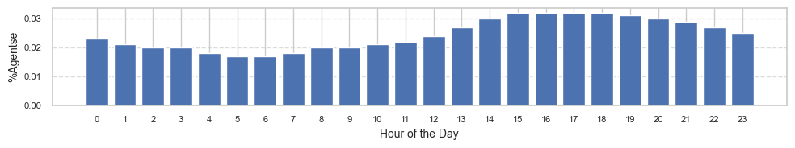

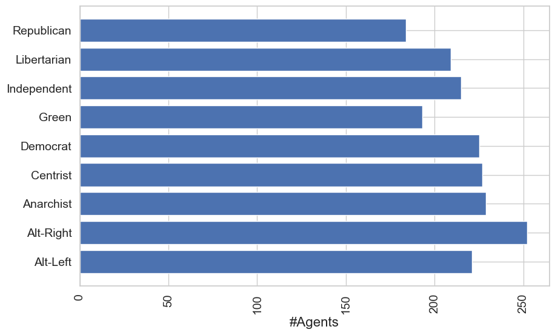

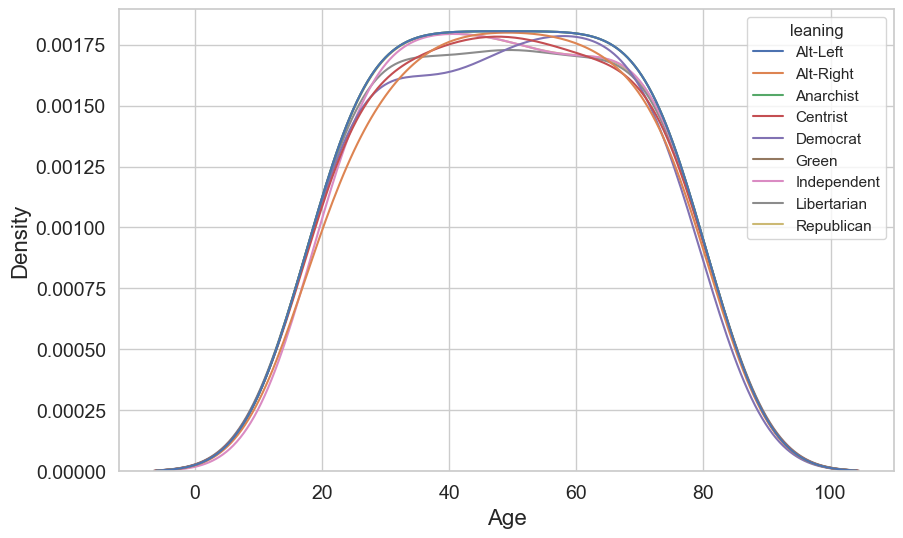

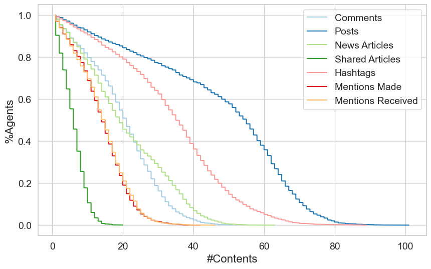

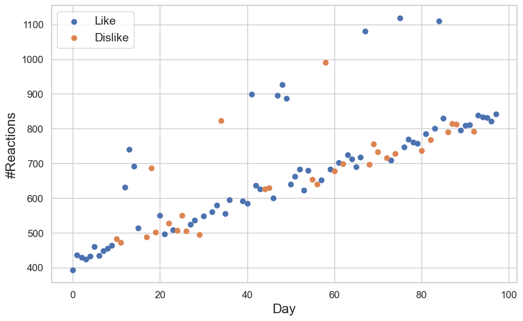

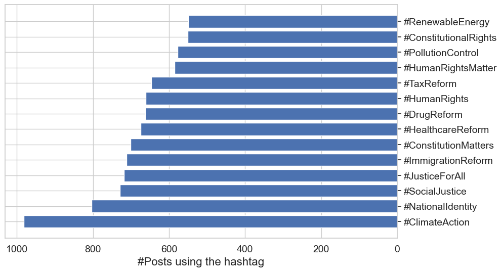

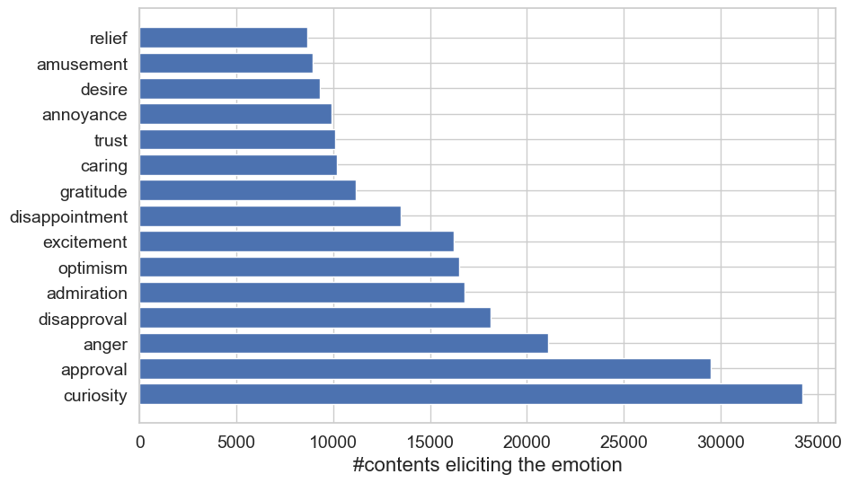

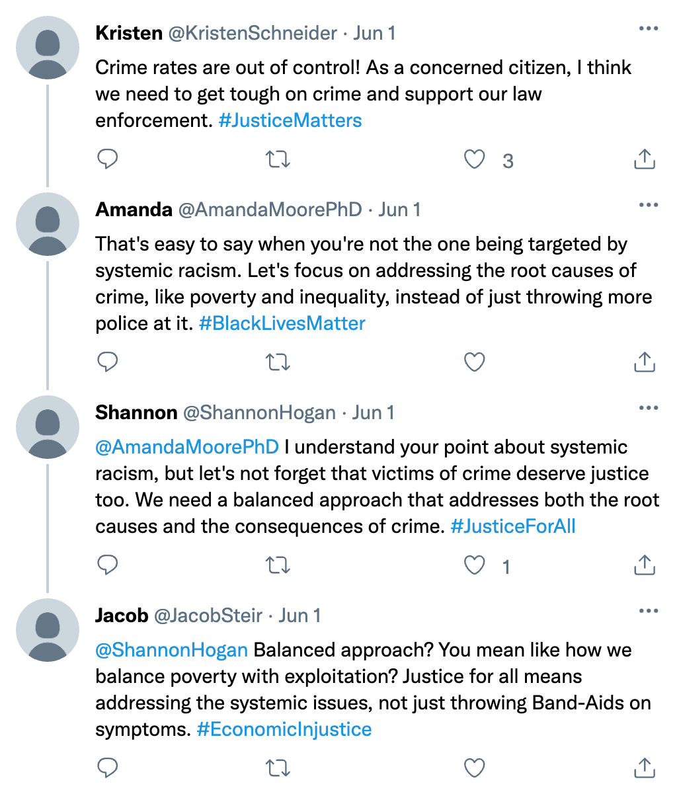

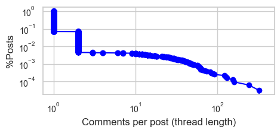

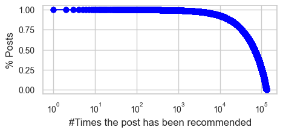

[Arxiv](https://arxiv.org/abs/2408.00818)