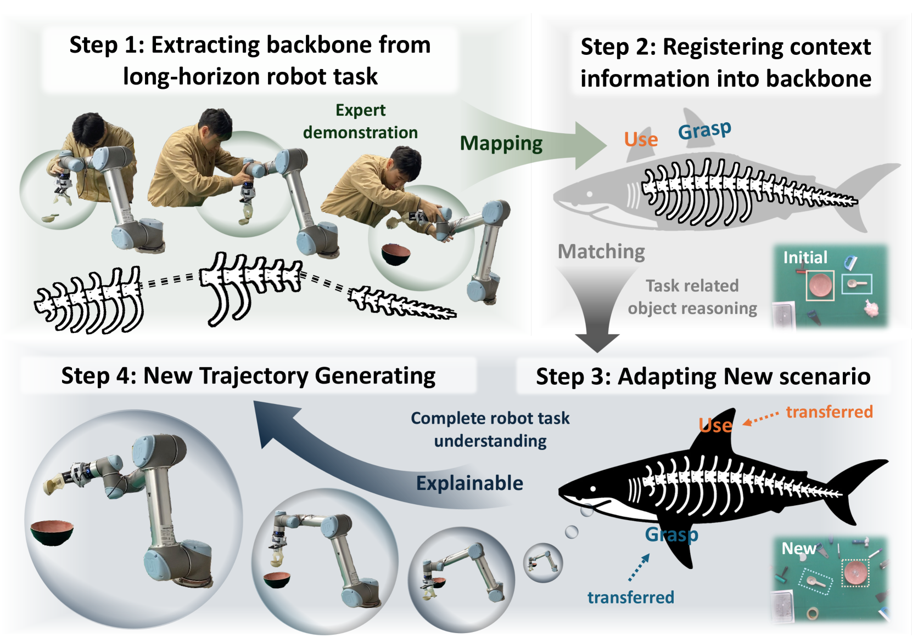
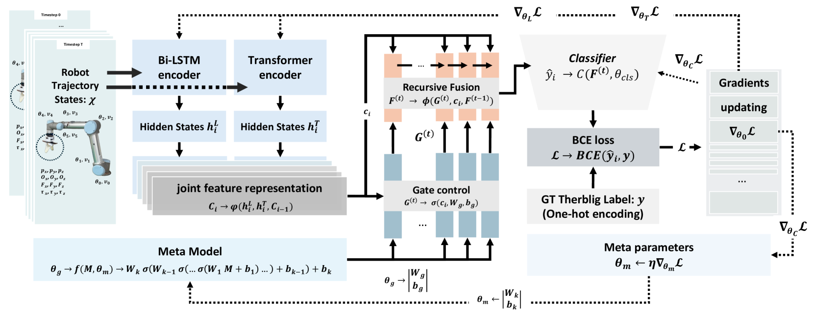

# 机器人长时程任务理解的关键支柱

发布时间：2024年08月02日

`Agent` `机器人技术` `人工智能`

> A Backbone for Long-Horizon Robot Task Understanding

# 摘要

> 针对长时间任务的端到端机器人学习常面临结果不可预测和泛化能力差的问题。为此，我们创新性地提出了基于Therblig的骨干框架（TBBF），旨在提升机器人任务的理解与转移能力。该框架通过将高级任务分解为基本动作元素（therbligs），并与现有基础模型结合，深化任务理解。方法分两阶段：离线训练中，我们设计了Meta-RGate SynerFusion（MGSF）网络，精准分割therbligs；在线测试时，MGSF网络提取任务高级知识，通过动作注册（ActionREG）编码至图像，并借助大型语言模型（LLM）-对齐视觉校正策略（LAP-VC）确保动作精确执行，优化轨迹转移。实验证实，therblig分割召回率达94.37%，简单与复杂场景的实际测试成功率分别为94.4%和80%。更多详情，请访问：https://sites.google.com/view/therbligsbasedbackbone/home

> End-to-end robot learning, particularly for long-horizon tasks, often results in unpredictable outcomes and poor generalization. To address these challenges, we propose a novel Therblig-based Backbone Framework (TBBF) to enhance robot task understanding and transferability. This framework uses therbligs (basic action elements) as the backbone to decompose high-level robot tasks into elemental robot configurations, which are then integrated with current foundation models to improve task understanding. The approach consists of two stages: offline training and online testing. During the offline training stage, we developed the Meta-RGate SynerFusion (MGSF) network for accurate therblig segmentation across various tasks. In the online testing stage, after a one-shot demonstration of a new task is collected, our MGSF network extracts high-level knowledge, which is then encoded into the image using Action Registration (ActionREG). Additionally, the Large Language Model (LLM)-Alignment Policy for Visual Correction (LAP-VC) is employed to ensure precise action execution, facilitating trajectory transfer in novel robot scenarios. Experimental results validate these methods, achieving 94.37% recall in therblig segmentation and success rates of 94.4% and 80% in real-world online robot testing for simple and complex scenarios, respectively. Supplementary material is available at: https://sites.google.com/view/therbligsbasedbackbone/home

[Arxiv](https://arxiv.org/abs/2408.01334)