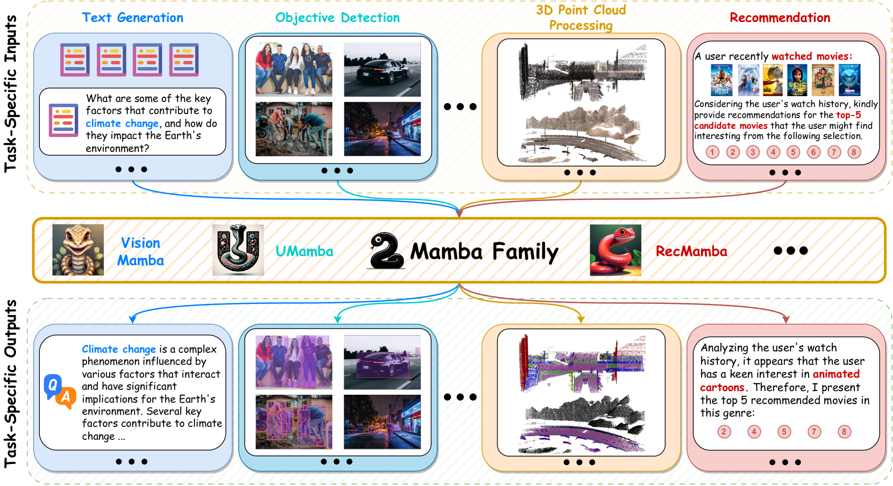
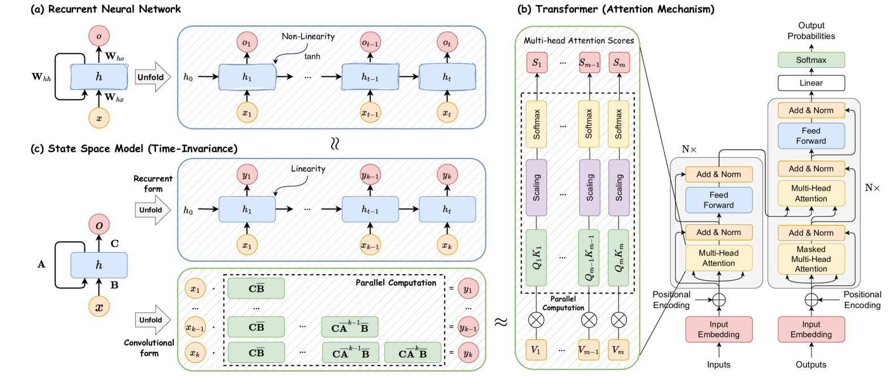
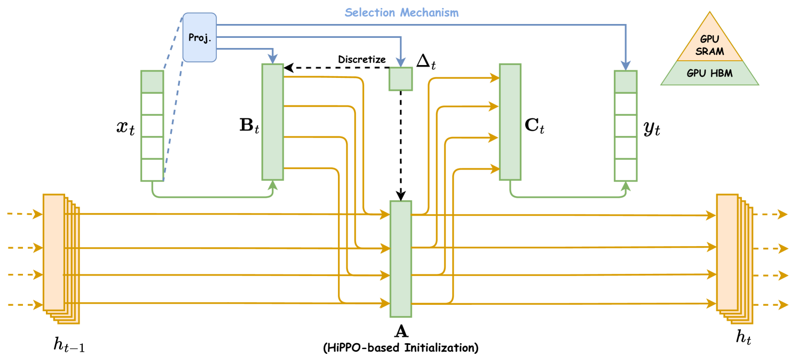
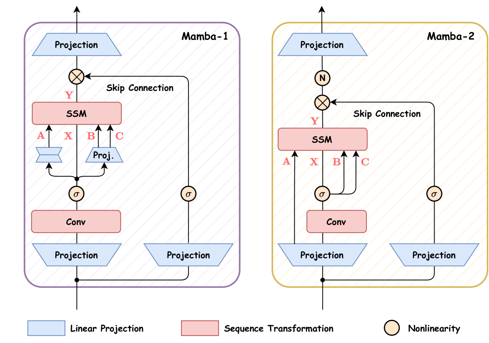
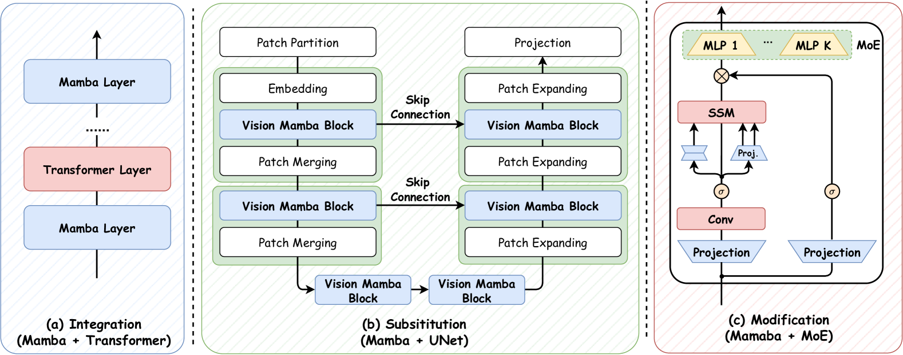
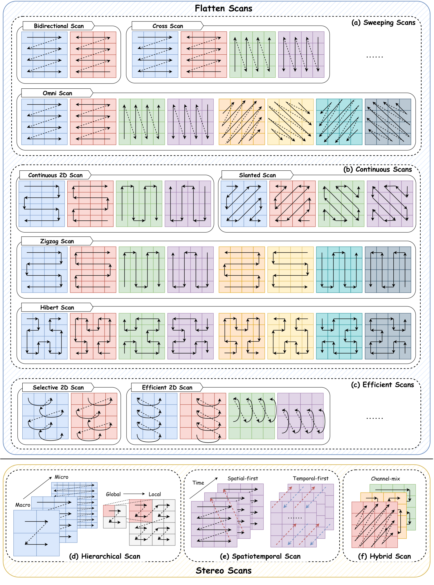
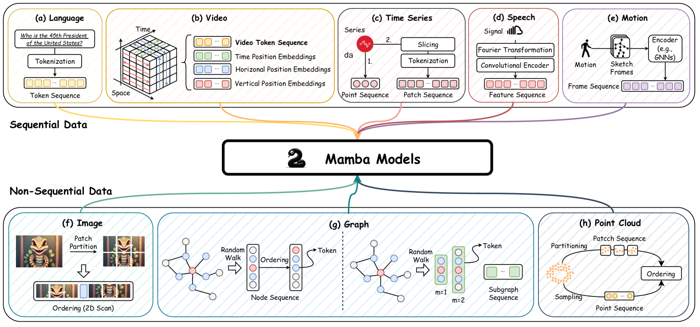

# 《Mamba 调查报告》

发布时间：2024年08月02日

`LLM理论` `人工智能`

> A Survey of Mamba

# 摘要

> 深度学习，这一人工智能领域的关键技术，已引发了一场革命。其中，Transformer架构尤为突出，它不仅赋能了众多先进模型，更是大型语言模型的基石。然而，Transformer也存在局限，尤其是注意力计算的二次复杂性导致的推理耗时问题。近期，Mamba架构崭露头角，它借鉴了经典状态空间模型，为构建基础模型提供了新思路，不仅建模能力媲美Transformer，还实现了序列长度的近线性可扩展性。这一进展激发了广泛的研究兴趣，探索Mamba在多领域的应用潜力。为此，我们进行了一项综述，深入探讨了Mamba相关研究的三个核心方面：模型进展、数据适应技术及应用场景。我们首先回顾了深度学习的基础知识及Mamba架构的细节，随后全面评述了Mamba在架构设计、数据适应性和实际应用中的研究进展。最后，我们指出了当前的挑战，并展望了未来的研究方向，以期为后续研究提供更深入的洞察。

> Deep learning, as a vital technique, has sparked a notable revolution in artificial intelligence. As the most representative architecture, Transformers have empowered numerous advanced models, especially the large language models that comprise billions of parameters, becoming a cornerstone in deep learning. Despite the impressive achievements, Transformers still face inherent limitations, particularly the time-consuming inference resulting from the quadratic computation complexity of attention calculation. Recently, a novel architecture named Mamba, drawing inspiration from classical state space models, has emerged as a promising alternative for building foundation models, delivering comparable modeling abilities to Transformers while preserving near-linear scalability concerning sequence length. This has sparked an increasing number of studies actively exploring Mamba's potential to achieve impressive performance across diverse domains. Given such rapid evolution, there is a critical need for a systematic review that consolidates existing Mamba-empowered models, offering a comprehensive understanding of this emerging model architecture. In this survey, we therefore conduct an in-depth investigation of recent Mamba-associated studies, covering from three main aspects: the advancements of Mamba-based models, the techniques of adapting Mamba to diverse data, and the applications where Mamba can excel. Specifically, we first recall the foundational knowledge of various representative deep learning models and the details of Mamba as preliminaries. Then, to showcase the significance of Mamba, we comprehensively review the related studies focusing on Mamba models' architecture design, data adaptability, and applications. Finally, we present an discussion of current limitations and explore various promising research directions to provide deeper insights for future investigations.

[Arxiv](https://arxiv.org/abs/2408.01129)